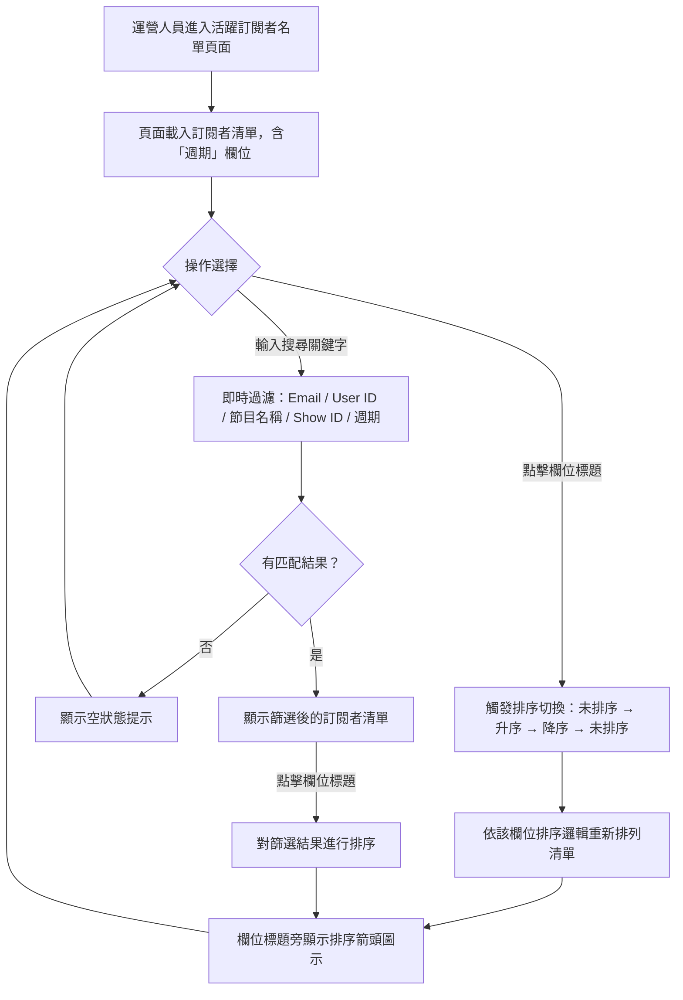

# User Story: 活躍訂閱者名單 - 三項功能新增

**Feature Slug：** active-subscribers-enhancements
**版本：** v1.0
**日期：** 2026-02-23
**狀態：** Draft
**前序產物：** prd-v1.0-20260223.md

---

## Stories 總覽

| ID | Title | Priority | Points | 依賴 |
|----|-------|----------|--------|------|
| **EP-01: 新增「週期」欄位** | | **P0** | **5** | |
| US-01 | 顯示訂閱週期欄位 | | 3 | — |
| US-02 | 週期欄位缺值處理 | | 2 | US-01 |
| **EP-02: 各欄位排序** | | **P0** | **11** | |
| US-03 | 單欄位排序切換機制 | | 5 | — |
| US-04 | 文字與 ID 欄位排序邏輯 | | 3 | US-03 |
| US-05 | 數值與日期欄位排序邏輯 | | 3 | US-03 |
| **EP-03: 搜尋功能** | | **P0** | **9** | |
| US-06 | 搜尋欄位 UI 與即時過濾 | | 5 | — |
| US-07 | 多欄位模糊比對邏輯 | | 3 | US-06 |
| US-08 | 搜尋無結果空狀態 | | 1 | US-06 |
| **EP-04: 排序與搜尋交互** | | **P1** | **3** | |
| US-09 | 排序與搜尋交互整合 | | 3 | US-03, US-06 |

---

## User Flow

---

## Epic 1: 新增「週期」欄位 (P0)

### Story US-01: 顯示訂閱週期欄位

**As a** 運營人員
**I want to** 在活躍訂閱者名單的「方案」欄位右側看到「週期」欄位，顯示「年方案」或「月方案」
**So that** 我可以直接在名單頁面辨識訂閱者的付費週期，不需切換至 Stripe Dashboard

| 項目 | 說明 |
|------|------|
| Priority | P0 |
| Story Points | 3 |
| 依賴 | 無 |

**Acceptance Criteria (Smoke-test):**

- Given 活躍訂閱者名單頁面已載入，When 頁面渲染完成，Then 「方案」欄位右側出現「週期」欄位，每列根據 Stripe subscription interval 顯示「年方案」或「月方案」

---

### Story US-02: 週期欄位缺值處理

**As a** 運營人員
**I want to** 當訂閱者的 Stripe subscription 缺少 interval 資料時，週期欄位顯示「-」而非錯誤
**So that** 我不會因資料缺失而無法正常瀏覽名單

| 項目 | 說明 |
|------|------|
| Priority | P0 |
| Story Points | 2 |
| 依賴 | US-01 |

**Acceptance Criteria (Smoke-test):**

- Given 某訂閱者的 Stripe subscription 無 interval 欄位，When 頁面載入該筆資料，Then 該訂閱者的「週期」欄位顯示「-」

---

## Epic 2: 各欄位排序 (P0)

### Story US-03: 單欄位排序切換機制

**As a** 運營人員
**I want to** 點擊任一欄位標題即可切換排序狀態（未排序 → 升序 → 降序 → 未排序），且同時只有一個欄位處於排序狀態
**So that** 我可以透過排序快速瀏覽並分析訂閱者資料

| 項目 | 說明 |
|------|------|
| Priority | P0 |
| Story Points | 5 |
| 依賴 | 無 |

**Acceptance Criteria (Smoke-test):**

- Given 頁面處於未排序狀態，When 點擊「Email」欄位標題一次，Then 清單依 Email 升序排列，該欄位標題旁顯示升序箭頭圖示（▲），其餘欄位無箭頭

---

### Story US-04: 文字與 ID 欄位排序邏輯

**As a** 運營人員
**I want to** Email、User ID、Stripe Customer ID 依字母排序，方案依 LITE→PRO→STUDIO→ENTERPRISE 排序，週期依月方案→年方案排序
**So that** 每個欄位的排序結果符合業務直覺

| 項目 | 說明 |
|------|------|
| Priority | P0 |
| Story Points | 3 |
| 依賴 | US-03 |

**Acceptance Criteria (Smoke-test):**

- Given 清單含有「月方案」與「年方案」的訂閱者，When 點擊「週期」欄位標題升序排序，Then 「月方案」排在「年方案」之前

---

### Story US-05: 數值與日期欄位排序邏輯

**As a** 運營人員
**I want to** 節目（數量）、付款次數、累計金額依數值大小排序，首次訂閱與最近付款依日期排序
**So that** 我可以快速找到付款最多或最早訂閱的用戶

| 項目 | 說明 |
|------|------|
| Priority | P0 |
| Story Points | 3 |
| 依賴 | US-03 |

**Acceptance Criteria (Smoke-test):**

- Given 清單中訂閱者的累計金額各不相同，When 點擊「累計金額」欄位標題升序排序，Then 清單由金額最少排到最多

---

## Epic 3: 搜尋功能 (P0)

### Story US-06: 搜尋欄位 UI 與即時過濾

**As a** 運營人員
**I want to** 在表格上方的搜尋欄位輸入關鍵字，清單即時過濾顯示匹配結果
**So that** 我可以快速定位特定訂閱者，不需逐頁瀏覽

| 項目 | 說明 |
|------|------|
| Priority | P0 |
| Story Points | 5 |
| 依賴 | 無 |

**Acceptance Criteria (Smoke-test):**

- Given 頁面已載入完整訂閱者清單，When 在搜尋欄位輸入某訂閱者的 Email 片段，Then 清單即時過濾，僅顯示 Email 包含該片段的訂閱者

---

### Story US-07: 多欄位模糊比對邏輯

**As a** 運營人員
**I want to** 搜尋關鍵字同時比對 Email、User ID、節目名稱、Show ID、週期，且不分大小寫
**So that** 我不需記住訂閱者的精確資料也能找到目標

| 項目 | 說明 |
|------|------|
| Priority | P0 |
| Story Points | 3 |
| 依賴 | US-06 |

**Acceptance Criteria (Smoke-test):**

- Given 某訂閱者的節目名稱包含「Podcast」，When 在搜尋欄位輸入「podcast」（小寫），Then 該訂閱者出現在篩選結果中，且結果不重複

---

### Story US-08: 搜尋無結果空狀態

**As a** 運營人員
**I want to** 當搜尋無匹配結果時看到明確的空狀態提示
**So that** 我知道是搜尋條件無匹配，而非系統故障

| 項目 | 說明 |
|------|------|
| Priority | P0 |
| Story Points | 1 |
| 依賴 | US-06 |

**Acceptance Criteria (Smoke-test):**

- Given 搜尋欄位已輸入關鍵字，When 無任何訂閱者匹配該關鍵字，Then 表格區域顯示空狀態提示文字

---

## Epic 4: 排序與搜尋交互 (P1)

### Story US-09: 排序與搜尋交互整合

**As a** 運營人員
**I want to** 搜尋過濾與欄位排序可同時作用，排序僅對篩選後的結果生效
**So that** 我可以先縮小範圍再排序，高效完成資料查找

| 項目 | 說明 |
|------|------|
| Priority | P1 |
| Story Points | 3 |
| 依賴 | US-03, US-06 |

**Acceptance Criteria (Smoke-test):**

- Given 搜尋欄位已輸入關鍵字且清單已篩選，When 點擊「首次訂閱」欄位標題升序排序，Then 篩選後的結果依首次訂閱日期由舊到新排列

---

## 相關檔案

| 類型 | 檔案 | 狀態 |
|------|------|------|
| PRD | prd-v1.0-20260223.md | ✅ 已存在 |
| User Story | user-story-v1.0-20260223.md | ✅ 本文件 |
| Wireframe | wireframe-v{ver}-{date}.html | ⬜ 尚未產出 |
| AC | acceptance-criteria-v{ver}-{date}.md | ⬜ 尚未產出 |

---

## 變更紀錄

| 版本 | 日期 | 變更內容 | 影響範圍 |
|------|------|----------|----------|
| v1.0 | 2026-02-23 | 初版 | User Story |
