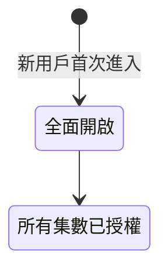
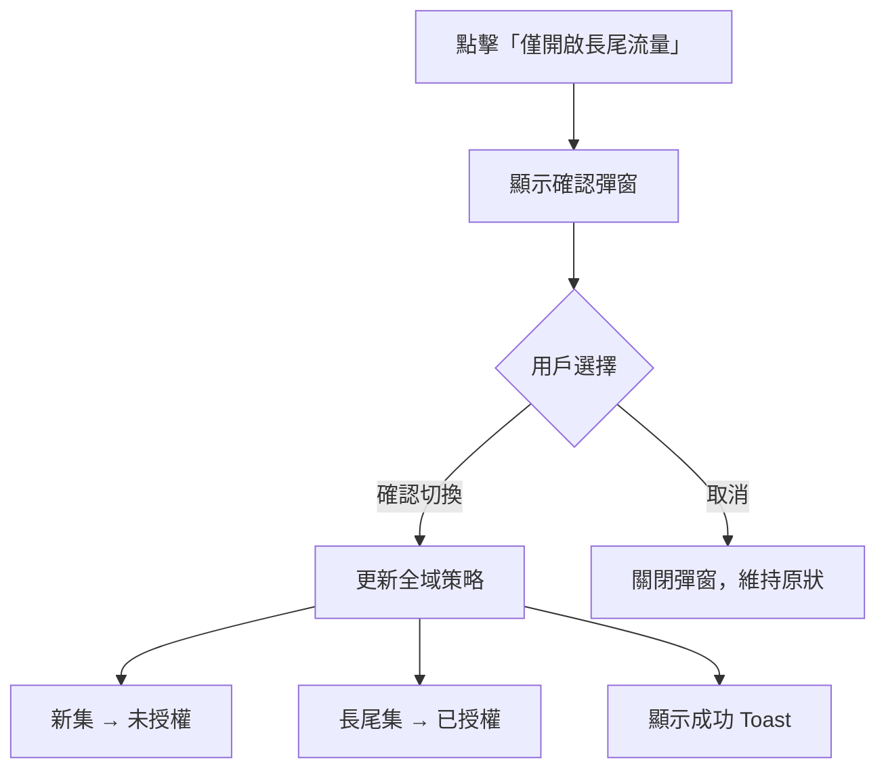
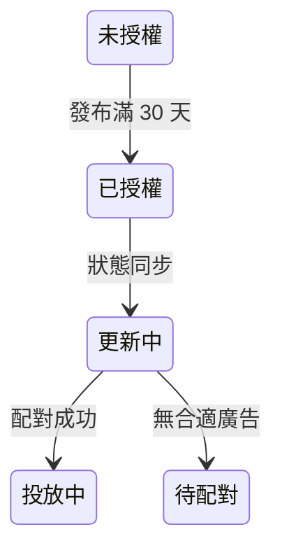
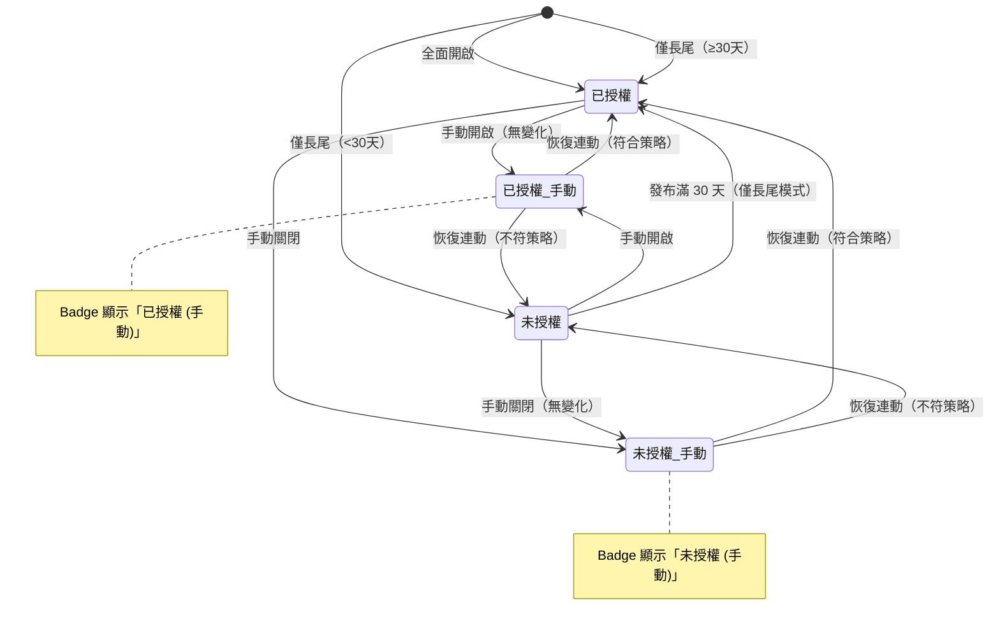
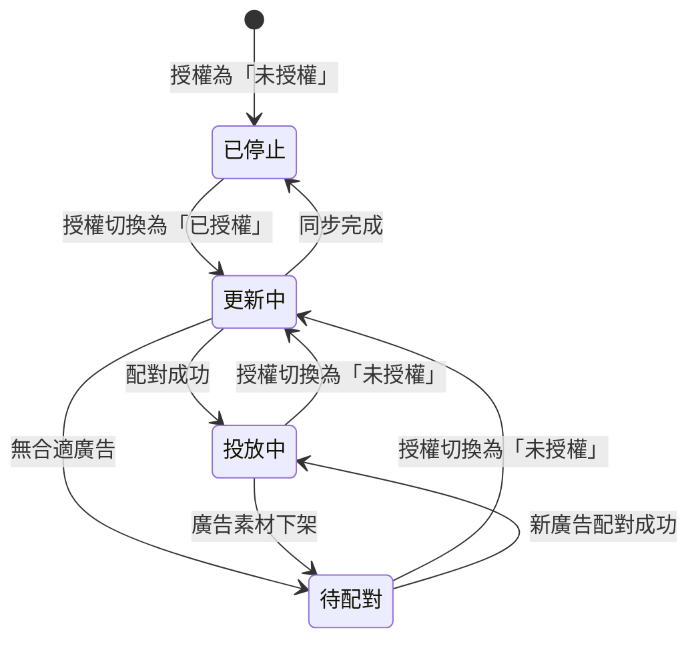

# Feature: 廣告授權全域設定與列表優化

**版本：** v1.0
**更新日期：** 2026-02-04
**狀態：** Draft
**Design System：** [MASTER.md](./../design-system/MASTER.md)

---

## 1. 概述

### 1.1 背景與目標

目前「開啟廣告」頁面的設計存在**狀態語義不清**的問題：用戶無法區分「已開啟」代表的是「已授權投放」還是「實際投放中」。這導致：
- 創作者對廣告投放狀態產生困惑
- 客服收到大量關於廣告狀態的諮詢
- 無法支援「長尾流量」等自動化策略

本次改版將：
1. 新增**全域設定**，提供 4 種策略選項
2. 將列表的狀態欄位**拆分為「廣告授權」與「廣告狀態」**
3. 支援**例外處理**與**恢復連動**機制

### 1.2 目標用戶

全階段創作者：
- 新手：選擇「全面開啟」快速開始變現
- 成長期：使用「僅長尾流量」保護新集不被廣告干擾
- 專業創作者：使用「自訂設定」精細控制每集授權

### 1.3 成功指標

| 指標 | 目標 |
| --- | --- |
| 廣告相關客服諮詢量 | 下降 30% |
| 開啟廣告的集數比例 | 提升 15% |
| 設定頁面停留時間 | 下降（更快完成設定） |

### 1.4 策略對齊

| 檢核項 | 回答 |
| --- | --- |
| **ICP 階段** | 全階段通用 |
| **NSM 貢獻** | 廣告版位數增加、創作者留存、付費轉化率 |
| **Roadmap 對應** | 待確認 |
| **競品差異** | 提供自動化長尾策略，競品多為手動設定 |

### 1.5 優先級評估 (RICE)

| 維度 | 評分 (1-5) | 說明 |
| --- | --- | --- |
| **Reach** | 4 | 所有使用廣告功能的創作者（約 60% MAU） |
| **Impact** | 4 | 直接影響廣告收益與用戶體驗 |
| **Confidence** | 4 | 需求明確，客服數據支持 |
| **Effort** | 3 | 需後端配合，中等工作量 |

---

## 2. 名詞定義

| 名詞 | 英文 | 定義 |
| --- | --- | --- |
| 廣告授權 | Ad Authorization / Enabled | 是否具備投放權利，由全域策略或手動覆蓋決定 |
| 廣告狀態 | Ad Status | 系統實際投放現狀，反應後端與廣告池的對接結果 |
| 全域策略 | Global Strategy | 節目層級的預設規則，自動套用至所有集數 |
| 長尾流量 | Long-tail Traffic | 發布超過 30 天的集數，通常有穩定但較低的收聽量 |
| 手動覆蓋 | Manual Override | 用戶無視全域規則，強行開啟或關閉單集授權 |
| 恢復連動 | Restore Sync | 將手動覆蓋的單集恢復為遵循全域策略 |

---

## 3. 驗收標準 (BDD)

**Feature: 廣告授權全域設定**

As a 創作者,
I want to 透過全域策略批量管理所有集數的廣告授權,
So that 我可以快速設定並減少逐集操作的時間成本.

**Background:**
Given 用戶已登入 Firstory Studio
And 用戶已導航至「盈利功能 > 開啟廣告」頁面

---

### Scenario 1: 新用戶看到預設為「全面開啟」

Given 用戶是首次進入廣告設定頁面
When 頁面載入完成
Then 全域設定應顯示「全面開啟」為已選取狀態
And 所有集數的廣告授權應為「已授權」



---

### Scenario 2: 切換至「僅開啟長尾流量」

Given 全域設定目前為「全面開啟」
And 存在 3 集發布未滿 30 天（新集）
And 存在 5 集發布超過 30 天（長尾集）
When 用戶點擊「僅開啟長尾流量」選項
Then 應顯示確認彈窗，內容包含：
  - 標題：「切換廣告策略」
  - 說明：「此操作將停止 3 集新集數的廣告投放，30 天後將自動開啟」
  - 按鈕：「確認切換」/「取消」
When 用戶點擊「確認切換」
Then 3 集新集的授權應變更為「未授權」
And 5 集長尾集的授權應維持「已授權」
And 應顯示 Toast：「已切換至長尾流量策略」



---

### Scenario 3: 切換至「全面關閉並下架所有廣告」

Given 全域設定目前為「全面開啟」
When 用戶點擊「全面關閉並下架所有廣告」選項
Then 應顯示警告彈窗，內容包含：
  - 標題：「確定要關閉所有廣告？」
  - 說明：「此操作將移除所有集數的廣告授權，廣告將立即停止投放。您可以隨時重新開啟。」
  - 按鈕：「確認關閉」（destructive 樣式）/「取消」
When 用戶點擊「確認關閉」
Then 所有集數的授權應變更為「未授權」
And 列表應進入唯讀模式（授權欄位不可點擊）
And 應顯示 Alert：「所有廣告已關閉。如需重新開啟，請選擇其他策略。」

```
┌─────────────────────────────────────────────────────────┐
│  ⚠️ Alert (--color-warning)                              │
│  所有廣告已關閉。如需重新開啟，請選擇其他策略。           │
└─────────────────────────────────────────────────────────┘
```

---

### Scenario 4: 手動覆蓋單集授權

Given 全域設定為「僅開啟長尾流量」
And EP99（發布 10 天）的授權為「未授權」
When 用戶點擊 EP99 的授權 Badge
Then 應顯示 Popover，包含：
  - 選項：「已授權」/「未授權」
  - 提示：「此集將不再遵循全域策略」
When 用戶選擇「已授權」
Then EP99 的授權應變更為「已授權 (手動)」
And 應顯示「恢復連動」按鈕

```
┌──────────────────────────────────────────────────────────────────────┐
│  日期        標題              時長    廣告授權           廣告狀態    │
├──────────────────────────────────────────────────────────────────────┤
│  2026-01-25  EP99: 最新一集    28:10   [已授權(手動)] [恢復連動]  [投放中]  │
│  2026-01-20  EP98: 上週回顧    35:22   [未授權]                   [已停止]  │
│  2025-12-15  EP90: 經典回顧    61:05   [已授權]                   [投放中]  │
└──────────────────────────────────────────────────────────────────────┘
```

---

### Scenario 5: 恢復連動

Given EP99 的授權為「已授權 (手動)」
And 全域策略為「僅開啟長尾流量」
And EP99 發布未滿 30 天
When 用戶點擊「恢復連動」按鈕
Then EP99 的授權應變更為「未授權」（遵循全域策略）
And 「恢復連動」按鈕應消失


---

### Scenario 6: 發布滿 30 天自動切換

Given 全域策略為「僅開啟長尾流量」
And EP99 的發布日期為 2026-01-05
And EP99 的授權為「未授權」（系統自動）
When 系統時間到達 2026-02-04（滿 30 天）
Then EP99 的授權應自動切換為「已授權」
And EP99 的廣告狀態應變更為「更新中」→「投放中」或「待配對」



---

### Scenario 7: API 失敗處理

Given 用戶正在切換全域策略
When API 請求失敗
Then 應在頁面頂部顯示 Alert（error 樣式）：
  - 內容：「設定儲存失敗，請稍後再試。如問題持續，請聯繫客服。」
And 全域設定應恢復至原選項
And Radio 選項應可再次操作

---

### Scenario 8: 片頭與中段廣告獨立設定

Given 用戶在「片頭廣告 (Pre-roll)」Tab
And 片頭廣告的全域策略為「全面開啟」
When 用戶切換至「中段廣告 (Mid-roll)」Tab
Then 中段廣告的全域策略應顯示其獨立設定（可能為不同值）
When 用戶將中段廣告設定為「僅開啟長尾流量」
Then 片頭廣告的設定應維持「全面開啟」不變

---

## 4. i18n 對照表

| Key | 繁體中文 | English |
| --- | --- | --- |
| `ad.global.title` | 廣告投放設定 | Ad Placement Settings |
| `ad.global.description` | 設定廣告插入策略 | Set ad insertion strategy |
| `ad.global.enableAll` | 全面開啟 | Enable All |
| `ad.global.enableAll.desc` | 每集皆插入片頭廣告，獲取最大收益。 | Insert pre-roll ads in all episodes for maximum revenue. |
| `ad.global.longTailOnly` | 僅開啟長尾流量 | Long-tail Only |
| `ad.global.longTailOnly.desc` | 僅 30 天以上舊集開放廣告。 | Only enable ads for episodes older than 30 days. |
| `ad.global.custom` | 自訂設定 | Custom Settings |
| `ad.global.custom.desc` | 前至下方列表個別調整單集片頭廣告授權。 | Adjust ad authorization for each episode individually. |
| `ad.global.disableAll` | 全面關閉並下架所有廣告 | Disable All Ads |
| `ad.global.disableAll.desc` | 完全關閉片頭廣告。 | Completely disable pre-roll ads. |
| `ad.auth.authorized` | 已授權 | Authorized |
| `ad.auth.authorized.manual` | 已授權 (手動) | Authorized (Manual) |
| `ad.auth.unauthorized` | 未授權 | Unauthorized |
| `ad.auth.unauthorized.manual` | 未授權 (手動) | Unauthorized (Manual) |
| `ad.status.active` | 投放中 | Active |
| `ad.status.syncing` | 更新中 | Syncing |
| `ad.status.pending` | 待配對 | Pending |
| `ad.status.stopped` | 已停止 | Stopped |
| `ad.action.restoreSync` | 恢復連動 | Restore Sync |
| `ad.modal.switchStrategy.title` | 切換廣告策略 | Switch Ad Strategy |
| `ad.modal.switchStrategy.confirm` | 確認切換 | Confirm Switch |
| `ad.modal.disableAll.title` | 確定要關閉所有廣告？ | Disable all ads? |
| `ad.modal.disableAll.confirm` | 確認關閉 | Confirm Disable |
| `ad.alert.allDisabled` | 所有廣告已關閉。如需重新開啟，請選擇其他策略。 | All ads are disabled. Select another strategy to re-enable. |
| `ad.error.saveFailed` | 設定儲存失敗，請稍後再試。 | Failed to save settings. Please try again later. |

---

## 5. UI 規範參照

> 基於 `design-system/MASTER.md v1.1.0`

### 5.1 引用的 Design Tokens

| Token 類型 | 引用項目 | 用途 | 出處 |
| --- | --- | --- | --- |
| **品牌色** | `--color-primary-500` (#F06A6A) | Radio 選中狀態、Tab active | §1.1 品牌色 |
| **品牌色** | `--color-primary-600` (#E11D48) | Button hover | §1.1 品牌色 |
| **語意色** | `--color-success` (#22C55E / #4ADE80) | 投放中 Badge | §1.1 語意色 - 成功 |
| **語意色** | `--color-info` (#3B82F6 / #60A5FA) | 更新中 Badge | §1.1 語意色 - 資訊 |
| **語意色** | `--color-warning` (#F59E0B / #FBBF24) | 待配對 Badge | §1.1 語意色 - 警告 |
| **語意色** | `--color-error` (#EF4444 / #F87171) | 全面關閉選項、錯誤 Alert | §1.1 語意色 - 錯誤 |
| **文字色** | `--text-primary` (#111827 / #F9FAFB) | 標題、主要文字 | §1.1 文字色 |
| **文字色** | `--text-secondary` (#4B5563 / #A1A1AA) | 已停止 Badge、說明文字 | §1.1 文字色 |
| **背景色** | `--bg-card` (#FFFFFF / #1A1A1A) | 設定卡片背景 | §1.1 背景色 |
| **背景色** | `--bg-hover` (#F3F4F6 / #2A2A2A) | Table hover、按鈕 hover | §1.1 背景色 |
| **邊框色** | `--border-default` (#E5E7EB / #2E2E2E) | 卡片邊框、Table 分隔線 | §1.1 邊框色 |
| **間距** | `--space-4` (16px) | Radio 項目間距 | §1.3 間距系統 |
| **間距** | `--space-6` (24px) | 卡片內 padding | §1.3 間距系統 |
| **圓角** | `--radius-md` (8px) | 按鈕、卡片、輸入框（統一預設） | §1.4 圓角系統 |
| **圓角** | `--radius-sm` (4px) | Badge | §1.4 圓角系統 |
| **圓角** | `--radius-xl` (16px) | Modal | §1.4 圓角系統 |
| **陰影** | `--shadow-sm` | 卡片陰影 | §1.5 陰影系統 |
| **陰影** | `--shadow-xl` | Modal 陰影 | §1.5 陰影系統 |
| **動畫** | `--duration-normal` (200ms) | 標準過渡效果 | §1.6 動畫系統 |

### 5.2 使用的組件

| 組件 | 變體 | 尺寸 | 用途 | 出處 |
| --- | --- | --- | --- | --- |
| Radio Group | default | - | 全域策略四選一 | shadcn/ui |
| Tabs | **underline** | - | 片頭/中段廣告切換 | §2.4 Tab 導航 |
| Table | default | row: 56px | 單集列表 | §2.3 表格 |
| Badge | success/info/warning/neutral | 24px | 授權與投放狀態 | §2.9 狀態標籤 |
| Modal | confirm/destructive | 480px (md) | 二次確認彈窗 | §2.7 Modal 彈窗 |
| Alert | error/warning (左邊線樣式) | - | API 錯誤/全面關閉提示 | §2.6 警示與橫幅 |
| Button | Primary / Ghost | sm (32px) | CTA / 恢復連動 | §2.1 按鈕 |
| Popover | default | - | 授權切換選單 | shadcn/ui |
| Tooltip | default | - | 手動覆蓋說明 | shadcn/ui |
| Empty State | - | - | 無集數時顯示 | §2.8 空狀態 |
| Skeleton | - | - | 列表載入中 | §2.10 Loading 狀態 |

### 5.3 狀態處理

| 狀態 | 處理方式 | 組件 |
| --- | --- | --- |
| Loading（頁面載入） | Table Skeleton | Skeleton rows |
| Loading（策略切換） | Radio disabled + Spinner | Spinner overlay |
| Empty（無集數） | Empty State + CTA | SVG 插圖 + 「發布第一集」按鈕 |
| Error（API 失敗） | Alert (error) | 頁面頂部 Alert |
| Success（設定成功） | Toast | 右下角 Toast |

### 5.4 Badge 顏色對照

> 參照 §1.1 狀態標籤色 (Status Badge)

| 欄位 | 狀態 | 樣式 | Token (bg / text) |
| --- | --- | --- | --- |
| 廣告授權 | 已授權 | 綠底深綠字 | `--status-active-bg` / `--status-active-text` |
| 廣告授權 | 已授權 (手動) | 綠底深綠字 + icon | `--status-active-bg` / `--status-active-text` |
| 廣告授權 | 未授權 | 灰底灰字 | `--status-cancelled-bg` / `--status-cancelled-text` |
| 廣告授權 | 未授權 (手動) | 灰底灰字 + icon | `--status-cancelled-bg` / `--status-cancelled-text` |
| 廣告狀態 | 投放中 (Active) | 綠底深綠字 | `--status-active-bg` / `--status-active-text` |
| 廣告狀態 | 更新中 (Syncing) | 藍底深藍字 | `--status-trial-bg` / `--status-trial-text` |
| 廣告狀態 | 待配對 (Pending) | 黃底深黃字 | `--status-pending-bg` / `--status-pending-text` |
| 廣告狀態 | 已停止 (Stopped) | 灰底灰字 | `--status-cancelled-bg` / `--status-cancelled-text` |

> **手動標記視覺**：Badge 右側加上小型 icon (Lucide: `Hand`，16px)，表示用戶手動覆蓋

### 5.5 頁面覆寫

遵循 MASTER.md，無覆寫

### 5.6 無障礙檢核

> 參照 §四、無障礙指南 (Accessibility)

| 項目 | 要求 | 本功能實作 | 出處 |
| --- | --- | --- | --- |
| 對比度 | 4.5:1 (正文) / 3:1 (大型文字) | ✅ 遵循 | §4.1 色彩對比度 |
| 鍵盤導航 | Tab 切換 `←` `→`、Modal 關閉 `Escape` | ✅ 遵循 | §4.3 鍵盤導航 |
| Focus Ring | `outline: 2px solid var(--color-primary-500)` | ✅ 遵循 | §4.2 Focus 狀態 |
| ARIA - Radio | `role="radiogroup"` + `aria-checked` | ✅ 遵循 | §4.4 ARIA 標籤 |
| ARIA - Badge | icon-only 需 `aria-label` | ✅ 「手動覆蓋」 | §4.4 ARIA 標籤 |
| ARIA - Modal | `role="dialog"` + `aria-modal="true"` | ✅ 遵循 | §4.4 ARIA 標籤 |
| 減少動畫 | 支援 `prefers-reduced-motion` | ✅ 遵循 | §4.5 減少動畫 |

---

## 6. Figma / Mockup 指引

**Design System 依據：** `design-system/MASTER.md v1.1.0`

**技術棧：** React + Tailwind CSS + shadcn/ui

**組件清單：**
- [ ] RadioGroup: 4 options / vertical layout
- [ ] Tabs: underline / 「片頭廣告 (Pre-roll)」「中段廣告 (Mid-roll)」
- [ ] Table: 7 columns / sortable by date
- [ ] Badge: 8 variants (4 auth + 4 status)
- [ ] Modal: confirm variant / destructive variant
- [ ] Alert: error variant / warning variant
- [ ] Button: ghost / sm / 「恢復連動」
- [ ] Popover: 2 options / 「已授權」「未授權」

**Mockup Prompt：**
```
請依據 design-system/MASTER.md v1.1.0 設計「廣告授權全域設定」頁面。

## 設計系統參照
- 風格：§〇、設計風格與原則（Flat Design + Soft UI）
- 色彩：§1.1 色彩系統（品牌色、語意色、狀態標籤色）
- 間距：§1.3 間距系統（4px 基準）
- 圓角：§1.4 圓角系統（統一 8px）
- 組件：§二、組件規範

## 頁面結構

### 1. 頁面標題區
- 標題：「盈利功能」（--text-xl, --font-semibold）
- 主導航 Tabs（下劃線式 §2.4）：開啟廣告 | 經營會員 | 會員經營指南 ↗

### 2. 廣告類型切換
- Tabs（下劃線式 §2.4）：片頭廣告 (Pre-roll) | 中段廣告 (Mid-roll)
- 兩個 Tab 獨立設定，切換時保留各自狀態

### 3. 全域設定 Card（§2.2 卡片）
- 標題：「廣告投放設定」+ 說明文字
- Radio Group（垂直排列，4 選項）：
  1. ● 全面開啟 - 每集皆插入廣告，獲取最大收益
  2. ○ 僅開啟長尾流量 - 僅 30 天以上舊集開放廣告
  3. ○ 自訂設定 - 前至下方列表個別調整
  4. ○ 全面關閉並下架所有廣告 - 完全關閉（--color-error 文字色，上方加分隔線）

### 4. 單集列表 Card（§2.2 卡片 + §2.3 表格）
- 標題：「單集授權概況」
- Table 欄位：
  | 日期 | 標題 | 時長 | 廣告授權 | | 廣告狀態 | 編輯 |
  - 廣告授權：Badge（可點擊，彈出 Popover 切換）
  - 手動覆蓋時：Badge 右側顯示 Hand icon + 「恢復連動」Ghost Button
  - 廣告狀態：Badge（唯讀，顯示 Active/Syncing/Pending/Stopped）
- Pagination：「< 1 - 20 of 54 >」

### 5. 狀態處理
- Loading：Table 使用 Skeleton（§2.10）
- Empty：SVG 插圖 + 「還沒有任何單集」+ 「發布第一集」CTA（§2.8）
- Error：頁面頂部 Alert（左邊線樣式 §2.6）

## 互動細節
- Radio 選項 hover：--bg-hover
- Badge 可點擊：cursor: pointer，hover 時 opacity: 0.8
- 切換策略時：顯示確認 Modal（§2.7）
- 「全面關閉」：顯示 destructive Modal，確認按鈕為紅色
- API 成功：Toast 通知（右下角）
- API 失敗：Alert 區塊（頁面頂部）

## 反模式提醒（§五）
- ❌ 不使用 Emoji 作為圖標 → ✅ 使用 Lucide
- ❌ 不混用圓角 → ✅ 統一 8px
- ❌ 空狀態不只顯示「無資料」→ ✅ 插圖 + 說明 + CTA
```

---

## 7. 依賴關係

### 7.1 後端 API

| API | 狀態 | 說明 |
| --- | --- | --- |
| `GET /shows/{showId}/ad-settings` | ✅ 已有 | 取得全域設定 |
| `PUT /shows/{showId}/ad-settings` | ⚠️ 需確認 | 更新全域策略（需新增策略類型欄位） |
| `GET /shows/{showId}/episodes/ad-auth` | ⚠️ 需確認 | 取得單集授權列表（需新增手動覆蓋標記） |
| `PUT /episodes/{episodeId}/ad-auth` | ⚠️ 需確認 | 更新單集授權（需支援手動覆蓋） |
| `POST /episodes/{episodeId}/ad-auth/restore` | ❌ 需新增 | 恢復連動 |

### 7.2 前端依賴

- shadcn/ui RadioGroup 組件
- shadcn/ui Popover 組件
- 現有 Table 組件擴充（新增欄位）

### 7.3 排程任務

| 任務 | 說明 |
| --- | --- |
| 長尾流量自動切換 | 每日檢查發布滿 30 天的集數，自動切換授權狀態 |

---

## 8. 開放問題

| # | 問題 | 負責人 | 狀態 |
| --- | --- | --- | --- |
| 1 | 30 天長尾判斷是後端排程還是前端即時計算？ | Backend | 待討論 |
| 2 | 後端 API 哪些欄位需要新增或修改？ | Backend | 待確認 |
| 3 | 是否需要廣告收益預估功能（切換策略時顯示影響）？ | PM | 待討論 |
| 4 | 「自訂設定」模式下，新發布的集數預設授權為何？ | PM | 待確認 |
| 5 | 此功能是否需要 A/B Test？ | PM | 待確認 |

---

## 9. 狀態機完整定義

### 9.1 廣告授權狀態機



### 9.2 廣告狀態轉換



### 9.3 全域策略切換對照表

| 原策略 | 新策略 | 對現有授權的影響 |
| --- | --- | --- |
| 任意 | 全面開啟 | 所有「未授權」→「已授權」（手動覆蓋除外） |
| 任意 | 僅長尾 | <30天「已授權」→「未授權」，≥30天維持（手動覆蓋除外） |
| 任意 | 自訂 | 維持現狀，關閉自動連動 |
| 任意 | 全面關閉 | 所有授權 →「未授權」，清除手動覆蓋，列表唯讀 |

---

## 變更紀錄

| 版本 | 日期 | 變更內容 | 作者 |
| --- | --- | --- | --- |
| v1.0 | 2026-02-04 | 初版，參照 MASTER.md v1.1.0 設計系統規範 | Claude |
