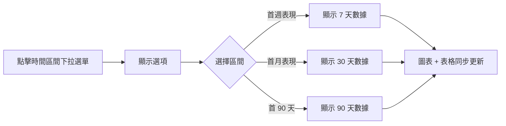
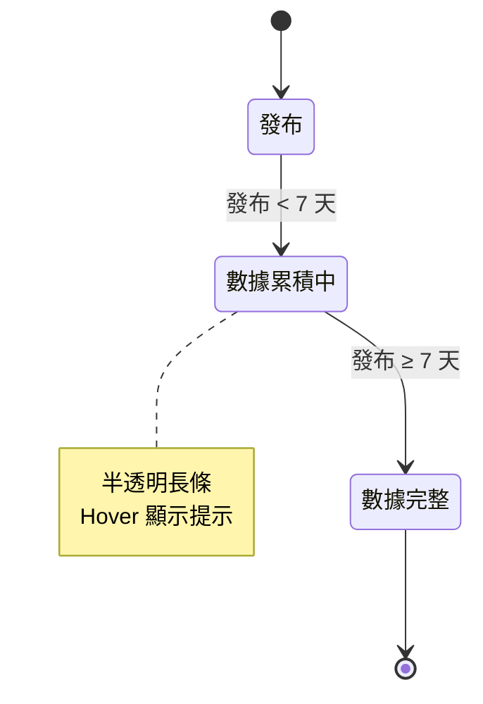

# Feature: 聽眾偏好 - 同期表現圖

**版本：** v1.3
**更新日期：** 2026-02-03
**狀態：** Draft

---

## 1. 概述

### 1.1 背景與目標

現有的 Episode Pacing 圖表尺度太細（每日），導致雜訊過多、難以解讀。創作者無法快速判斷哪些單集表現好、哪些題材受歡迎。

本功能將圖表改為「同期比較」模式，以發布後 7/30/90 天為標準化基準點，讓創作者能夠公平比較不同單集的表現，精準掌握熱門題材。

**參考資料：** [7-Day Downloads: What Are They And Why Do They Matter?](https://7-day-downloads-article)

### 1.2 目標用戶

處於「撞牆期」的專業創作者（醫師、顧問、知識型講師），他們：
- 有固定粉絲但流量卡關
- 需要數據洞察來優化內容策略
- 在意「完聽率」與「轉換率」等深度指標

### 1.3 成功指標

| 指標 | 目標 |
| --- | --- |
| 功能使用率 | > 60% 的活躍用戶使用過此圖表 |
| 時間區間切換率 | 用戶平均切換 > 1.5 次/session |
| 頁面停留時間 | 節目數據頁停留時間提升 20% |

### 1.4 策略對齊

| 檢核項 | 回答 |
| --- | --- |
| **ICP 階段** | 撞牆期（解決「數據盲區與成長迷航」痛點） |
| **NSM 貢獻** | SaaS Retention Rate（提供數據洞察增加平台黏著度） |
| **Roadmap 對應** | 2026 Q1 - SaaS 影音與數據整合 |
| **競品差異** | 競品僅提供累計下載數，無同期比較功能 |

### 1.5 優先級評估

| 維度 | 評分 (1-5) | 說明 |
| --- | --- | --- |
| **Reach** | 4 | 所有有節目數據頁的用戶 |
| **Impact** | 4 | 直接解決 ICP 核心痛點「數據盲區」 |
| **Confidence** | 4 | 有 Figma prototype 驗證 |
| **Effort** | 3 | 需前後端配合，中等複雜度 |

**RICE 分數：** (4 × 4 × 4) / 3 = **21.3**

---

## 2. 名詞定義

| 術語 | 定義 | 英文 |
| --- | --- | --- |
| 同期表現 | 以相同時間基準（發布後 X 天）比較不同單集的下載數 | Cohort Performance |
| 發布 X 天 | 從單集發布當下到第 X 天的數據總和 | X-Day Downloads |
| 數據累積中 | 單集發布時間不足所選時間區間，數據尚未完整 | Data Accumulating |

---

## 3. 驗收標準

### 3.1 User Stories (BDD)

**Feature: 聽眾偏好同期表現圖**
As a 撞牆期專業創作者,
I want to 比較各單集在相同時間基準點的下載表現,
So that 我能快速識別熱門題材並優化內容策略.

**Background:**
Given 用戶已登入 Firstory Studio
And 用戶擁有至少一個已發布單集的節目
And 用戶在節目數據頁

---

**Scenario: 查看同期表現圖表**
Given 用戶進入「單集表現」區塊
When 頁面載入完成
Then 用戶應該看到「聽眾偏好」圖表

> 📸 **示意圖：**
> - 流程類：直接用 Mermaid 語法
> - UI 標註：ASCII 簡圖或 Figma URL

```
┌─────────────────────────────────────────────────────────────┐
│  節目數據頁                                                  │
├─────────────────────────────────────────────────────────────┤
│  ┌─ 聽眾偏好 ─────────────────────────────────────────────┐ │
│  │  [下載數 ▼] [由新到舊 ▼] [首週表現 ▼]    🔍 搜尋單集   │ │
│  ├────────────────────────────────────────────────────────┤ │
│  │  🟣 Apple/其他 RSS  🟢 Spotify(即將推出)  —— 平均      │ │
│  │                                                        │ │
│  │   ▓▓▓   ▓▓▓   ▓▓▓   ░░░   ▓▓▓   ▓▓▓   ▓▓▓   ▓▓▓     │ │
│  │   ▓▓▓   ▓▓▓   ▓▓▓   ░░░   ▓▓▓   ▓▓▓   ▓▓▓   ▓▓▓     │ │
│  │   ▓▓▓   ▓▓▓   ▓▓▓   ░░░   ▓▓▓   ▓▓▓   ▓▓▓   ▓▓▓──── │ │
│  │   ▓▓▓   ▓▓▓   ▓▓▓   ░░░   ▓▓▓   ▓▓▓   ▓▓▓   ▓▓▓     │ │
│  │   EP8   EP7   EP6   EP5   EP4   EP3   EP2   EP1      │ │
│  │                      ↑                                 │ │
│  │              數據累積中（半透明）                        │ │
│  └────────────────────────────────────────────────────────┘ │
│                                          資料時區：UTC+0    │
└─────────────────────────────────────────────────────────────┘
```

---

**Scenario: 切換為首月表現**
Given 用戶正在查看圖表
And 目前時間區間為「首週表現」
When 用戶選擇「首月表現」
Then 圖表應該更新為各單集發布後 30 天的下載數總和
And 下方表格應該同步更新

> 📸 **示意圖：**
> - 流程類：直接用 Mermaid 語法
> - UI 標註：ASCII 簡圖或 Figma URL



---

**Scenario: 按下載數由高到低排序**
Given 用戶正在查看圖表
And 目前排序為「由新到舊」
When 用戶切換排序為「由高到低」
Then 圖表應該按下載數由高到低排列
And 下方表格應該同步排序

> 📸 **示意圖：**
> - 流程類：直接用 Mermaid 語法
> - UI 標註：ASCII 簡圖或 Figma URL


---

**Scenario: 瀏覽更早的單集**
Given 節目有超過 15 集
And 圖表目前顯示最新的 15 集
When 用戶瀏覽更早的單集
Then 應該顯示更早的單集資料
And 應該能夠返回較新的單集

> 📸 **示意圖：**
> - 流程類：直接用 Mermaid 語法
> - UI 標註：ASCII 簡圖或 Figma URL

```
┌────────────────────────────────────────────────────┐
│                                                    │
│  ◀  [EP16-EP30 的長條圖區域]                   ▶  │
│  ↑                                             ↑  │
│  點擊顯示                              點擊顯示  │
│  更早單集                              較新單集  │
│                                                    │
└────────────────────────────────────────────────────┘
* 單集數 ≤ 15 時不顯示箭頭
```

---

**Scenario: 顯示數據累積中的單集**
Given 時間區間為「首週表現」
And 某單集發布不到 7 天
When 用戶查看該單集
Then 該單集應該以半透明樣式顯示
And 提示應該顯示「數據累積中」

> 📸 **示意圖：**
> - 流程類：直接用 Mermaid 語法
> - UI 標註：ASCII 簡圖或 Figma URL



```
視覺呈現：
  ▓▓▓   ▓▓▓   ░░░   ← 半透明（數據累積中）
  ▓▓▓   ▓▓▓   ░░░
  ▓▓▓   ▓▓▓   ░░░
  EP3   EP2   EP1
              ↓
        ┌─────────────────────────┐
        │ 數據累積中               │
        │ （發布不到 7 天）        │
        └─────────────────────────┘
```

---

**Scenario: 查看單集詳細數據**
Given 用戶正在查看圖表
When 用戶查看某單集的詳細資訊
Then 應該顯示該單集的下載數據明細

> 📸 **示意圖：**
> - 流程類：直接用 Mermaid 語法
> - UI 標註：ASCII 簡圖或 Figma URL

```
Hover 長條時顯示 Tooltip：

        ┌──────────────────────────┐
        │ EP42: 為什麼你該開始投資 │
        ├──────────────────────────┤
        │ 🟣 Apple/RSS:    1,234   │
        │ 🟢 Spotify:      ---     │
        │ ─────────────────────    │
        │ 總計:            1,234   │
        └──────────────────────────┘
                 ↓
              ▓▓▓▓▓
              ▓▓▓▓▓
              ▓▓▓▓▓
               EP42
```

---

**Scenario: 前往單集分析頁**
Given 用戶正在查看表格
When 用戶選擇查看某單集的完整分析
Then 應該進入該單集的分析頁面

> 📸 **示意圖：**
> - 流程類：直接用 Mermaid 語法
> - UI 標註：ASCII 簡圖或 Figma URL


---

**Scenario: 搜尋特定單集**
Given 用戶正在查看表格
And 想找特定主題的單集
When 用戶搜尋關鍵字
Then 表格應該篩選出符合的單集
And 圖表應該同步更新

> 📸 **示意圖：**
> - 流程類：直接用 Mermaid 語法
> - UI 標註：ASCII 簡圖或 Figma URL


---

**Scenario: 切換為重複下載數**
Given 用戶正在查看圖表
And 目前顯示「下載數」
When 用戶切換為「重複下載數」
Then 圖表應該更新為重複下載數據
And 排序方式與時間區間應該維持不變

> 📸 **示意圖：**
> - 流程類：直接用 Mermaid 語法
> - UI 標註：ASCII 簡圖或 Figma URL


---

### 3.2 UI 注意事項

- Sticky 控制列往下滑時固定在頂端，同時控制圖表與表格
- 圖例位於圖表左上角：🟣 Apple/其他 RSS、🟢 Spotify（即將推出）、—— 平均
- 平均線計算方式：所有跑滿給定時間區間的單集之平均數
- 右下角顯示「資料時區：UTC+0」
- 表格使用現有單集列表元件，移除「Spotify 播放次數」欄位
- 數據累積中的單集在表格中以淺色斜體顯示
- **RWD 響應式設計**：手機版圖表與表格一次顯示 5 筆資料（桌面版 15 筆）

### 3.3 Edge Cases

| 情境 | 處理方式 |
| --- | --- |
| 節目無任何單集 | 顯示空狀態提示「尚無單集數據」 |
| 所有單集都發布不到 7 天 | 全部顯示為「數據累積中」，平均線不顯示 |
| 搜尋無結果 | 顯示「找不到符合的單集」 |
| 單集數量剛好 15 集 | 不顯示左右按鈕 |
| API 載入中 | 圖表區域顯示 Loading skeleton |
| API 錯誤 | 顯示錯誤提示，提供重試按鈕 |

---

## 4. i18n 對照表

### 標題與說明

| Key | 中文 | English | 日本語 | Bahasa Indonesia |
| --- | --- | --- | --- | --- |
| `profile.analytics.preference` | 聽眾偏好 | Audience Preference | リスナーの好み | Preferensi Pendengar |
| `profile.analytics.preference.description` | 比較單集同期表現，精準掌握熱門題材 | Compare episode performance over the same period | 同期間のエピソードパフォーマンスを比較 | Bandingkan performa episode dalam periode yang sama |

### 控制項

| Key | 中文 | English | 日本語 | Bahasa Indonesia |
| --- | --- | --- | --- | --- |
| `profile.analytics.downloads` | 下載數 | Downloads | ダウンロード数 | Unduhan |
| `profile.analytics.unique.downloads` | 重複下載數 | Unique Downloads | ユニークダウンロード数 | Unduhan Unik |
| `profile.analytics.new.to.old` | 由新到舊 | Newest First | 新しい順 | Terbaru |
| `profile.analytics.high.to.low` | 由高到低 | Highest First | 高い順 | Tertinggi |
| `profile.analytics.publish.7` | 首週表現 | First Week | 初週パフォーマンス | Performa Minggu Pertama |
| `profile.analytics.publish.30` | 首月表現 | First Month | 初月パフォーマンス | Performa Bulan Pertama |
| `profile.analytics.publish.90` | 首 90 天表現 | First 90 Days | 初90日パフォーマンス | Performa 90 Hari Pertama |

### 圖例與 Tooltip

| Key | 中文 | English | 日本語 | Bahasa Indonesia |
| --- | --- | --- | --- | --- |
| `profile.analytics.apple` | Apple / 其他 RSS | Apple / Other RSS | Apple / その他RSS | Apple / RSS Lainnya |
| `profile.analytics.spotify` | Spotify（即將推出） | Spotify (Coming Soon) | Spotify（近日公開） | Spotify (Segera Hadir) |
| `profile.analytics.average` | 平均 | Average | 平均 | Rata-rata |
| `profile.analytics.total` | 總計 | Total | 合計 | Total |
| `profile.analytics.accumulated` | 數據累積中（發布不到 {number} 天） | Data accumulating (less than {number} days since publish) | データ収集中（公開後{number}日未満） | Data sedang dikumpulkan (kurang dari {number} hari) |

### 表格與搜尋

| Key | 中文 | English | 日本語 | Bahasa Indonesia |
| --- | --- | --- | --- | --- |
| `profile.analytics.search.placeholder` | 搜尋單集 | Search episodes | エピソードを検索 | Cari episode |
| `profile.analytics.episode.title` | 單集標題 | Episode Title | エピソードタイトル | Judul Episode |
| `profile.analytics.publish.date` | 發布日期 | Publish Date | 公開日 | Tanggal Publikasi |

### 狀態提示

| Key | 中文 | English | 日本語 | Bahasa Indonesia |
| --- | --- | --- | --- | --- |
| `profile.analytics.empty` | 尚無單集數據 | No episode data yet | エピソードデータがありません | Belum ada data episode |
| `profile.analytics.no.results` | 找不到符合的單集 | No matching episodes found | 該当するエピソードが見つかりません | Tidak ditemukan episode yang cocok |
| `profile.analytics.loading` | 載入中... | Loading... | 読み込み中... | Memuat... |
| `profile.analytics.error` | 發生錯誤，請重試 | An error occurred, please try again | エラーが発生しました。再試行してください | Terjadi kesalahan, silakan coba lagi |
| `profile.analytics.retry` | 重試 | Retry | 再試行 | Coba Lagi |

### 其他

| Key | 中文 | English | 日本語 | Bahasa Indonesia |
| --- | --- | --- | --- | --- |
| `profile.analytics.timezone` | 資料時區：UTC+0 | Data timezone: UTC+0 | データタイムゾーン：UTC+0 | Zona waktu data: UTC+0 |

**命名規則：** `profile.analytics.{element}`

---

## 5. 設計系統

> 完整規範見 `design-system/audience-preference-chart/MASTER.md`

### 5.1 風格與色彩

| 項目 | 值 |
| --- | --- |
| **Pattern** | Dashboard Analytics |
| **Style** | Clean SaaS - 乾淨、專業、數據導向 |
| **Primary** | `#1E40AF` (Deep Blue - 主要數據色) |
| **Secondary** | `#3B82F6` (Blue - 輔助色) |
| **CTA** | `#F59E0B` (Amber - 強調/警示) |
| **Background** | `#F8FAFC` (Slate 50 - 淺灰底) |
| **Text** | `#1E3A8A` (Blue 900 - 深藍文字) |

**圖表專用色：**
| 用途 | 色值 | 說明 |
| --- | --- | --- |
| Apple/RSS 長條 | `#8B5CF6` (Violet 500) | 紫色系，辨識度高 |
| Spotify 長條 | `#22C55E` (Green 500) | 綠色系，Spotify 品牌色 |
| 平均線 | `#64748B` (Slate 500) | 中性灰，不搶焦 |
| 數據累積中 | 上述色彩 + `opacity: 0.4` | 半透明表示未完整 |

### 5.2 字型

| 用途 | 字型 | 特性 |
| --- | --- | --- |
| Heading | Fira Code | 數據感、技術感、精確 |
| Body | Fira Sans | 清晰、易讀、現代 |

**Google Fonts Import:**
```css
@import url('https://fonts.googleapis.com/css2?family=Fira+Code:wght@400;500;600;700&family=Fira+Sans:wght@300;400;500;600;700&display=swap');
```

### 5.3 關鍵效果與避免事項

**採用：**
- `transition: all 200ms ease` - 所有互動狀態平滑過渡
- `box-shadow: 0 4px 6px rgba(0,0,0,0.1)` - 卡片微浮起效果
- `border-radius: 8px` - 統一圓角
- Hover 長條高亮：`filter: brightness(1.1)`
- Tooltip：白底 + 陰影 + 8px 圓角

**避免（Anti-patterns）：**
- ❌ Emoji 作為 icon（使用 Heroicons/Lucide SVG）
- ❌ 缺少 `cursor-pointer` 在可點擊元素
- ❌ 瞬間狀態切換（需有 transition）
- ❌ 複雜圖表動畫（數據圖表保持簡潔）
- ❌ 過度裝飾（數據頁面以清晰為優先）

### 5.4 Pre-Delivery Checklist

**視覺品質：**
- [ ] 無 emoji 作為 icon（使用 Heroicons/Lucide/Simple Icons）
- [ ] 所有 icon 來自同一套 icon set
- [ ] Hover 不造成 layout shift
- [ ] 使用 theme colors 直接引用（`bg-primary`、`text-secondary`）
- [ ] 長條圖顏色與圖例一致

**互動：**
- [ ] 所有可點擊元素有 `cursor-pointer`
- [ ] Hover states 有明確視覺回饋
- [ ] Transitions 流暢（150-300ms）
- [ ] Focus states 可見（keyboard navigation）
- [ ] Dropdown 展開/收合有動畫

**Light/Dark Mode：**
- [ ] Light mode 文字對比度 ≥ 4.5:1
- [ ] 半透明長條在 light mode 清晰可辨
- [ ] Borders 在兩種模式都可見
- [ ] 交付前測試兩種模式

**Layout：**
- [ ] Sticky 控制列不遮擋內容
- [ ] 無內容被 fixed navbar 遮擋
- [ ] 響應式：375px / 768px / 1024px / 1440px
- [ ] 無水平捲動（mobile）
- [ ] 圖表在小螢幕可橫向滑動

**Accessibility：**
- [ ] 所有圖表有 aria-label 描述
- [ ] Form inputs 有 labels
- [ ] 顏色不是唯一指示器（搭配圖案或文字）
- [ ] `prefers-reduced-motion` respected

### 5.5 Figma Make Prompt

> **功能描述：**
> 設計一個「聽眾偏好」數據圖表，讓 Podcast 創作者比較各單集在發布後 7/30/90 天的同期下載表現。圖表為長條圖，橫軸為單集，縱軸為下載數。上方有 Sticky 控制列包含排序切換和時間區間下拉選單。下方有同步的單集表格。
>
> **設計系統：**
> - Primary: #1E40AF (Deep Blue)
> - Secondary: #3B82F6 (Blue)
> - Accent: #F59E0B (Amber)
> - Background: #F8FAFC (Slate 50)
> - 長條色：#8B5CF6 (Violet) / #22C55E (Green)
> - 字型：Fira Code (heading) + Fira Sans (body)
> - 圓角：8px
> - 陰影：0 4px 6px rgba(0,0,0,0.1)
>
> **技術規格：**
> - 使用 Tailwind CSS
> - 風格：Clean SaaS Dashboard
>
> **互動狀態：**
> - Default：顯示最新 15 集的首週表現
> - Hover：長條 brightness(1.1)，顯示 Tooltip
> - Loading：Skeleton 載入狀態
> - Empty：無單集時的空狀態
> - Partial：數據累積中的單集顯示 opacity: 0.4
>
> **主要文案：**
> - 標題：聽眾偏好
> - 副標：比較單集同期表現，精準掌握熱門題材
> - 控制項：由新到舊、由高到低、首週表現/首月表現/首 90 天表現
> - 圖例：Apple/其他 RSS、Spotify（即將推出）、平均

**Prototype 參考：** https://www.figma.com/make/VXcx1C1wfd4TraY1aojbTk/

---

## 6. 依賴關係

| 依賴項目 | 類型 | 狀態 | 負責人 |
| --- | --- | --- | --- |
| 單集 7/30/90 天下載數 API | API | 待確認 | Backend |
| 現有單集列表元件 | 功能 | 完成 | - |
| Spotify 數據整合 | 功能 | 待處理（標示「即將推出」） | - |

---

## 7. 開放問題

- [ ] 標題 + 下載報表按鈕何時排入？
- [ ] Spotify 數據整合的預計時程？
- [ ] 是否需要支援匯出圖表功能？

---

## 變更紀錄

| 版本 | 日期 | 變更內容 |
| --- | --- | --- |
| v1.0 | 2026-01-30 | 初版 |
| v1.1 | 2026-02-02 | 每個 Scenario 新增示意圖欄位，方便前端理解操作流程 |
| v1.2 | 2026-02-02 | 示意圖改用混合策略：Mermaid flowchart/stateDiagram 用於流程與狀態、ASCII 簡圖用於 UI 標註，提升 PRD 自動生成效率 |
| v1.3 | 2026-02-03 | 新增 §5 設計系統：色彩規範、字型、圖表專用色、Pre-Delivery Checklist、Figma Make Prompt |
