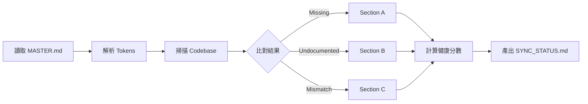
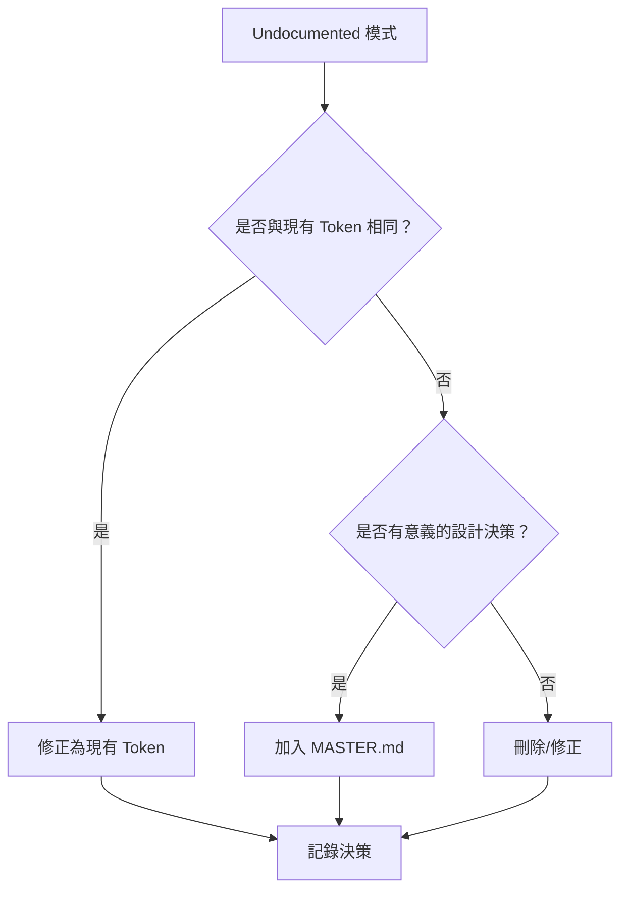
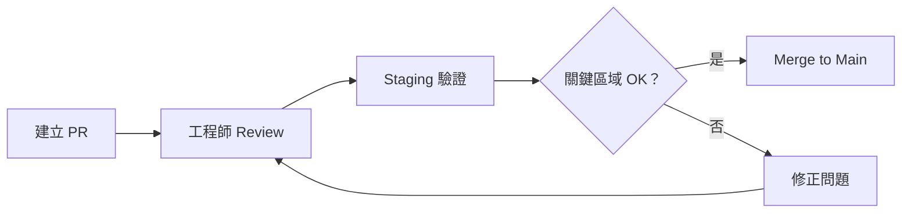
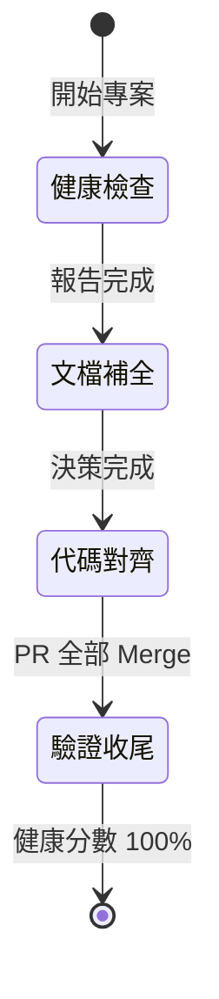

# Feature: Design System Alignment（設計系統對齊）

**版本：** v1.2
**建立日期：** 2026-02-04
**狀態：** Draft

---

## 1. 概述

### 1.1 背景與目標

Firstory Studio 隨著功能迭代，UI 樣式逐漸出現不一致的情況：硬編碼顏色、非標準間距、組件樣式偏離規範等。這些「設計債」不僅影響用戶體驗的一致性，也增加了後續開發的維護成本。

本專案是一次性的「設計系統對齊」工作，目標是將 Firstory Studio 程式碼與 `MASTER.md` 設計規範完全同步：

1. **掃描程式碼** — 找出與 MASTER.md 規範不一致的地方
2. **修正代碼** — 將不符合規範的樣式修正為 MASTER.md 定義的值
3. **補全文檔** — 將代碼中已存在但 MASTER.md 未定義的模式，討論後補進設計系統

### 1.2 目標用戶

| 角色 | 關係 |
| --- | --- |
| **最終用戶（創作者）** | 主要受益者 — UI 一致性提升信任感與使用體驗 |
| **工程師** | 執行者 — 配合修正程式碼，Review PR |
| **PM (Jeremy)** | 決策者 — 審核 Undocumented 模式的處理決策 |

### 1.3 成功指標

| 指標 | 目標 | 優先級 |
| --- | --- | --- |
| 設計系統健康分數 | 100%（所有 tokens 對齊） | **P0** |
| 組件文檔覆蓋率 | 100%（所有 shadcn 組件有規範） | P1 |
| 硬編碼樣式數量 | 0（全部使用 CSS variables 或 Tailwind classes） | P1 |

### 1.4 策略對齊

| 檢核項 | 回答 |
| --- | --- |
| **ICP 階段** | 內部基礎建設（間接支援撞牆期專業創作者） |
| **NSM 貢獻** | 間接：UI 一致性 → 用戶信任感 → 轉化率 (Efficiency) / 留存率 (Frequency) |
| **Roadmap 對應** | 支援 SaaS 產品線的設計基礎，配合 2026 Q1-Q2 功能開發 |
| **競品差異** | N/A（內部基建） |

### 1.5 優先級評估 (RICE)

| 維度 | 評分 (1-5) | 說明 |
| --- | --- | --- |
| **Reach** | 5 | 影響所有 Studio 用戶（100% MAU） |
| **Impact** | 3 | 中度影響 — 間接提升信任感與轉化 |
| **Confidence** | 4 | 高確信 — 範圍明確，可量化驗證 |
| **Effort** | 3 | 中等工時 — 需工程師配合，按類別分批執行 |

**RICE Score:** (5 × 3 × 4) / 3 = **20**

---

## 2. 名詞定義

| 名詞 | 定義 |
| --- | --- |
| **MASTER.md** | 設計系統規範文件，位於 `design-system/MASTER.md`，定義所有 Design Tokens 與組件規格 |
| **Design Token** | 設計系統的原子單位，如顏色、間距、圓角等，以 CSS Variables 或 Tailwind classes 形式存在 |
| **健康分數** | 代碼與 MASTER.md 的對齊程度，計算公式：`(對齊項目數 / 總項目數) × 100%` |
| **Undocumented 模式** | 代碼中存在但 MASTER.md 未定義的樣式模式 |
| **硬編碼樣式** | 直接寫死的值（如 `#F06A6A`），而非使用 token（如 `var(--color-primary-500)`） |
| **ds-ignore** | 特殊註解 `/* ds-ignore */`，標記該行可忽略掃描 |
| **關鍵保護區域** | 修改時需特別注意的重要頁面/流程 |

---

## 3. 範圍定義

### 3.1 包含範圍 (In Scope)

| 項目 | 說明 |
| --- | --- |
| **目標 Codebase** | Firstory Studio（創作者後台） |
| **掃描檔案** | `tailwind.config.*`、`globals.css`、`components/ui/**/*`、`app/**/*` |
| **對齊項目** | Colors、Typography、Spacing、Border Radius、Shadows、Components |

### 3.2 排除範圍 (Out of Scope)

| 項目 | 原因 |
| --- | --- |
| 第三方整合樣式 | Stripe、OAuth 按鈕等由第三方控制 |
| 已棄用舊頁面 | 計劃移除，不值得投入修正 |
| 行銷 Landing Page | 獨立於 Studio，可能有不同設計需求 |
| 自動化 CLI 工具 | 列為後續獨立專案 |

### 3.3 關鍵保護區域

以下頁面/流程在修改時需**優先確保不出問題**：

1. **付費流程** — 直接影響營收
2. **上傳流程** — 核心功能
3. **登入頁面** — 第一印象
4. **Dashboard** — 高頻使用

---

## 4. 專案階段與驗收標準 (BDD)

### Feature: Design System Alignment

```
As a Firstory Studio 用戶
I want to 體驗一致的 UI 介面
So that 我能更信任平台，專注於內容創作
```

---

### Phase 1: 健康檢查（報告生成）

**Background:**
```gherkin
Given MASTER.md v1.1.0 已存在於 design-system/MASTER.md
And 目標 codebase 路徑已確認
And 掃描規則已定義於 SCAN_RULES.md
```

#### Scenario 1.1: 成功生成差異報告

```gherkin
Given 我有 Firstory Studio codebase 的讀取權限
When 執行健康檢查掃描
Then 應該產出 SYNC_STATUS.md 包含以下區塊：
  | 區塊 | 說明 |
  | A. Missing in Code | MASTER.md 有但代碼沒有 |
  | B. Undocumented | 代碼有但 MASTER.md 沒有 |
  | C. Mismatch | 數值不一致 |
  | D. Component Coverage | 組件覆蓋狀態 |
  | E. Anti-Pattern Detection | 反模式檢測 |
  | F. Health Score | 健康分數 |
And 應該產出 TOKEN_REGISTRY.md 包含所有 MASTER.md tokens
And 應該產出 design-system.html 視覺化 Gallery 包含：
  | 內容 |
  | Token 視覺化（色票、字型樣本、間距示意） |
  | 組件預覽（各組件變體與狀態，以純 HTML/CSS 重現） |
  | 暗色/亮色模式切換 |
And 被 ds-ignore 標記的項目應該列在報告附錄
```

> **示意圖：掃描流程**


#### Scenario 1.2: 發現 MASTER.md 內部矛盾

```gherkin
Given MASTER.md Section 1 定義了某 token
But Section 6 CSS Variables 漏掉該 token
When 執行健康檢查掃描
Then 應該在報告中標記此矛盾
And 列入 Phase 2 待處理清單
And 不應該中斷掃描流程
```

---

### Phase 2: 文檔補全（討論與決策）

**Background:**
```gherkin
Given Phase 1 SYNC_STATUS.md 已產出
And PM 已 review 完整報告
```

#### Scenario 2.1: 處理 Undocumented 模式 — 修正為現有 Token

```gherkin
Given 報告中有 Undocumented 硬編碼顏色 "#F06A6A"
And 該值與 MASTER.md "--color-primary-500" 相同
When PM 決策處理方式
Then 預設建議應該是「修正為現有 Token」
And 記錄決策於 SYNC_STATUS.md Section G
```

#### Scenario 2.2: 處理 Undocumented 模式 — 加入 MASTER.md

```gherkin
Given 報告中有 Undocumented 顏色 "#8B5CF6"
And 該值在 MASTER.md 中不存在
And PM 判斷這是有意義的設計決策（如 accent color）
When PM 決策「加入 MASTER.md」
Then 應該更新 MASTER.md 新增該 token
And 記錄決策於 SYNC_STATUS.md Section G
```

#### Scenario 2.3: 處理 MASTER.md 內部矛盾

```gherkin
Given Phase 1 發現 MASTER.md 有內部矛盾
When PM review 矛盾項目
Then 應該修正 MASTER.md 確保一致性
And 以 Section 6 CSS Variables 為最終參考標準
```

> **示意圖：決策流程**


---

### Phase 3: 代碼對齊（修正執行）

**Background:**
```gherkin
Given Phase 2 所有決策已完成
And MASTER.md 已更新（如有需要）
And 工程師已準備好協作
```

#### Scenario 3.1: 按類別分批修正 — Colors

```gherkin
Given 報告中有 15 個顏色相關問題
When 執行 Colors 類別修正
Then 應該建立獨立 PR "fix: align color tokens with design system"
And PR 應該包含：
  | 修正項目 |
  | tailwind.config 的 colors 設定 |
  | globals.css 的 color variables |
  | 組件中的硬編碼顏色 |
And PR 需要工程師 review
And PR merge 前需在 staging 環境驗證
And 關鍵保護區域（付費、上傳、登入、Dashboard）需視覺走查
```

#### Scenario 3.2: 按類別分批修正 — Typography

```gherkin
Given 報告中有 Typography 相關問題
When 執行 Typography 類別修正
Then 應該建立獨立 PR "fix: align typography tokens with design system"
And 修正內容包含 font-size、line-height、font-weight、font-family
```

#### Scenario 3.3: 按類別分批修正 — Spacing & Layout

```gherkin
Given 報告中有 Spacing 相關問題
When 執行 Spacing 類別修正
Then 應該建立獨立 PR "fix: align spacing tokens with design system"
And 所有間距應該是 4px 的倍數
```

#### Scenario 3.4: 按類別分批修正 — Components

```gherkin
Given 報告中有組件樣式問題
And shadcn/ui 預設樣式與 MASTER.md 衝突
When 執行 Components 類別修正
Then MASTER.md 規範應該優先於 shadcn 預設
And 應該建立獨立 PR "fix: align component styles with design system"
```

> **示意圖：PR 流程**


---

### Phase 4: 驗證與收尾

**Background:**
```gherkin
Given Phase 3 所有 PR 已 merge
```

#### Scenario 4.1: 重新執行健康檢查

```gherkin
When 重新執行健康檢查掃描
Then 健康分數應該 = 100%
And Section A (Missing in Code) 應該為空
And Section B (Undocumented) 應該為空
And Section C (Mismatch) 應該為空
```

#### Scenario 4.2: 更新 Gallery 反映修正結果

```gherkin
Given Phase 2 已完成決策（可能新增 tokens 到 MASTER.md）
And Phase 3 已完成所有代碼修正
When Phase 4 開始
Then 應該更新 design-system.html 反映：
  | 更新項目 |
  | Phase 2 新增到 MASTER.md 的 tokens（如有） |
  | Phase 3 修正後的組件樣式 |
And Gallery 應該與最新 MASTER.md 完全一致
And 使用暗色/亮色模式切換驗證兩種模式下的呈現
```

#### Scenario 4.3: 產出維護文件

```gherkin
When Phase 4 完成
Then 應該產出 MAINTENANCE.md 包含：
  | 內容 |
  | 新增/修改組件時的檢查清單 |
  | 如何保持設計系統同步 |
  | ds-ignore 使用時機 |
And 應該產出 CHANGELOG.md 記錄本次所有變更
```

#### Scenario 4.4: 更新 SYNC_STATUS.md 最終狀態

```gherkin
When 所有驗證通過
Then SYNC_STATUS.md 應該更新：
  | 欄位 | 值 |
  | 狀態 | Completed |
  | 完成日期 | {當天日期} |
  | 最終健康分數 | 100% |
```

> **示意圖：Phase 狀態機**


---

## 5. i18n 對照表

> 本專案為內部基礎建設，無面向用戶的文案，故不適用 i18n。

---

## 6. Figma / UI 參考

> 本專案不涉及新 UI 設計，以 `MASTER.md` 為唯一設計規範來源。

**關鍵參考文件：**
- `design-system/MASTER.md` — 設計系統規範 v1.1.0
- `design-system/TOKEN_REGISTRY.md` — Token 清單（本專案產出）
- `design-system/SCAN_RULES.md` — 掃描規則定義

---

## 7. 依賴關係

### 7.1 前置依賴

| 依賴項 | 狀態 | 負責人 |
| --- | --- | --- |
| MASTER.md v1.1.0 | ✅ 已存在 | PM |
| Firstory Studio codebase 路徑 | ⏳ 待確認 | 工程師 |
| Codebase 讀寫權限 | ⏳ 待確認 | 工程師 |
| 技術棧確認（Next.js 版本等） | ⏳ 待補充 | 工程師 |

### 7.2 執行依賴

| Phase | 依賴 |
| --- | --- |
| Phase 1 | Codebase 路徑 |
| Phase 2 | Phase 1 完成 + PM 決策時間 |
| Phase 3 | Phase 2 完成 + 工程師協作時間 |
| Phase 4 | Phase 3 所有 PR merge |

### 7.3 人力需求

| 角色 | 投入 |
| --- | --- |
| PM | Phase 2 決策 review、Phase 4 驗收 |
| 工程師 | 提供 codebase 路徑、Review PR、Staging 驗證 |
| Claude | Phase 1 掃描、Phase 3 修正、文件產出 |

---

## 8. 交付物清單

| 檔案 | 說明 | Phase |
| --- | --- | --- |
| `design-system/TOKEN_REGISTRY.md` | 從 MASTER.md 提取的結構化 token 清單 | 1 |
| `design-system/SYNC_STATUS.md` | 差異報告（含最終狀態） | 1, 4 |
| `design-system/design-system.html` | 視覺化 Gallery（Token + 組件預覽） | 1, 4 |
| `design-system/MASTER.md` | 更新後的設計規範（如有補全） | 2 |
| `design-system/MAINTENANCE.md` | 維護指南 | 4 |
| `design-system/CHANGELOG.md` | 變更紀錄 | 4 |
| PR: Colors | 顏色相關修正 | 3 |
| PR: Typography | 字體相關修正 | 3 |
| PR: Spacing | 間距相關修正 | 3 |
| PR: Components | 組件樣式修正 | 3 |

---

## 9. 長期維護策略

### 9.1 設計規範存放位置

專案完成後，`design-system/` 資料夾應遷移至 **Firstory Studio codebase**，與代碼同 repo 管理：

```
firstory-studio/
├── docs/
│   └── design-system/
│       ├── MASTER.md           ← 設計規範（Single Source of Truth）
│       ├── TOKEN_REGISTRY.md   ← Token 清單
│       ├── SYNC_STATUS.md      ← 健康檢查報告
│       ├── SCAN_RULES.md       ← 掃描規則
│       ├── MAINTENANCE.md      ← 維護指南
│       └── CHANGELOG.md        ← 變更紀錄
├── src/
│   ├── components/
│   └── styles/
└── ...
```

### 9.2 同步流程

```
PM 更新 MASTER.md → Push to GitHub → 工程師 Pull → 執行對齊 → PR 修正代碼 → Review → Merge
```

**優點：**
- 代碼與文檔同 repo，PR 可同時修改規範和實作
- 版本控制、變更歷史清晰
- 工程師熟悉的協作方式

### 9.3 維護責任

| 角色 | 責任 |
| --- | --- |
| **PM** | 維護 MASTER.md 規範內容、審核新增 tokens |
| **工程師** | 維護 repo 結構、執行健康檢查、確保代碼對齊 |
| **共同** | Review 涉及設計系統的 PR |

### 9.4 Gallery 同步維護

> ⚠️ **重要：** `design-system.html` 使用純 HTML/CSS 重現組件外觀，與 React 組件是**兩套實作**。當 React 組件樣式變更時，需手動同步更新 Gallery。

**觸發同步的情境：**
| 變更類型 | 是否需同步 Gallery |
| --- | --- |
| 新增/修改 Design Token | ✅ 是 |
| 修改組件樣式（顏色、間距、圓角等） | ✅ 是 |
| 新增組件變體（如 Button 新增 size） | ✅ 是 |
| 組件內部邏輯變更（不影響外觀） | ❌ 否 |

**同步流程：**
```
React 組件 PR 合併 → 檢查是否影響外觀 → 若是 → 更新 design-system.html → 同一 PR 或 follow-up PR
```

**檢核點：**
- PR Review 時確認：若涉及 `components/ui/**` 樣式變更，Gallery 是否已同步更新

### 9.5 變更流程

1. **新增 Token**：PM 先更新 MASTER.md → 工程師實作 → 更新 Gallery → 同一 PR 完成
2. **修改現有 Token**：評估影響範圍 → 更新 MASTER.md + 修正所有引用 + 同步 Gallery → 視覺走查
3. **組件規範變更**：更新 MASTER.md Section 2 → 修正 shadcn 組件 → 同步 Gallery → 驗證所有變體

---

## 10. 風險與緩解

| 風險 | 影響 | 機率 | 緩解措施 |
| --- | --- | --- | --- |
| CSS 修改造成非預期 UI 變化 | High | Medium | PR review + staging 驗證 + 關鍵區域視覺走查 |
| 工程師時間不足 | Medium | Medium | 按類別分批 PR，降低單次 review 負擔 |
| MASTER.md 規範不完整 | Medium | Low | Phase 2 補全機制 |
| shadcn 升級導致樣式衝突 | Medium | Low | MASTER.md 優先策略，記錄覆寫邏輯 |

---

## 11. 開放問題

| # | 問題 | 狀態 | 決策 |
| --- | --- | --- | --- |
| 1 | Firstory Studio codebase 完整路徑？ | ⏳ 待工程師確認 |  |
| 2 | 技術棧細節（Next.js 版本、是否有 CSS-in-JS）？ | ⏳ 待補充 |  |
| 3 | 是否需要在 feature branch 執行修正？ | ⏳ 待確認 |  |
| 4 | Staging 環境是否已就緒？ | ⏳ 待確認 |  |

---

## 變更紀錄

| 版本 | 日期 | 變更內容 | 作者 |
| --- | --- | --- | --- |
| v1.0 | 2026-02-04 | 初版建立 | PM |
| v1.1 | 2026-02-04 | 新增 Section 9 長期維護策略、附錄 C Gallery 功能、日常工作流程 | PM |
| v1.2 | 2026-02-05 | Gallery 基礎版納入本次範圍（Phase 1, 4 產出）、新增 Section 9.4 Gallery 同步維護策略、Phase 4 新增 Scenario 4.2 更新 Gallery（含 Phase 2 新增 tokens 銜接） | PM |

---

## 附錄 A: 掃描規則摘要

### 掃描目標檔案

```
tailwind.config.{js,ts,mjs}  → Tailwind 設定
globals.css / styles/*.css   → CSS Variables
components/ui/**/*.tsx       → shadcn 組件
app/**/*.tsx                 → 頁面組件
```

### 違規模式 (Regex)

| 類型 | Pattern |
| --- | --- |
| 硬編碼顏色 | `#[A-Fa-f0-9]{3,8}` |
| 非標準間距 | 非 4px 倍數的 px/rem 值 |
| 非標準圓角 | 非 0/4/8/12/16/9999 的 px 值 |
| 非標準字體大小 | 非 12/14/16/18/20/24/30/36 的 px 值 |

### 忽略規則

```tsx
// 行級忽略
const color = "#123456"; /* ds-ignore */

// 區塊忽略
/* ds-ignore-start */
const thirdPartyColors = { ... };
/* ds-ignore-end */
```

---

## 附錄 B: PR 類別與命名

| 類別 | PR Title | 包含內容 |
| --- | --- | --- |
| Colors | `fix: align color tokens with design system` | tailwind colors、CSS variables、硬編碼顏色 |
| Typography | `fix: align typography tokens with design system` | font-size、line-height、font-weight、font-family |
| Spacing | `fix: align spacing tokens with design system` | margin、padding、gap |
| Border Radius | `fix: align border-radius tokens with design system` | 圓角值 |
| Shadows | `fix: align shadow tokens with design system` | box-shadow |
| Components | `fix: align component styles with design system` | shadcn 組件樣式 |

---

## 附錄 C: 後續獨立專案（備忘）

> 本次專案完成後，可考慮將流程自動化為持續使用的工具

**建議工具結構：**
```
~/.claude/skills/design-sync/
├── SKILL.md
├── references/
│   ├── parser-guide.md
│   └── scanner-guide.md
└── templates/
    └── sync-status.md
```

**建議指令：**
| 指令 | 說明 |
| --- | --- |
| `/ds-sync-check` | 健康檢查，輸出 SYNC_STATUS |
| `/ds-sync-enforce` | 自動修正不符規範的代碼 |
| `/ds-sync-harvest` | 掃描組件，補全文檔 |
| `/ds-sync-guard` | Pre-commit 檢查 |
| `/ds-sync-gallery` | 重新生成視覺化 Gallery |

**Gallery 功能（進階迭代）：**

基礎版 Gallery 已納入本次範圍（Phase 1 產出），以下為後續可迭代的進階功能：

| 功能 | 本次範圍 | 後續迭代 |
| --- | --- | --- |
| Token 視覺化（色票、字型、間距） | ✅ 已包含 | — |
| 組件預覽（純 HTML/CSS 重現） | ✅ 已包含 | — |
| 暗色/亮色模式切換 | ✅ 已包含 | — |
| 複製程式碼按鈕 | — | ⏳ 後續 |
| 搜尋/篩選功能 | — | ⏳ 後續 |
| 自動從 React 組件生成預覽 | — | ⏳ 後續（需 build 流程） |

**日常工作流程：**

設計系統對齊完成後，團隊應遵循以下工作流程，確保 MASTER.md 為 Single Source of Truth：

```
┌─────────────────────────────────────────────────────────────────────────┐
│                        新功能開發流程                                    │
├─────────────────────────────────────────────────────────────────────────┤
│                                                                         │
│  ┌─────────┐    ┌─────────────┐    ┌─────────────┐    ┌─────────────┐  │
│  │ PM 設計 │ → │ 工程師實作  │ → │ 合規檢查    │ → │   結果      │  │
│  └─────────┘    └─────────────┘    └─────────────┘    └─────────────┘  │
│       │               │                  │                  │          │
│       ▼               ▼                  ▼                  ▼          │
│  依據 MASTER.md   依據 MASTER.md    100% 符合？      ┌─────────────┐  │
│  定義 UI 規格     實作功能               │           │  ✓ 符合     │  │
│                                          │           │  → 完成     │  │
│                                          │           ├─────────────┤  │
│                                          │           │  ✗ 不符合   │  │
│                                          │           │  → 變更流程 │  │
│                                          │           └─────────────┘  │
│                                          │                  │          │
│                                          ▼                  ▼          │
│                                   ┌─────────────────────────────┐      │
│                                   │        變更流程             │      │
│                                   │  1. 評估是否為設計意圖      │      │
│                                   │  2. 若是 → 更新 MASTER.md   │      │
│                                   │  3. 若否 → 修正代碼         │      │
│                                   └─────────────────────────────┘      │
│                                                                         │
└─────────────────────────────────────────────────────────────────────────┘
```

| 階段 | 負責人 | 檢核點 |
| --- | --- | --- |
| **設計階段** | PM | 所有 UI 規格必須引用 MASTER.md tokens，不可自創樣式值 |
| **實作階段** | 工程師 | 使用 CSS variables / Tailwind classes，禁止硬編碼 |
| **Review 階段** | 工程師 + PM | PR 檢查是否 100% 符合 MASTER.md |
| **驗收階段** | PM | 視覺走查，確認實作與規範一致 |

**原則：**

1. **MASTER.md 是唯一真相** — 任何 UI 決策都必須能在 MASTER.md 找到依據
2. **100% 合規是底線** — 不存在「差不多」或「先這樣之後再改」
3. **變更流程是例外** — 只有當新設計確實需要新 token 時，才走變更流程更新 MASTER.md
4. **先更新文檔再實作** — 若需新增 token，必須先更新 MASTER.md，再進行代碼實作

---

*— Design System Alignment PRD v1.2 —*
