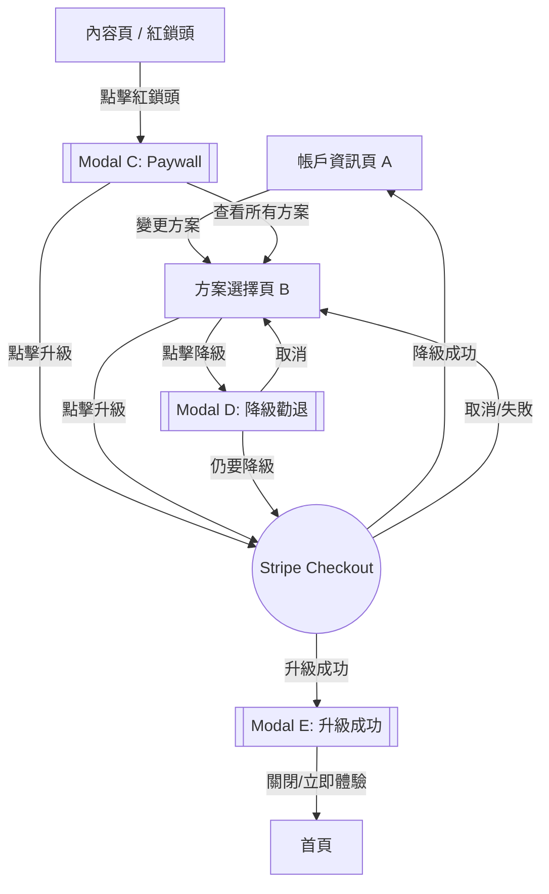
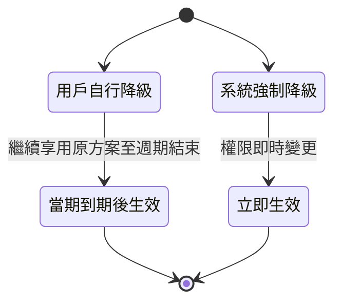
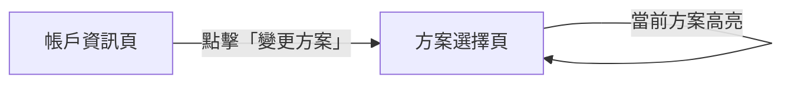
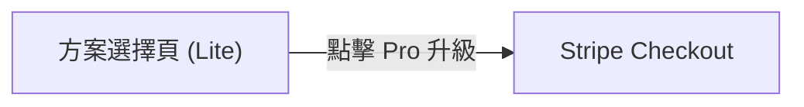
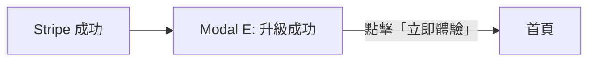
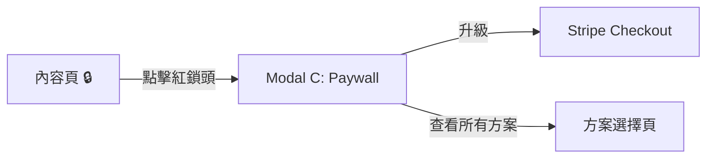
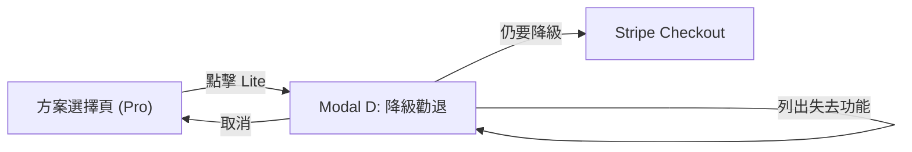
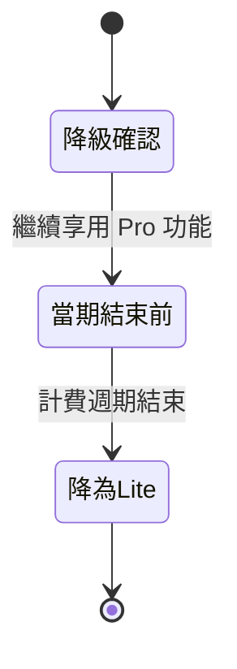

# Feature: SaaS 方案升降級流程重設計

**版本：** v1.0
**更新日期：** 2026-02-09
**狀態：** Draft

---

## 1. 概述

### 1.1 背景與目標

現有升降級流程 UX 不佳，導致升級轉化率偏低、降級時缺乏挽留機制。本次重設計 5 個核心元件，建立完整的升降級體驗，涵蓋兩個觸發入口（帳戶頁 & 紅鎖頭 Paywall）。

### 1.2 目標用戶

處於「撞牆期」的專業創作者（醫師、顧問、知識型講師），已使用 Firstory 但受限於當前方案功能。

### 1.3 成功指標

| 指標 | 當前 | 目標 |
|------|------|------|
| 升級轉化率（方案選擇頁 → Stripe 完成） | TBD | 提升 20%+ |
| 降級挽留率（勸退 Modal → 取消降級） | N/A | > 30% |
| Paywall 升級轉化率（紅鎖頭 → 完成付費） | TBD | TBD |

### 1.4 策略對齊

| 檢核項 | 回答 |
|--------|------|
| **ICP 階段** | 撞牆期專業創作者 |
| **NSM 貢獻** | SaaS 轉化率 (Conversion Rate) + ARPPU |
| **Roadmap 對應** | 2026 Q4 - 升降級 UX 調整 |
| **競品差異** | 結合 Paywall 即時觸發 + 降級勸退機制 |

### 1.5 優先級評估 (RICE)

| 維度 | 評分 (1-5) | 說明 |
|------|-----------|------|
| **Reach** | 4 | 影響所有付費用戶與潛在升級用戶 |
| **Impact** | 4 | 直接影響轉化率與 ARPPU |
| **Confidence** | 4 | 流程已明確定義 |
| **Effort** | 3 | 5 個元件重設計，整合 Stripe Checkout |

---

## 2. 名詞定義

| 名詞 | 定義 |
|------|------|
| **紅鎖頭** | 付費功能旁的鎖定圖示，點擊觸發 Paywall Modal |
| **Paywall Modal** | 顯示功能需升級提示的彈窗（元件 C） |
| **降級勸退 Modal** | 降級前顯示將失去功能清單的彈窗（元件 D） |
| **Stripe Checkout** | Stripe 託管的結帳頁面，用於處理付費方案變更 |
| **當期到期** | 當前計費週期結束的時間點 |

---

## 3. 方案層級

| 方案 | 層級 |
|------|------|
| Free | 0（基礎免費） |
| Lite | 1 |
| Pro | 2 |
| Enterprise | 3 |

- 升級：目標方案層級 > 當前層級，可跳級
- 降級：目標方案層級 < 當前層級，可跳級（含降至 Free）

---

## 4. UX 流程

### 4.1 總覽流程圖

### 4.2 入口 1：帳戶頁 → 方案選擇頁

**路徑：** A → B → Stripe Checkout

1. 用戶在帳戶資訊頁 A 點擊「變更方案」
2. 進入方案選擇頁 B，顯示所有方案（標示當前方案）
3. 選擇目標方案後：
   - 若為升級 → 跳轉 Stripe Checkout
   - 若為降級 → 顯示降級勸退 Modal D

### 4.3 入口 2：紅鎖頭 → Paywall Modal

**路徑：** Content → C → Stripe Checkout 或 → B

1. 用戶在內容頁點擊紅鎖頭
2. 顯示 Paywall Modal C，說明該功能所需方案
3. 用戶可選擇：
   - 「升級」→ 跳轉 Stripe Checkout（直接升級到該功能所需的最低方案）
   - 「查看所有方案」→ 前往方案選擇頁 B

### 4.4 降級流程

**路徑：** B → D → Stripe Checkout → A

1. 用戶在方案選擇頁 B 選擇較低方案
2. 顯示降級勸退 Modal D：
   - 列出降級後將失去的具體功能
   - 提供「取消」（回 B）和「仍要降級」按鈕
3. 確認降級 → 跳轉 Stripe Checkout 處理
4. 降級成功 → 返回帳戶頁 A

### 4.5 Stripe 返回處理

| Stripe 結果 | 來源 | 導向 |
|-------------|------|------|
| 升級成功 | 任何入口 | Modal E: 升級成功 |
| 降級成功 | 方案選擇頁 | 帳戶資訊頁 A |
| 取消/失敗 | 任何入口 | 方案選擇頁 B |

### 4.6 降級生效規則

---

## 5. 驗收標準 (BDD)

**Feature: SaaS 方案升降級**
As a 創作者, I want to 升級或降級我的方案, So that 我能使用符合需求的功能組合.

**Background:**
Given 用戶已登入且擁有一個 show

---

### Scenario 1: 從帳戶頁進入方案選擇頁

Given 用戶在帳戶資訊頁
When 用戶點擊「變更方案」
Then 應該顯示方案選擇頁
And 當前方案應該被標示

---

### Scenario 2: 從方案選擇頁升級

Given 用戶在方案選擇頁
And 用戶當前方案為 Lite
When 用戶點擊 Pro 方案的「升級」按鈕
Then 應該跳轉至 Stripe Checkout 頁面
And Stripe 應顯示 Pro 方案的付費資訊

---

### Scenario 3: 升級成功後顯示成功 Modal

Given 用戶在 Stripe Checkout 完成升級付費
When 用戶從 Stripe 返回
Then 應該顯示升級成功 Modal E
And Modal 應包含「立即體驗」按鈕

---

### Scenario 4: 升級成功 Modal 導向首頁

Given 升級成功 Modal E 已顯示
When 用戶點擊「立即體驗」或關閉 Modal
Then 應該導向首頁

---

### Scenario 5: 紅鎖頭觸發 Paywall Modal

Given 用戶在內容頁
And 用戶當前方案無法使用某功能
When 用戶點擊該功能旁的紅鎖頭
Then 應該顯示 Paywall Modal C
And Modal 應說明該功能所需方案

---

### Scenario 6: Paywall Modal 直接升級

Given Paywall Modal C 已顯示
And 該功能最低需要 Pro 方案
When 用戶點擊「升級」
Then 應該跳轉至 Stripe Checkout
And Stripe 應顯示 Pro 方案的付費資訊

---

### Scenario 7: Paywall Modal 查看所有方案

Given Paywall Modal C 已顯示
When 用戶點擊「查看所有方案」
Then 應該導向方案選擇頁 B

---

### Scenario 8: 降級觸發勸退 Modal

Given 用戶在方案選擇頁
And 用戶當前方案為 Pro
When 用戶點擊 Lite 方案
Then 應該顯示降級勸退 Modal D
And Modal 應列出降級後將失去的功能清單

---

### Scenario 9: 降級勸退 - 用戶取消

Given 降級勸退 Modal D 已顯示
When 用戶點擊「取消」
Then Modal 應關閉
And 用戶應回到方案選擇頁 B

---

### Scenario 10: 降級勸退 - 用戶確認降級

Given 降級勸退 Modal D 已顯示
When 用戶點擊「仍要降級」
Then 應該跳轉至 Stripe Checkout 處理降級

---

### Scenario 11: 用戶自行降級成功

Given 用戶透過 Stripe Checkout 完成降級
When 用戶從 Stripe 返回
Then 應該導向帳戶資訊頁 A
And 帳戶頁應顯示新方案（當期到期後生效）
And 用戶在當期到期前應繼續享用原方案功能

---

### Scenario 12: 系統強制降級

Given 用戶因付款失敗等原因被系統強制降級
When 系統執行降級
Then 方案應立即生效
And 受限功能應立即鎖定（顯示紅鎖頭）

---

### Scenario 13: Stripe 取消或失敗

Given 用戶在 Stripe Checkout 頁面
When 用戶取消付款或付款失敗
Then 應該返回方案選擇頁 B
And 用戶方案應維持不變

---

### Scenario 14: Free 用戶降級限制

Given 用戶當前方案為 Free
When 用戶在方案選擇頁
Then 不應顯示任何降級選項
And 所有方案按鈕應顯示為「升級」

---

## 6. 元件設計要點（UX 先行）

### A - 帳戶資訊頁
- 清楚顯示當前方案名稱與計費週期
- 「變更方案」CTA 明顯可見
- 若有待生效的降級，顯示提示：「您的方案將於 {日期} 變更為 {方案名}」

### B - 方案選擇頁
- 所有方案並排比較（功能差異一目瞭然）
- 當前方案標示「目前方案」
- 升級按鈕：主要 CTA 樣式
- 降級按鈕：次要/低調樣式（但不隱藏）
- 推薦方案標示（如 Pro 標記 "Most Popular"）

### C - Paywall Modal
- 標題：說明被鎖定的功能名稱
- 內容：簡述該功能的價值
- 主 CTA：「升級到 {方案名}」（直接 Stripe Checkout）
- 次 CTA：「查看所有方案」（前往 B）
- 關閉按鈕：可直接關閉

### D - 降級勸退 Modal
- 標題：「確定要降級嗎？」
- 內容：列出降級後將失去的功能清單（根據當前方案 vs 目標方案動態生成）
- 主 CTA：「取消」（留在當前方案）
- 次 CTA：「仍要降級」（前往 Stripe Checkout）
- 不提供折扣優惠（僅顯示失去功能）

### E - 升級成功 Modal
- 標題：恭喜/成功提示
- 內容：簡述新方案解鎖的功能
- 主 CTA：「立即體驗」→ 導向首頁
- 關閉按鈕：同樣導向首頁

---

## 7. i18n 對照表

| Key | zh-TW | en |
|-----|-------|----|
| `plan.upgrade.cta` | 升級 | Upgrade |
| `plan.downgrade.cta` | 降級 | Downgrade |
| `plan.change.cta` | 變更方案 | Change Plan |
| `plan.current.label` | 目前方案 | Current Plan |
| `plan.downgrade.confirm.title` | 確定要降級嗎？ | Are you sure you want to downgrade? |
| `plan.downgrade.confirm.lose` | 降級後您將失去以下功能： | You will lose access to: |
| `plan.downgrade.confirm.cancel` | 取消 | Cancel |
| `plan.downgrade.confirm.proceed` | 仍要降級 | Downgrade Anyway |
| `plan.upgrade.success.title` | 升級成功！ | Upgrade Successful! |
| `plan.upgrade.success.cta` | 立即體驗 | Start Exploring |
| `plan.paywall.title` | 此功能需要 {plan} 方案 | This feature requires {plan} |
| `plan.paywall.upgrade` | 升級到 {plan} | Upgrade to {plan} |
| `plan.paywall.view_all` | 查看所有方案 | View All Plans |
| `plan.downgrade.pending` | 您的方案將於 {date} 變更為 {plan} | Your plan will change to {plan} on {date} |

---

## 8. Figma Make Prompt

> 設計一個 SaaS 方案升降級流程，包含：
> 1. 方案選擇頁：4 個方案（Free/Lite/Pro/Enterprise）的比較卡片，標示當前方案，升級用主要按鈕、降級用次要按鈕
> 2. Paywall Modal：說明鎖定功能、升級 CTA、查看所有方案連結
> 3. 降級勸退 Modal：失去功能清單、取消按鈕（主要）、仍要降級按鈕（次要）
> 4. 升級成功 Modal：恭喜訊息、新功能摘要、立即體驗按鈕

---

## 9. 依賴關係

| 依賴 | 說明 | 狀態 |
|------|------|------|
| Stripe Checkout 整合 | 需支援升級與降級的 Checkout Session 建立 | 已有基礎 |
| 方案功能對照表 | 各方案包含的功能清單（用於 Paywall 和勸退 Modal） | 需確認 |
| Stripe Webhook | 處理付款成功/失敗回調，更新用戶方案 | 已有基礎 |
| 紅鎖頭系統 | 各功能與所需方案的對應關係 | 需確認 |

---

## 10. 開放問題

| # | 問題 | 狀態 |
|---|------|------|
| 1 | 各方案具體價格與功能清單？ | 待確認 |
| 2 | Enterprise 方案是否需要聯繫銷售而非 Stripe Checkout？ | 待確認 |
| 3 | 年繳/月繳切換是否在此次範圍內？ | 待確認 |
| 4 | 降級後的資料處理規則？（如超出額度的內容是否隱藏/刪除） | 待確認 |

---

## 變更紀錄

| 日期 | 版本 | 變更說明 |
|------|------|----------|
| 2026-02-09 | v1.0 | 初版 Draft |
