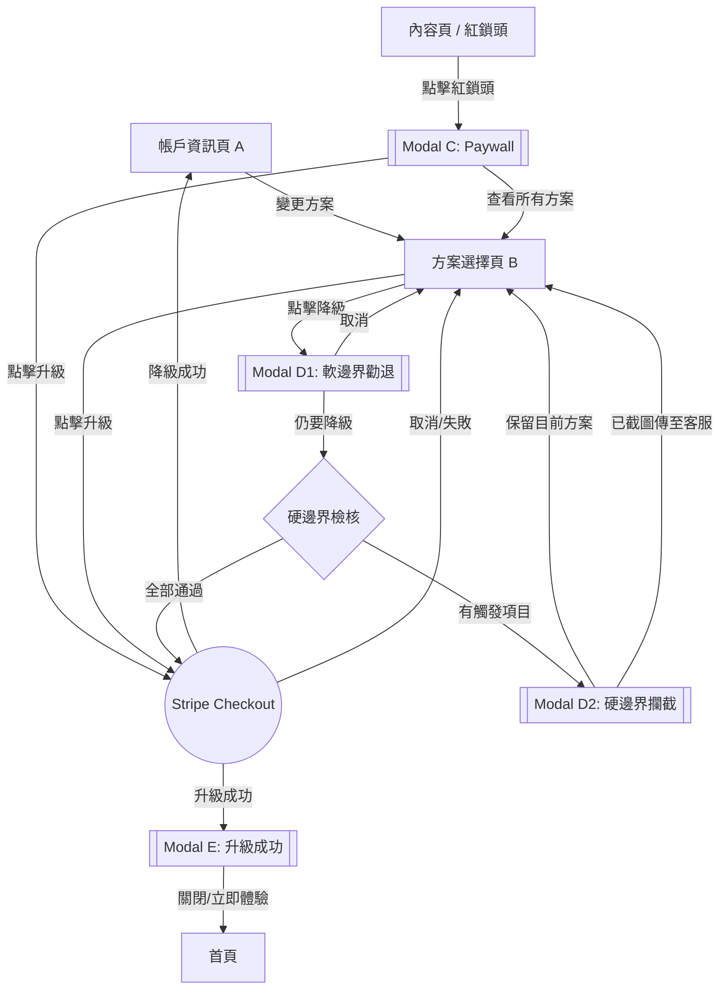
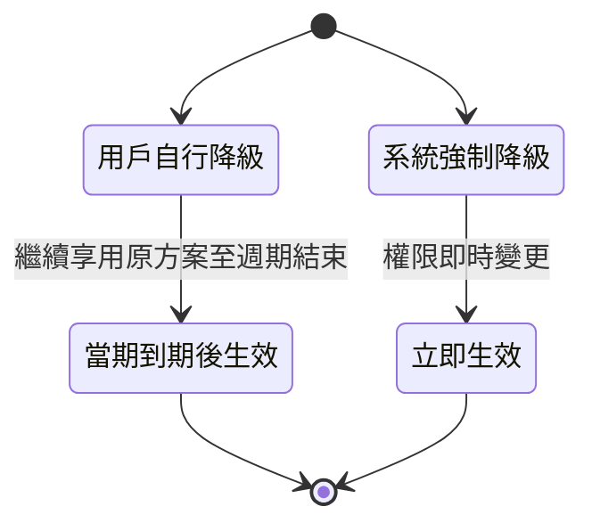
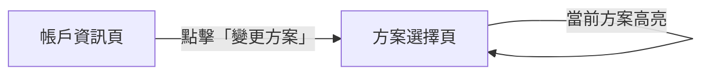
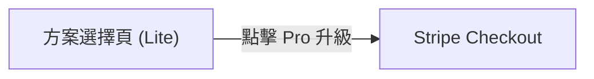
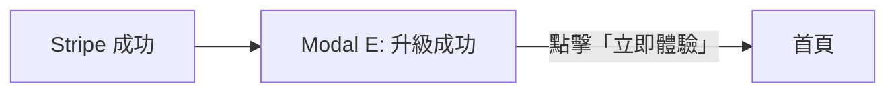
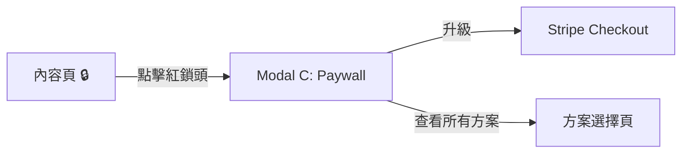
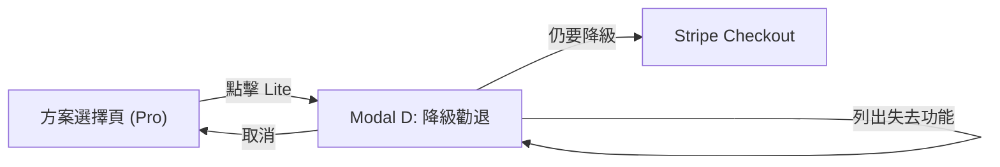
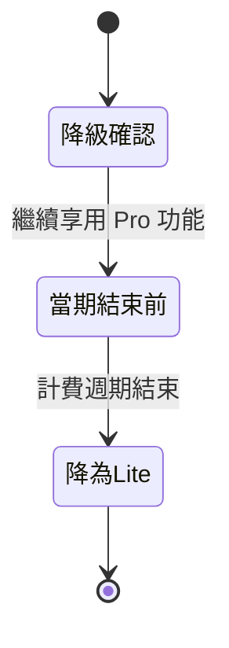

# Feature: SaaS 方案升降級流程重設計

**版本：** v1.1
**更新日期：** 2026-02-09
**狀態：** Draft

---

## 1. 概述

### 1.1 背景與目標

現有升降級流程 UX 不佳，導致升級轉化率偏低、降級時缺乏挽留機制。本次重設計 5 個核心元件，建立完整的升降級體驗，涵蓋兩個觸發入口（帳戶頁 & 紅鎖頭 Paywall）。

### 1.2 目標用戶

處於「撞牆期」的專業創作者（醫師、顧問、知識型講師），已使用 Firstory 但受限於當前方案功能。

### 1.3 成功指標

| 指標 | 當前 | 目標 |
|------|------|------|
| 升級轉化率（方案選擇頁 → Stripe 完成） | TBD | 提升 20%+ |
| 降級挽留率（勸退 Modal → 取消降級） | N/A | > 30% |
| Paywall 升級轉化率（紅鎖頭 → 完成付費） | TBD | TBD |

### 1.4 策略對齊

| 檢核項 | 回答 |
|--------|------|
| **ICP 階段** | 撞牆期專業創作者 |
| **NSM 貢獻** | SaaS 轉化率 (Conversion Rate) + ARPPU |
| **Roadmap 對應** | 2026 Q4 - 升降級 UX 調整 |
| **競品差異** | 結合 Paywall 即時觸發 + 降級勸退機制 |

### 1.5 優先級評估 (RICE)

| 維度 | 評分 (1-5) | 說明 |
|------|-----------|------|
| **Reach** | 4 | 影響所有付費用戶與潛在升級用戶 |
| **Impact** | 4 | 直接影響轉化率與 ARPPU |
| **Confidence** | 4 | 流程已明確定義 |
| **Effort** | 3 | 5 個元件重設計，整合 Stripe Checkout |

---

## 2. 名詞定義

| 名詞 | 定義 |
|------|------|
| **紅鎖頭** | 付費功能旁的鎖定圖示，點擊觸發 Paywall Modal |
| **Paywall Modal** | 顯示功能需升級提示的彈窗（元件 C） |
| **降級勸退 Modal** | 降級前顯示將失去功能清單的彈窗（元件 D） |
| **Stripe Checkout** | Stripe 託管的結帳頁面，用於處理付費方案變更 |
| **當期到期** | 當前計費週期結束的時間點 |
| **Legacy 方案** | 舊版方案，現有用戶可能仍在使用，但不可降回 |

---

## 3. 方案層級

### 3.1 層級定義

| 方案 | 層級 | 說明 |
|------|------|------|
| Legacy | -1 | 舊版方案，**不可降回** |
| Free | 0 | 基礎免費 |
| Lite | 1 | |
| Pro | 2 | |
| Enterprise | 3 | |

- 升級：目標方案層級 > 當前層級，可跳級
- 降級：目標方案層級 < 當前層級，可跳級（含降至 Free）
- **所有方案都不可降回 Legacy**（Legacy 用戶只能升級，不可被降回）

### 3.2 方案功能對照表

| 功能 | Legacy | Free | Lite | Pro | Enterprise |
|------|--------|------|------|-----|------------|
| 創立節目上限 | 1 檔 | 1 檔 | 1 檔 | 5 檔 | **無限** |
| 進階數據分析 | ✗ | ✗ | ✗ | ✓ | ✓ |
| 下載數據報表 | ✗ | ✗ | ✓ | ✓ | ✓ |
| 單集 Flink 萬用連結 | ✗ | ✗ | ✓ | ✓ | ✓ |
| AI 內容萃取 | 1 集/月 | 1 集/月 | 3 集/月 | 6 集/月 | 25 集/月 |
| 移除動態廣告 | ✓ | ✗ | ✗ | ✓ | ✓ |
| 提高廣告分潤 | ✗ | ✗ | ✗ | ✗ | 100% |
| 調降經營會員抽成 | ✗ | ✗ | ✗ | 3% | 5% |

### 3.3 升級解鎖功能矩陣

> Modal E（升級成功）動態內容來源

| 升級至 → | 解鎖功能 |
|----------|---------|
| Lite | 下載數據報表、單集 Flink 萬用連結、AI 內容萃取 3 集/月 |
| Pro | 進階數據分析、下載數據報表、單集 Flink 萬用連結、AI 內容萃取 6 集/月、移除動態廣告、調降經營會員抽成 3% |
| Enterprise | 全部功能 + 創立節目無限 + AI 25 集/月 + 廣告分潤 100% + 抽成 5% |

### 3.5 方案定價

> 所有價格均以美元（USD）計算。

| 方案 | 月繳 | 年繳（月均） | 年繳省下 |
|------|------|-------------|---------|
| Free | $0 | $0 | — |
| Lite | $9/mo | $7/mo | 22% |
| Pro | $19/mo | $15/mo | 21% |
| Enterprise | $199/mo | $159/mo | 20% |

- 預設顯示**年繳**（對消費者較有利）
- 年繳金額以月均顯示，旁邊標註省下百分比
- 切換器使用 Toggle Switch 元件

### 3.4 降級影響矩陣

> Modal D 動態內容來源。降級流程分兩階段：
> - **Phase 1（軟邊界）**：顯示失去功能清單，用戶可選擇繼續降級或取消
> - **Phase 2（硬邊界）**：檢核高危險事項，若觸發則需聯繫客服手動處理後才能降級
>
> 數字欄位以 `{變數}` 標示，需由後端即時帶入。

#### 軟邊界 — 失去功能清單（Phase 1: Modal D1）

##### d1. 從 Enterprise 降

| 降至 → | 失去功能清單 |
|--------|-------------|
| Pro | 每月失去 19 集 AI 內容萃取、每筆廣告分潤減少 100%、每筆經營會員抽成漲價 2% |
| Lite | 總計 {flink_count} 條單集 Flink 萬用連結失效、每月失去 22 集 AI 內容萃取、每筆廣告分潤減少 100%、每筆經營會員抽成漲價 5% |
| Free | 總計 {flink_count} 條單集 Flink 萬用連結失效、每月失去 24 集 AI 內容萃取、自動幫所有 {episode_count} 集單集插入廣告、每筆廣告分潤減少 100%、每筆經營會員抽成漲價 5% |

##### d2. 從 Pro 降

| 降至 → | 失去功能清單 |
|--------|-------------|
| Lite | 總計 {flink_count} 條單集 Flink 萬用連結失效、每月失去 3 集 AI 內容萃取、每筆經營會員抽成漲價 3% |
| Free | 總計 {flink_count} 條單集 Flink 萬用連結失效、每月失去 5 集 AI 內容萃取、自動幫所有 {episode_count} 集單集插入廣告、每筆經營會員抽成漲價 3% |

##### d3. 從 Lite 降

| 降至 → | 失去功能清單 |
|--------|-------------|
| Free | 每月失去 2 集 AI 內容萃取、自動幫所有 {episode_count} 集單集插入廣告 |

> **規則：** 所有方案都「降不回 Legacy」。Legacy 用戶在方案選擇頁只看到升級選項。

#### 硬邊界 — 降級檢核項目（Phase 2: Modal D2）

> 後端在用戶通過 Phase 1 後執行檢核。若以下 5 項**全部通過**（皆不觸發），則跳過 Phase 2 直接進入 Stripe Checkout。任一項觸發，則顯示 Modal D2，用戶必須聯繫客服手動處理完成後才能降級。

| # | 檢核項目 | 觸發條件 | 說明 |
|---|---------|---------|------|
| 1 | 移除部分節目 | 降級後方案節目上限 < 現有節目數 | 例：Enterprise (無限) → Pro (5 檔)，但用戶有 8 個節目 |
| 2 | 移除法人銀行提領 | 降到 Lite 或 Free，且目前設有法人銀行提領 | 法人提領僅 Pro+ 支援 |
| 3 | 移除部分免費追蹤會員 | 降級後免費追蹤會員上限 < 現有免費追蹤會員人數 | 各方案上限：Free 50 / Lite 100 / Pro 500 / Enterprise 7,000 |
| 4 | 關閉 Discord 群組 | 降到 Lite 或 Free，且目前設有 Discord 群組 | Discord 整合僅 Pro+ 支援 |
| 5 | 關閉 Zapier 會員自動信 | 降到 Lite 或 Free，且目前設有 Zapier 自動信 | Zapier 整合僅 Pro+ 支援 |

> **處理流程：** 用戶截圖 Modal D2 → 傳至客服對話框 → 客服手動處理危險項目 → 處理完成後用戶可繼續降級

---

## 4. UX 流程

### 4.1 總覽流程圖



### 4.2 入口 1：帳戶頁 → 方案選擇頁

**路徑：** A → B → Stripe Checkout

1. 用戶在帳戶資訊頁 A 點擊「變更方案」
2. 進入方案選擇頁 B，顯示所有方案（標示當前方案）
3. 選擇目標方案後：
   - 若為升級 → 跳轉 Stripe Checkout
   - 若為降級 → 顯示降級勸退 Modal D

### 4.3 入口 2：紅鎖頭 → Paywall Modal

**路徑：** Content → C → Stripe Checkout 或 → B

1. 用戶在內容頁點擊紅鎖頭
2. 顯示 Paywall Modal C，說明該功能所需方案
3. 用戶可選擇：
   - 「升級」→ 跳轉 Stripe Checkout（直接升級到該功能所需的最低方案）
   - 「查看所有方案」→ 前往方案選擇頁 B

### 4.4 降級流程

**路徑：** B → D1 → (D2) → Stripe Checkout → A

1. 用戶在方案選擇頁 B 選擇較低方案
2. **Phase 1 — 軟邊界勸退 (Modal D1)**：
   - 列出降級後將失去的具體功能
   - 提供「取消」（回 B）和「仍要降級」按鈕
3. 用戶點擊「仍要降級」→ 後端執行硬邊界檢核
4. **若檢核全部通過** → 跳轉 Stripe Checkout 處理
5. **若有觸發項目 → Phase 2 — 硬邊界攔截 (Modal D2)**：
   - 顯示「{當前方案} → {目標方案}」Badge
   - 列出需客服處理的高危險項目
   - 提供「保留目前方案」和「我已截圖並傳至對話框」按鈕
   - **兩個按鈕都回到方案選擇頁 B**
   - 用戶截圖傳至客服 → 客服手動處理危險項目 → 處理完成後通知用戶
   - 用戶再次操作降級流程時，已處理的項目不再觸發硬邊界
6. 降級成功 → 返回帳戶頁 A

### 4.5 Stripe 返回處理

| Stripe 結果 | 來源 | 導向 |
|-------------|------|------|
| 升級成功 | 任何入口 | Modal E: 升級成功 |
| 降級成功 | 方案選擇頁 | 帳戶資訊頁 A |
| 取消/失敗 | 任何入口 | 方案選擇頁 B |

### 4.6 降級生效規則



---

## 5. 驗收標準 (BDD)

**Feature: SaaS 方案升降級**
As a 創作者, I want to 升級或降級我的方案, So that 我能使用符合需求的功能組合.

**Background:**
Given 用戶已登入且擁有一個 show

---

### Scenario 1: 從帳戶頁進入方案選擇頁

Given 用戶在帳戶資訊頁
When 用戶點擊「變更方案」
Then 應該顯示方案選擇頁
And 當前方案應該被標示



---

### Scenario 2: 從方案選擇頁升級

Given 用戶在方案選擇頁
And 用戶當前方案為 Lite
When 用戶點擊 Pro 方案的「升級」按鈕
Then 應該跳轉至 Stripe Checkout 頁面
And Stripe 應顯示 Pro 方案的付費資訊



---

### Scenario 3: 升級成功後顯示成功 Modal

Given 用戶在 Stripe Checkout 完成升級付費
When 用戶從 Stripe 返回
Then 應該顯示升級成功 Modal E
And Modal 應包含「立即體驗」按鈕



---

### Scenario 4: 升級成功 Modal 導向首頁

Given 升級成功 Modal E 已顯示
When 用戶點擊「立即體驗」或關閉 Modal
Then 應該導向首頁

---

### Scenario 5: 紅鎖頭觸發 Paywall Modal

Given 用戶在內容頁
And 用戶當前方案無法使用某功能
When 用戶點擊該功能旁的紅鎖頭
Then 應該顯示 Paywall Modal C
And Modal 應說明該功能所需方案



---

### Scenario 6: Paywall Modal 直接升級

Given Paywall Modal C 已顯示
And 該功能最低需要 Pro 方案
When 用戶點擊「升級」
Then 應該跳轉至 Stripe Checkout
And Stripe 應顯示 Pro 方案的付費資訊

---

### Scenario 7: Paywall Modal 查看所有方案

Given Paywall Modal C 已顯示
When 用戶點擊「查看所有方案」
Then 應該導向方案選擇頁 B

---

### Scenario 8: 降級觸發勸退 Modal

Given 用戶在方案選擇頁
And 用戶當前方案為 Pro
When 用戶點擊 Lite 方案
Then 應該顯示降級勸退 Modal D
And Modal 應列出降級後將失去的功能清單



---

### Scenario 9: 降級勸退 - 用戶取消

Given 降級勸退 Modal D 已顯示
When 用戶點擊「取消」
Then Modal 應關閉
And 用戶應回到方案選擇頁 B

---

### Scenario 10: 降級勸退 - 用戶確認降級

Given 降級勸退 Modal D 已顯示
When 用戶點擊「仍要降級」
Then 應該跳轉至 Stripe Checkout 處理降級

---

### Scenario 11: 用戶自行降級成功

Given 用戶透過 Stripe Checkout 完成降級
When 用戶從 Stripe 返回
Then 應該導向帳戶資訊頁 A
And 帳戶頁應顯示新方案（當期到期後生效）
And 用戶在當期到期前應繼續享用原方案功能



---

### Scenario 12: 系統強制降級

Given 用戶因付款失敗等原因被系統強制降級
When 系統執行降級
Then 方案應立即生效
And 受限功能應立即鎖定（顯示紅鎖頭）

---

### Scenario 13: Stripe 取消或失敗

Given 用戶在 Stripe Checkout 頁面
When 用戶取消付款或付款失敗
Then 應該返回方案選擇頁 B
And 用戶方案應維持不變

---

### Scenario 14: Free 用戶降級限制

Given 用戶當前方案為 Free
When 用戶在方案選擇頁
Then 不應顯示任何降級選項
And 所有方案按鈕應顯示為「升級」

---

## 6. 元件 UI 規格

> 所有元件遵循 Firstory Design System v2.0.0。
> 間距基準 4px，圓角預設 `--radius-md` (8px)，Modal 圓角 `--radius-xl` (16px)。

---

### A - 帳戶資訊頁

#### 佈局

```
┌─ Page: 帳戶資訊 ──────────────────────────────────────────────────┐
│  padding: 32px (左右) / 24px (上下)                                │
│                                                                    │
│  ┌─ Card default ────────────────────────────────────────────────┐ │
│  │  padding: 24px                                                │ │
│  │                                                               │ │
│  │  方案名稱 ──────────── text-xl / semibold / --foreground      │ │
│  │  Status Badge ───────── 「活躍」success / 「待降級」warning   │ │
│  │                         gap: 8px (與方案名水平排列)           │ │
│  │                                                               │ │
│  │  ┌─ 計費資訊 ─────────────────────────────────────────────┐  │ │
│  │  │  下次扣款日：{date}          金額：NT${amount}/月       │  │ │
│  │  │  text-sm / --muted-foreground                           │  │ │
│  │  └────────────────────────────────────────────────────────┘  │ │
│  │                                         gap: 16px             │ │
│  │  [ 變更方案 ]  ─── Button Primary (lg), width: auto           │ │
│  │                                                               │ │
│  └───────────────────────────────────────────────────────────────┘ │
│                                                                    │
│  ┌─ Alert Info Banner (條件顯示) ────────────────────────────────┐ │
│  │  bg: --info / text: --info-foreground / left-border: 3px      │ │
│  │  「您的方案將於 {date} 變更為 {plan}」                        │ │
│  └───────────────────────────────────────────────────────────────┘ │
│                                                                    │
│  ┌─ Alert Warning Banner (條件顯示) ────────────────────────────┐ │
│  │  bg: --warning / text: --warning-foreground / left-border: 3px│ │
│  │  「您的付款失敗，方案已降級為 {plan}。請更新付款方式。」      │ │
│  └───────────────────────────────────────────────────────────────┘ │
│                                                                    │
└────────────────────────────────────────────────────────────────────┘
```

#### 狀態

| 狀態 | 顯示內容 | Design System 元件 |
|------|---------|-------------------|
| **正常** | 方案卡片 + Badge「活躍」+ 變更方案 CTA | Card default, Badge success, Button Primary (lg) |
| **有待生效降級** | 方案卡片 + Badge「待降級」+ Info Banner | Card default, Badge warning, Alert Info (left-border) |
| **系統強制降級警告** | 方案卡片 + Warning Banner | Card default, Alert Warning (left-border) |

---

### B - 方案選擇頁

#### 佈局

```
┌─ Page: 選擇方案 ──────────────────────────────────────────────────────────────┐
│  padding: 32px (左右) / 24px (上下)                                            │
│                                                                                │
│  標題: 「選擇最適合你的方案」 ── text-2xl / bold / --foreground                │
│  副標: 「隨時升級或降級，靈活調整」 ── text-base / --muted-foreground          │
│                                                     gap: 16px                  │
│  ┌─ Billing Toggle ── 置中 ─────────────────────────────────────────────────┐ │
│  │  [ 月繳 ]  ◉ Toggle Switch ──  [ 年繳 (預設) ]                           │ │
│  │  Toggle Switch 元件，default = 年繳 (右側)                                │ │
│  │  右側標註: 「省下最多 22%」── text-sm / semibold / --success-foreground   │ │
│  └────────────────────────────────────────────────────────────────────────────┘ │
│                                                     gap: 24px                  │
│  ┌─ Plan Grid: 4 欄 ── gap: 16px ────────────────────────────────────────────┐ │
│  │                                                                            │ │
│  │  ┌─ Free ──────┐  ┌─ Lite ──────┐  ┌─ Pro ───────┐  ┌─ Enterprise ──┐   │ │
│  │  │ Card default │  │ Card default │  │ Card elevat.│  │ Card default  │   │ │
│  │  │ pad: 24px    │  │ pad: 24px    │  │ pad: 24px   │  │ pad: 24px     │   │ │
│  │  │              │  │              │  │ ┌─────────┐ │  │               │   │ │
│  │  │              │  │              │  │ │Most Pop.│ │  │               │   │ │
│  │  │              │  │              │  │ └─────────┘ │  │               │   │ │
│  │  │ 方案名       │  │ 方案名       │  │ 方案名      │  │ 方案名        │   │ │
│  │  │ $0/mo        │  │ $7/mo        │  │ $15/mo      │  │ $159/mo       │   │ │
│  │  │              │  │ (月繳 $9)    │  │ (月繳 $19)  │  │ (月繳 $199)   │   │ │
│  │  │              │  │ 省 22%       │  │ 省 21%      │  │ 省 20%        │   │ │
│  │  │ ── 功能 ──  │  │ ── 功能 ──  │  │ ── 功能 ── │  │ ── 功能 ──  │   │ │
│  │  │ ✓ 功能 1    │  │ ✓ 功能 1    │  │ ✓ 功能 1   │  │ ✓ 功能 1    │   │ │
│  │  │ ✓ 功能 2    │  │ ✓ 功能 2    │  │ ✓ 功能 2   │  │ ✓ 功能 2    │   │ │
│  │  │ ...          │  │ ...          │  │ ...         │  │ ...           │   │ │
│  │  │              │  │              │  │             │  │               │   │ │
│  │  │ [目前方案]   │  │ [升級/降級]  │  │ [升級/降級] │  │ [升級/降級]  │   │ │
│  │  │ Btn disabled │  │              │  │             │  │               │   │ │
│  │  └──────────────┘  └──────────────┘  └─────────────┘  └───────────────┘   │ │
│  └────────────────────────────────────────────────────────────────────────────┘ │
│                                                     gap: 16px                  │
│  ┌─ 「完整比較」── 置中 ─────────────────────────────────────────────────────┐ │
│  │  [ 完整比較 ↗ ]  ── Button Ghost (md), Lucide `ExternalLink` icon         │ │
│  │  onclick: window.open('https://firstory.me/pricing', '_blank')             │ │
│  └────────────────────────────────────────────────────────────────────────────┘ │
│                                                     gap: 32px                  │
│  ┌─ 功能比較表 ── Card outlined ─────────────────────────────────────────────┐ │
│  │  （見下方完整內容）                                                        │ │
│  └────────────────────────────────────────────────────────────────────────────┘ │
└────────────────────────────────────────────────────────────────────────────────┘
```

#### 方案卡片按鈕狀態

| 用戶當前方案 | Free 卡片 | Lite 卡片 | Pro 卡片 | Enterprise 卡片 |
|-------------|----------|----------|---------|----------------|
| **Free** | `目前方案` (disabled) | `升級` Primary | `升級` Primary | `升級` Primary |
| **Lite** | `降級` Ghost | `目前方案` (disabled) | `升級` Primary | `升級` Primary |
| **Pro** | `降級` Ghost | `降級` Ghost | `目前方案` (disabled) | `升級` Primary |
| **Enterprise** | `降級` Ghost | `降級` Ghost | `降級` Ghost | `目前方案` (disabled) |
| **Legacy** | `升級` Primary | `升級` Primary | `升級` Primary | `升級` Primary |

> **Pro 卡片**使用 Card elevated + Badge `Most Popular`（bg: `--primary-muted`, text: `--primary`）

#### 功能比較表（方案選擇頁底部）

> 使用 Table 元件，表頭 `bg: --secondary`, `text-xs / font-medium / --muted-foreground`

| 功能 | Free | Lite | Pro | Enterprise |
|------|------|------|-----|------------|
| 創立節目上限 | 1 檔 | 1 檔 |  5 檔 | 無限 |
| 進階數據分析 | ✗ | ✗ | ✓ | ✓ |
| 下載數據報表 | ✗ | ✓ | ✓ | ✓ |
| 單集 Flink 萬用連結 | ✗ | ✓ | ✓ | ✓ |
| AI 內容萃取 | 1 集/月 | 3 集/月 | 6 集/月 | 25 集/月 |
| 移除動態廣告 | ✗ | ✗ | ✓ | ✓ |
| 提高廣告分潤 | ✗ | ✗ | ✗ | 100% |
| 調降經營會員抽成 | ✗ | ✗ | 3% | 5% |

> 注意：功能比較表不顯示 Legacy 欄位，Legacy 用戶也看此表但無 Legacy 欄。

---

### C - Paywall Modal

#### 佈局

```
┌─ Modal sm (480px) ── border-radius: 16px ── shadow-xl ──────────┐
│  padding: 24px                                                    │
│                                                          [×] ──── │ ← icon btn, 右上角
│                                                                   │
│  ┌─ Icon ──┐                                                      │
│  │  Lock   │  ── Lucide `Lock` icon, 48px, --primary              │
│  └─────────┘                                                      │
│                                          gap: 16px                │
│  此功能需要 {plan} 方案                                            │
│  ── text-xl / semibold / --foreground                              │
│                                          gap: 8px                 │
│  {feature_description}                                             │
│  ── text-sm / --muted-foreground / max 2 行                       │
│                                          gap: 24px                │
│  ┌──────────────────────────────────────────────────────────────┐ │
│  │  [ 升級到 {plan} ]  ── Button Primary (lg), full-width       │ │
│  └──────────────────────────────────────────────────────────────┘ │
│                                          gap: 8px                 │
│  ┌──────────────────────────────────────────────────────────────┐ │
│  │  [ 查看所有方案 ]   ── Button Ghost (lg), full-width          │ │
│  └──────────────────────────────────────────────────────────────┘ │
│                                                                   │
└───────────────────────────────────────────────────────────────────┘
  背景遮罩: var(--overlay)
```

#### 動態內容

| 觸發功能 | {plan} | {feature_description} |
|---------|--------|----------------------|
| 進階數據分析 | Pro | 深入了解聽眾行為與互動數據，優化你的內容策略 |
| 下載數據報表 | Lite | 將數據匯出為報表，方便分析與簡報使用 |
| 單集 Flink 萬用連結 | Lite | 為每集建立專屬短連結，追蹤各管道成效 |
| 移除動態廣告 | Pro | 移除系統自動插入的廣告，提供乾淨的收聽體驗 |

#### 狀態

| 狀態 | 說明 |
|------|------|
| **Default** | 如上佈局 |
| **Hover (升級按鈕)** | bg: `--primary-hover` |
| **Hover (查看所有方案)** | bg: `--primary-muted` |

---

### D - 降級 Modal（兩階段）

> 降級流程分為 Phase 1（軟邊界）和 Phase 2（硬邊界）。Phase 2 僅在硬邊界檢核有觸發項目時顯示。

#### D1 — 軟邊界勸退 Modal（Phase 1）

##### 佈局

```
┌─ Modal sm (480px) ── border-radius: 16px ── shadow-xl ──────────┐
│  padding: 24px                                                    │
│                                                          [×] ──── │
│                                                                   │
│  ┌─ Icon ──┐                                                      │
│  │  Alert  │  ── Lucide `AlertTriangle`, 48px, --warning-fgnd     │
│  └─────────┘                                                      │
│                                          gap: 16px                │
│  確定要降級嗎？                                                    │
│  ── text-xl / semibold / --foreground                              │
│                                          gap: 8px                 │
│  降級後您將失去以下功能：                                           │
│  ── text-sm / --muted-foreground                                   │
│                                          gap: 12px                │
│  ┌─ 失去功能清單 ── Card filled (bg: --error, 低透明度) ────────┐ │
│  │  padding: 16px                                                │ │
│  │                                                               │ │
│  │  − {loss_item_1}                                              │ │
│  │  − {loss_item_2}                                              │ │
│  │  − {loss_item_3}                                              │ │
│  │  ...                                                          │ │
│  │  ── text-sm / --error-foreground                              │ │
│  │  ── Lucide `Minus` icon (16px) 每行前綴                      │ │
│  └───────────────────────────────────────────────────────────────┘ │
│                                          gap: 12px                │
│  降級將於當期結束後（{date}）生效。                                 │
│  ── text-xs / --muted-foreground                                   │
│                                          gap: 24px                │
│  ┌──────────────────────────────────────────────────────────────┐ │
│  │  [ 取消 ]          ── Button Primary (lg), full-width         │ │
│  └──────────────────────────────────────────────────────────────┘ │
│                                          gap: 8px                 │
│  ┌──────────────────────────────────────────────────────────────┐ │
│  │  [ 仍要降級 ]      ── Button Ghost (lg), full-width           │ │
│  └──────────────────────────────────────────────────────────────┘ │
│                                                                   │
└───────────────────────────────────────────────────────────────────┘
  背景遮罩: var(--overlay)
```

##### 動態內容邏輯

失去功能清單根據「當前方案 → 目標方案」組合，由 Section 3.4 軟邊界矩陣動態帶入。

**範例：Pro → Free**

```
− 總計 156 條單集 Flink 萬用連結失效
− 每月失去 5 集 AI 內容萃取
− 自動幫所有 82 集單集插入廣告
− 每筆經營會員抽成漲價 3%
```

> 其中 `156`、`82` 為動態數值，由後端根據用戶實際使用量帶入。

##### 軟邊界動態內容對照表

| 當前 → 目標 | 清單項目 |
|------------|---------|
| Enterprise → Pro | AI -19 集、廣告分潤 -100%、抽成 +2% |
| Enterprise → Lite | Flink 失效 {n} 條、AI -22 集、廣告分潤 -100%、抽成 +5% |
| Enterprise → Free | Flink 失效 {n} 條、AI -24 集、插入廣告 {n} 集、廣告分潤 -100%、抽成 +5% |
| Pro → Lite | Flink 失效 {n} 條、AI -3 集、抽成 +3% |
| Pro → Free | Flink 失效 {n} 條、AI -5 集、插入廣告 {n} 集、抽成 +3% |
| Lite → Free | AI -2 集、插入廣告 {n} 集 |

---

#### D2 — 硬邊界攔截 Modal（Phase 2）

> 用戶在 D1 點擊「仍要降級」後，後端執行硬邊界檢核。若 5 項檢核全部通過則跳過本 Modal，直接進入 Stripe。若任一項觸發則顯示本 Modal。

##### 佈局

```
┌─ Modal sm (480px) ── border-radius: 16px ── shadow-xl ──────────┐
│  padding: 24px                                                    │
│                                                          [×] ──── │
│                                                                   │
│  ┌─ Badge ──────────────────────────────────┐                     │
│  │  {current_plan} → {target_plan}          │                     │
│  │  bg: --primary / text: --primary-fgnd    │                     │
│  │  border-radius: --radius-full            │                     │
│  └──────────────────────────────────────────┘                     │
│                                          gap: 16px                │
│  降級前需要完成的事                                                │
│  ── text-xl / bold / --foreground                                  │
│                                          gap: 8px                 │
│  請完整截圖本頁，並傳送至右下角客服對話框。                         │
│  ── text-sm / --muted-foreground                                   │
│                                          gap: 16px                │
│  ┌─ 檢核清單 ── Card outlined (border: dashed) ────────────────┐ │
│  │  padding: 16px                                                │ │
│  │                                                               │ │
│  │  以下事項因危險性較高，將有客服專員為您處理：                  │ │
│  │  ── text-sm / semibold / --foreground                         │ │
│  │                                          gap: 12px            │ │
│  │  − 移除部分節目              (條件觸發)                       │ │
│  │  − 移除法人銀行提領          (條件觸發)                       │ │
│  │  − 移除部分免費追蹤會員      (條件觸發)                       │ │
│  │  − 關閉 Discord 群組         (條件觸發)                       │ │
│  │  − 關閉 Zapier 會員自動信    (條件觸發)                       │ │
│  │  ── text-sm / --error-foreground                              │ │
│  │  ── Lucide `Minus` icon (16px, --error-foreground) 每行前綴   │ │
│  │                                                               │ │
│  │  ※ 僅顯示被觸發的項目，未觸發的不顯示                        │ │
│  └───────────────────────────────────────────────────────────────┘ │
│                                          gap: 24px                │
│  ┌──────────────────────────────────────────────────────────────┐ │
│  │  [ 保留目前方案 ]  ── Button Primary (lg), full-width         │ │
│  └──────────────────────────────────────────────────────────────┘ │
│                                          gap: 8px                 │
│  ┌──────────────────────────────────────────────────────────────┐ │
│  │  [ 我已截圖並傳至對話框 ]  ── Button Ghost (lg), full-width   │ │
│  └──────────────────────────────────────────────────────────────┘ │
│                                                                   │
└───────────────────────────────────────────────────────────────────┘
  背景遮罩: var(--overlay)
```

##### 硬邊界檢核觸發條件

| 項目 | 觸發條件 | 適用降級路徑 |
|------|---------|-------------|
| 移除部分節目 | 降級後方案節目上限 < 現有節目數 | Enterprise → Pro/Lite/Free |
| 移除法人銀行提領 | 目前設有法人銀行提領 | 任何 → Lite 或 Free |
| 移除部分免費追蹤會員 | 降級後免費追蹤會員上限 < 現有人數 | 視方案上限而定 |
| 關閉 Discord 群組 | 目前設有 Discord 群組 | 任何 → Lite 或 Free |
| 關閉 Zapier 會員自動信 | 目前設有 Zapier 自動信 | 任何 → Lite 或 Free |

> **規則：** 若 5 項檢核全部通過（皆不觸發），則整個 D2 Modal 不出現，直接進入 Stripe Checkout。

---

### E - 升級成功 Modal

#### 佈局

```
┌─ Modal sm (480px) ── border-radius: 16px ── shadow-xl ──────────┐
│  padding: 24px                                                    │
│                                                          [×] ──── │
│                                                                   │
│  ┌─ Icon ──┐                                                      │
│  │  Check  │  ── Lucide `CheckCircle`, 48px, --success-fgnd       │
│  └─────────┘                                                      │
│                                          gap: 16px                │
│  升級成功！                                                        │
│  ── text-xl / semibold / --foreground                              │
│                                          gap: 8px                 │
│  你已升級至 {plan} 方案，以下功能已解鎖：                           │
│  ── text-sm / --muted-foreground                                   │
│                                          gap: 12px                │
│  ┌─ 解鎖功能清單 ── Card filled (bg: --success, 低透明度) ──────┐ │
│  │  padding: 16px                                                │ │
│  │                                                               │ │
│  │  ✓ {unlock_item_1}                                            │ │
│  │  ✓ {unlock_item_2}                                            │ │
│  │  ✓ {unlock_item_3}                                            │ │
│  │  ...                                                          │ │
│  │  ── text-sm / --success-foreground                            │ │
│  │  ── Lucide `Check` icon (16px) 每行前綴                      │ │
│  └───────────────────────────────────────────────────────────────┘ │
│                                          gap: 24px                │
│  ┌──────────────────────────────────────────────────────────────┐ │
│  │  [ 立即體驗 ]      ── Button Primary (lg), full-width         │ │
│  └──────────────────────────────────────────────────────────────┘ │
│                                                                   │
└───────────────────────────────────────────────────────────────────┘
  背景遮罩: var(--overlay)
```

#### 動態內容邏輯

解鎖功能清單根據升級目標方案，由 Section 3.3 升級解鎖矩陣動態帶入。

**範例：升級至 Pro**

```
✓ 進階數據分析
✓ 下載數據報表
✓ 單集 Flink 萬用連結
✓ AI 內容萃取 6 集/月
✓ 移除動態廣告
✓ 調降經營會員抽成 3%
```

#### 動態內容對照表

| 升級至 | 解鎖功能清單 |
|--------|------------|
| Lite | 下載數據報表、單集 Flink 萬用連結、AI 內容萃取 3 集/月 |
| Pro | 進階數據分析、下載數據報表、單集 Flink 萬用連結、AI 內容萃取 6 集/月、移除動態廣告、調降經營會員抽成 3% |
| Enterprise | 創立節目無限、進階數據分析、下載數據報表、單集 Flink 萬用連結、AI 內容萃取 25 集/月、移除動態廣告、提高廣告分潤 100%、調降經營會員抽成 5% |

---

## 7. i18n 對照表

| Key | zh-TW | en |
|-----|-------|----|
| `plan.upgrade.cta` | 升級 | Upgrade |
| `plan.downgrade.cta` | 降級 | Downgrade |
| `plan.change.cta` | 變更方案 | Change Plan |
| `plan.current.label` | 目前方案 | Current Plan |
| `plan.recommended.label` | 最多人選擇 | Most Popular |
| `plan.select.title` | 選擇最適合你的方案 | Choose the Right Plan for You |
| `plan.select.subtitle` | 隨時升級或降級，靈活調整 | Upgrade or downgrade anytime |
| `plan.downgrade.confirm.title` | 確定要降級嗎？ | Are you sure you want to downgrade? |
| `plan.downgrade.confirm.lose` | 降級後您將失去以下功能： | You will lose access to: |
| `plan.downgrade.confirm.cancel` | 取消 | Cancel |
| `plan.downgrade.confirm.proceed` | 仍要降級 | Downgrade Anyway |
| `plan.downgrade.confirm.effective` | 降級將於當期結束後（{date}）生效。 | Downgrade takes effect after your current period ends ({date}). |
| `plan.upgrade.success.title` | 升級成功！ | Upgrade Successful! |
| `plan.upgrade.success.subtitle` | 你已升級至 {plan} 方案，以下功能已解鎖： | You've upgraded to {plan}. The following features are now unlocked: |
| `plan.upgrade.success.cta` | 立即體驗 | Start Exploring |
| `plan.paywall.title` | 此功能需要 {plan} 方案 | This feature requires {plan} |
| `plan.paywall.upgrade` | 升級到 {plan} | Upgrade to {plan} |
| `plan.paywall.view_all` | 查看所有方案 | View All Plans |
| `plan.downgrade.pending` | 您的方案將於 {date} 變更為 {plan} | Your plan will change to {plan} on {date} |
| `plan.downgrade.forced` | 您的付款失敗，方案已降級為 {plan}。請更新付款方式。 | Payment failed. Your plan has been downgraded to {plan}. Please update your payment method. |
| `plan.downgrade.loss.flink` | 總計 {count} 條單集 Flink 萬用連結失效 | {count} episode Flink links will be deactivated |
| `plan.downgrade.loss.ai` | 每月失去 {count} 集 AI 內容萃取 | Lose {count} AI content extractions per month |
| `plan.downgrade.loss.ad_insert` | 自動幫所有 {count} 集單集插入廣告 | Ads will be auto-inserted into all {count} episodes |
| `plan.downgrade.loss.ad_revenue` | 每筆廣告分潤減少 {percent}% | Ad revenue share reduced by {percent}% |
| `plan.downgrade.loss.commission` | 每筆經營會員抽成漲價 {percent}% | Membership commission increases by {percent}% |
| `plan.upgrade.unlock.analytics` | 進階數據分析 | Advanced Analytics |
| `plan.upgrade.unlock.report` | 下載數據報表 | Download Data Reports |
| `plan.upgrade.unlock.flink` | 單集 Flink 萬用連結 | Episode Flink Universal Links |
| `plan.upgrade.unlock.ai` | AI 內容萃取 {count} 集/月 | AI Content Extraction {count}/month |
| `plan.upgrade.unlock.no_ad` | 移除動態廣告 | Remove Dynamic Ads |
| `plan.upgrade.unlock.ad_revenue` | 提高廣告分潤 {percent}% | Increase Ad Revenue Share {percent}% |
| `plan.upgrade.unlock.commission` | 調降經營會員抽成 {percent}% | Reduce Membership Commission {percent}% |
| `plan.upgrade.unlock.unlimited_show` | 創立節目無限 | Unlimited Shows |
| `plan.downgrade.hard.badge` | {current} → {target} | {current} → {target} |
| `plan.downgrade.hard.title` | 降級前需要完成的事 | Things to Complete Before Downgrading |
| `plan.downgrade.hard.subtitle` | 請完整截圖本頁，並傳送至右下角客服對話框。 | Please screenshot this page and send it to the support chat in the bottom right. |
| `plan.downgrade.hard.description` | 以下事項因危險性較高，將有客服專員為您處理： | The following items require manual handling by our support team: |
| `plan.downgrade.hard.keep` | 保留目前方案 | Keep Current Plan |
| `plan.downgrade.hard.submitted` | 我已截圖並傳至對話框 | I've Sent a Screenshot to Support |
| `plan.downgrade.hard.remove_shows` | 移除部分節目 | Remove Some Shows |
| `plan.downgrade.hard.remove_bank` | 移除法人銀行提領 | Remove Corporate Bank Withdrawal |
| `plan.downgrade.hard.remove_followers` | 移除部分免費追蹤會員 | Remove Some Free Followers |
| `plan.downgrade.hard.close_discord` | 關閉 Discord 群組 | Close Discord Group |
| `plan.downgrade.hard.close_zapier` | 關閉 Zapier 會員自動信 | Close Zapier Auto-Messages |
| `plan.legacy.no_downgrade` | 此方案無法降回 Legacy | Cannot downgrade to Legacy plan |
| `plan.billing.monthly` | 月繳 | Monthly |
| `plan.billing.annual` | 年繳 | Annual |
| `plan.billing.save` | 省下最多 {percent}% | Save up to {percent}% |
| `plan.billing.annual_note` | 省 {percent}% | Save {percent}% |
| `plan.billing.price` | ${amount}/mo | ${amount}/mo |
| `plan.billing.price_note` | 所有價格均以美元計算 | All prices are in USD |
| `plan.compare.full` | 完整比較 | Full Comparison |

---

## 8. Figma Make Prompt

> 設計一個 SaaS 方案升降級流程，包含：
> 1. 帳戶資訊頁：方案卡片（方案名 + 狀態 Badge + 計費資訊）、變更方案 CTA、待降級 Info Banner、強制降級 Warning Banner
> 2. 方案選擇頁：月繳/年繳 Toggle Switch（預設年繳，標註省下 %）；4 個方案（Free/Lite/Pro/Enterprise）的比較卡片，Pro 標記 Most Popular，標示當前方案，升級用 Primary 按鈕、降級用 Ghost 按鈕；「完整比較」外部連結按鈕；底部功能比較表
> 3. Paywall Modal (480px)：Lock icon、功能名稱、價值描述、升級 CTA（Primary full-width）、查看所有方案（Ghost full-width）
> 4a. 降級軟邊界 Modal D1 (480px)：AlertTriangle icon、「確定要降級嗎？」、失去功能清單（紅色背景卡片 + Minus icon）、生效時間提示、取消按鈕（Primary）、仍要降級（Ghost）
> 4b. 降級硬邊界 Modal D2 (480px)：方案轉換 Badge（Primary pill）、「降級前需要完成的事」、截圖說明、虛線框檢核清單（Minus icon + 危險項目）、保留目前方案按鈕（Primary）、我已截圖並傳至對話框（Ghost）
> 5. 升級成功 Modal (480px)：CheckCircle icon、恭喜訊息、解鎖功能清單（綠色背景卡片 + Check icon）、立即體驗按鈕（Primary）

---

## 9. 依賴關係

| 依賴 | 說明 | 狀態 |
|------|------|------|
| Stripe Checkout 整合 | 需支援升級與降級的 Checkout Session 建立 | 已有基礎 |
| 方案功能對照表 API | 各方案包含的功能清單（用於 Paywall 和勸退 Modal） | v1.1 已定義 |
| Stripe Webhook | 處理付款成功/失敗回調，更新用戶方案 | 已有基礎 |
| 紅鎖頭系統 | 各功能與所需方案的對應關係 | 需確認 |
| 用戶使用量 API | 提供 Flink 數量、集數等動態數值給降級 Modal | 需開發 |
| 硬邊界檢核 API | 檢查節目數、法人提領、追蹤會員、Discord、Zapier 狀態 | 需開發 |
| 客服對話框整合 | 右下角客服對話框需能接收降級截圖並觸發處理流程 | 需確認 |

---

## 10. 開放問題

| # | 問題 | 狀態 |
|---|------|------|
| 1 | ~~各方案具體價格？~~ | ✅ 已定義於 Section 3.5 |
| 2 | Enterprise 方案是否需要聯繫銷售而非 Stripe Checkout？ | 待確認 |
| 3 | ~~年繳/月繳切換是否在此次範圍內？~~ | ✅ 是，含 Toggle Switch，預設年繳 |
| 4 | 降級後的資料處理規則？（如超出額度的內容是否隱藏/刪除） | 待確認 |
| 5 | Legacy 用戶的具體遷移路徑？（是否有特殊優惠？） | 待確認 |
| 6 | Paywall Modal 的 feature_description 文案由誰定義？ | 待確認 |

---

## 變更紀錄

| 日期 | 版本 | 變更說明 |
|------|------|----------|
| 2026-02-09 | v1.0 | 初版 Draft |
| 2026-02-09 | v1.1 | 新增 Legacy 方案層級；新增完整方案功能對照表（Section 3.2-3.4）；重寫 Section 6 元件 UI 規格（含 ASCII 佈局圖、狀態定義、Design System 對照）；擴充 i18n 對照表（降級影響 & 升級解鎖動態文案）；新增用戶使用量 API 依賴；**降級 Modal D 拆分為兩階段：D1 軟邊界勸退 + D2 硬邊界攔截（需客服處理）**；新增 5 項硬邊界檢核項目（節目數、法人提領、追蹤會員、Discord、Zapier）；更新降級流程圖含硬邊界分支；**新增方案定價（Section 3.5, USD）**；方案選擇頁 B 新增月繳/年繳 Toggle Switch（預設年繳）+ 省下百分比標註 + 「完整比較」外部連結按鈕 |
