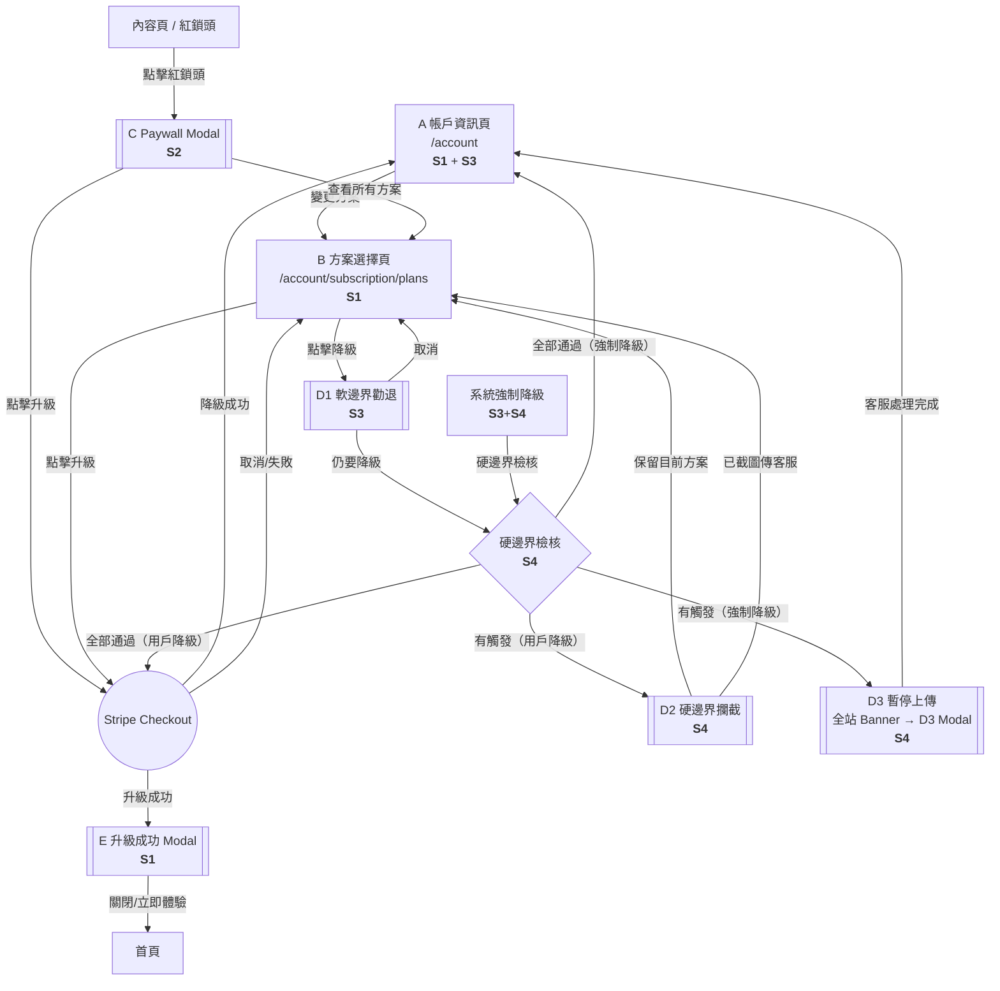

# Feature: SaaS 方案升降級流程重設計

**版本：** v1.2
**更新日期：** 2026-02-10
**狀態：** Draft

---

## 1. 概述

現有升降級流程 UX 不佳，導致升級轉化率偏低、降級時缺乏挽留機制。本次重設計 5 個核心元件（A 帳戶資訊頁、B 方案選擇頁、C Paywall Modal、D 降級 Modal、E 升級成功 Modal），建立完整的升降級體驗。

**目標用戶：** 處於「撞牆期」的專業創作者（醫師、顧問、知識型講師）。

**成功指標：** 升級轉化率提升 20%+、降級挽留率 > 30%。

---

## 2. 名詞定義

| 名詞 | 定義 |
|------|------|
| **紅鎖頭** | 付費功能旁的鎖定圖示，點擊觸發 Paywall Modal |
| **Paywall Modal** | 顯示功能需升級提示的彈窗（元件 C） |
| **降級勸退 Modal** | 降級前顯示將失去功能清單的彈窗（元件 D） |
| **Stripe Checkout** | Stripe 託管的結帳頁面 |
| **當期到期** | 當前計費週期結束的時間點 |
| **Legacy 方案** | 舊版方案，不可降回 |

---

## 3. 方案層級與定價

### 3.1 層級定義

| 方案 | 層級 | 說明 |
|------|------|------|
| Legacy | -1 | 舊版方案，**不可降回** |
| Free | 0 | 基礎免費 |
| Lite | 1 | |
| Pro | 2 | |
| Enterprise | 3 | |

### 3.2 方案功能對照表

> **Source: S0 Feature-Tier Registry** — 待 S0 registry 確認後更新，以下為目前已知項目。

| 功能 | Legacy | Free | Lite | Pro | Enterprise |
|------|--------|------|------|-----|------------|
| 創立節目上限 | 1 檔 | 1 檔 | 1 檔 | 5 檔 | **無限** |
| 進階數據分析 | ✗ | ✗ | ✗ | ✓ | ✓ |
| 下載數據報表 | ✗ | ✗ | ✗ | ✓ | ✓ |
| 單集 Flink 萬用連結 | ✗ | ✗ | ✓ | ✓ | ✓ |
| AI 內容萃取 | 1 集/月 | 1 集/月 | 3 集/月 | 6 集/月 | 25 集/月 |
| 移除動態廣告 | ✓ | ✗ | ✗ | ✓ | ✓ |
| 提高廣告分潤 | ✗ | ✗ | ✗ | ✗ | 100% |
| 調降經營會員抽成 | ✗ | ✗ | ✗ | 3% | 5% |

### 3.3 升級解鎖功能矩陣

| 升級至 → | 解鎖功能 |
|----------|---------|
| Lite | 單集 Flink 萬用連結、AI 內容萃取 3 集/月 |
| Pro | 創立 5 檔節目、進階數據分析、下載數據報表、單集 Flink 萬用連結、AI 內容萃取 6 集/月、移除動態廣告、調降經營會員抽成 3% |
| Enterprise | 全部功能 + 創立節目無限 + AI 25 集/月 + 廣告分潤 100% + 抽成 5% |

### 3.4 降級影響矩陣

詳見各 Story PRD（Story 3 軟邊界、Story 4 硬邊界）。

### 3.5 方案定價

> 所有價格均以美元（USD）計算。

| 方案 | 月繳 | 年繳（月均） | 年繳省下 |
|------|------|-------------|---------|
| Free | $0 | $0 | — |
| Lite | $9/mo | $7/mo | 22% |
| Pro | $19/mo | $15/mo | 21% |
| Enterprise | $199/mo | $159/mo | 20% |

- 預設顯示**年繳**，切換器使用 Toggle Switch 元件
- 首次升級用戶享 14 天免費試用，試用結束後統一以**年繳**計費。詳見 Story 1 Section 3.6

---

## 4. Story 拆分索引

| Story | 標題 | 範疇（元件） | 依賴 | 建議順序 |
|-------|------|-------------|------|---------|
| **S0** | [功能等級盤點](saas-plan-upgrade-downgrade-v1.2-story0-feature-registry-20260210.md) | Feature-Tier Registry | 無 | **0th (Blocker)** |
| **S1** | [方案瀏覽與升級](saas-plan-upgrade-downgrade-v1.2-story1-browse-upgrade-20260210.md) | A (`/account`) + B (`/account/subscription/plans`) + E | S0、Stripe Checkout、方案 API | 1st |
| **S2** | [Paywall 攔截](saas-plan-upgrade-downgrade-v1.2-story2-paywall-20260210.md) | C | S0、S1（B 頁 + 升級流程）、紅鎖頭系統 | 2nd |
| **S3** | [軟邊界降級](saas-plan-upgrade-downgrade-v1.2-story3-soft-downgrade-20260210.md) | D1 + A 待降級狀態 | S0、S1（B 頁）、使用量 API、Stripe 排程降級 | 3rd |
| **S4** | [硬邊界降級](saas-plan-upgrade-downgrade-v1.2-story4-hard-downgrade-20260210.md) | D2 | S0、S3（D1 流程）、硬邊界檢核 API、客服對話框 | 4th |

### 流程總覽

---

## 9. 依賴關係（總覽）

| 依賴 | 說明 | 狀態 |
|------|------|------|
| Stripe Checkout 整合 | 升降級 Checkout Session | 已有基礎 |
| 方案功能對照表 API | 各方案功能清單 | v1.1 已定義 |
| Stripe Webhook | 付款成功/失敗回調 | 已有基礎 |
| 紅鎖頭系統 | 功能與方案對應關係 | 需確認 |
| 用戶使用量 API | Flink 數量、集數等動態數值 | 需開發 |
| 硬邊界檢核 API | 節目數、法人提領、追蹤會員、Discord、Zapier | 需開發 |
| 客服對話框整合 | 接收降級截圖並觸發處理流程 | 需確認 |

---

## 10. 開放問題

| # | 問題 | 狀態 |
|---|------|------|
| 1 | ~~各方案具體價格？~~ | ✅ 已定義於 Section 3.5 |
| 2 | Enterprise 方案是否需要聯繫銷售而非 Stripe Checkout？ | 待確認 |
| 3 | ~~年繳/月繳切換是否在此次範圍內？~~ | ✅ 是，含 Toggle Switch |
| 4 | 降級後的資料處理規則？ | 待確認 |
| 5 | Legacy 用戶的具體遷移路徑？ | 待確認 |
| 6 | ~~Paywall Modal 的 feature_description 文案由誰定義？~~ | ✅ 由 S0 Feature-Tier Registry 定義，工程盤點後 PM review |

---

## 變更紀錄

| 日期 | 版本 | 變更說明 |
|------|------|----------|
| 2026-02-09 | v1.0 | 初版 Draft |
| 2026-02-09 | v1.1 | Legacy 方案、功能對照表、UI 規格 ASCII 佈局、i18n、D1/D2 拆分、定價、Toggle |
| 2026-02-10 | v1.2 | **縮減為索引文件**；新增 Story 拆分索引（S1-S4）+ 流程總覽圖標註各 Story 負責節點；詳細 UX 流程、BDD、UI 規格、i18n 移至各 Story PRD |
| 2026-02-10 | v1.2.1 | 新增 S0 功能等級盤點；Story 索引加入 S0 為所有 Story 的 blocker；開放問題 #6 由 S0 解決；3.2 加註待 S0 確認；S1-S4 加註 S0 來源引用 |
