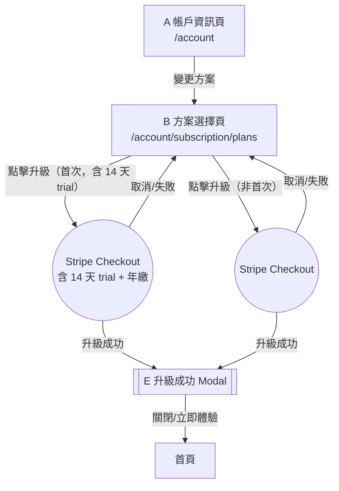

# Story 1: 方案瀏覽與升級

**Master PRD：** [saas-plan-upgrade-downgrade-v1.2-20260210.md](saas-plan-upgrade-downgrade-v1.2-20260210.md)
**Story：** S1 — 方案瀏覽與升級
**元件：** A（帳戶資訊頁）+ B（方案選擇頁）+ E（升級成功 Modal）
**依賴：** Stripe Checkout、方案功能對照表 API、Stripe Webhook

---

## 1. 範疇

用戶從帳戶頁進入方案選擇頁，瀏覽各方案定價與功能差異，選擇升級目標方案後跳轉 Stripe Checkout 完成付費，返回後顯示升級成功 Modal。

**頁面路徑：**

| 元件 | URL |
|------|-----|
| A 帳戶資訊頁 | `https://studio.firstory.me/account` |
| B 方案選擇頁 | `https://studio.firstory.me/account/subscription/plans` |

---

## 2. 名詞定義

| 名詞 | 定義 |
|------|------|
| **紅鎖頭** | 付費功能旁的鎖定圖示，點擊觸發 Paywall Modal |
| **Paywall Modal** | 顯示功能需升級提示的彈窗（元件 C） |
| **降級勸退 Modal** | 降級前顯示將失去功能清單的彈窗（元件 D） |
| **Stripe Checkout** | Stripe 託管的結帳頁面 |
| **當期到期** | 當前計費週期結束的時間點 |
| **Legacy 方案** | 舊版方案，不可降回 |
| **14 天免費試用** | 從未升級過的用戶首次升級任一付費方案時，享有 14 天免費試用期。每位用戶僅有一次機會，所有方案共享 |

---

## 3. 共用參考資料

### 3.1 層級定義

| 方案 | 層級 |
|------|------|
| Legacy | -1（不可降回） |
| Free | 0 |
| Lite | 1 |
| Pro | 2 |
| Enterprise | 3 |

### 3.2 方案功能對照表

> **Source: [S0 Feature-Tier Registry](saas-plan-upgrade-downgrade-v1.2-story0-feature-registry-20260210.md)** — 以下資料待 S0 registry 確認後同步更新。

| 功能 | Legacy | Free | Lite | Pro | Enterprise |
|------|--------|------|------|-----|------------|
| 創立節目上限 | 1 檔 | 1 檔 | 1 檔 | 5 檔 | **無限** |
| 進階數據分析 | ✗ | ✗ | ✗ | ✓ | ✓ |
| 下載數據報表 | ✗ | ✗ | ✗ | ✓ | ✓ |
| 單集 Flink 萬用連結 | ✗ | ✗ | ✓ | ✓ | ✓ |
| AI 內容萃取 | 1 集/月 | 1 集/月 | 3 集/月 | 6 集/月 | 25 集/月 |
| 移除動態廣告 | ✓ | ✗ | ✗ | ✓ | ✓ |
| 提高廣告分潤 | ✗ | ✗ | ✗ | ✗ | 100% |
| 調降經營會員抽成 | ✗ | ✗ | ✗ | 3% | 5% |

### 3.3 升級解鎖功能矩陣

| 升級至 → | 解鎖功能 |
|----------|---------|
| Lite | 單集 Flink 萬用連結、AI 內容萃取 3 集/月 |
| Pro | 創立 5 檔節目、進階數據分析、下載數據報表、單集 Flink 萬用連結、AI 內容萃取 6 集/月、移除動態廣告、調降經營會員抽成 3% |
| Enterprise | 全部功能 + 創立節目無限 + AI 25 集/月 + 廣告分潤 100% + 抽成 5% |

### 3.5 方案定價

| 方案 | 月繳 | 年繳（月均） | 年繳省下 |
|------|------|-------------|---------|
| Free | $0 | $0 | — |
| Lite | $9/mo | $7/mo | 22% |
| Pro | $19/mo | $15/mo | 21% |
| Enterprise | $199/mo | $159/mo | 20% |

- 預設顯示**年繳**，切換器使用 Toggle Switch 元件

### 3.6 免費試用規則

- **資格：** 從未升級過任何付費方案的用戶（含 Free 和 Legacy）
- **期間：** 14 天
- **次數：** 每位用戶僅一次，所有方案共享同一額度（例：用 Lite 試用後，Pro 不再有試用）
- **到期處理：** 14 天到期後自動開始以**年繳**方案扣款（統一採用年繳，不提供月繳選項）
- **提前取消：** 試用期間可取消，不產生費用，方案回到 Free
- **判斷依據：** 後端 `user.has_ever_subscribed` flag（布林值）

---

## 4. UX 流程（升級路徑）



### 入口：帳戶頁 → 方案選擇頁

1. 用戶在帳戶資訊頁 A 點擊「變更方案」
2. 進入方案選擇頁 B，顯示所有方案（標示當前方案）
3. 選擇升級目標方案 → 跳轉 Stripe Checkout

### Stripe 返回處理

| Stripe 結果 | 導向 |
|-------------|------|
| 升級成功 | Modal E: 升級成功 |
| 取消/失敗 | 方案選擇頁 B |

---

## 5. 驗收標準 (BDD)

**Feature: 方案瀏覽與升級**
As a 創作者, I want to 瀏覽方案並升級, So that 我能使用更多功能.

**Background:**
Given 用戶已登入且擁有一個 show

---

### Scenario 1: 從帳戶頁進入方案選擇頁

Given 用戶在帳戶資訊頁
When 用戶點擊「變更方案」
Then 應該顯示方案選擇頁
And 當前方案應該被標示

### Scenario 2: 從方案選擇頁升級

Given 用戶在方案選擇頁
And 用戶當前方案為 Lite
When 用戶點擊 Pro 方案的「升級」按鈕
Then 應該跳轉至 Stripe Checkout 頁面
And Stripe 應顯示 Pro 方案的付費資訊

### Scenario 3: 升級成功後顯示成功 Modal

Given 用戶在 Stripe Checkout 完成升級付費
When 用戶從 Stripe 返回
Then 應該顯示升級成功 Modal E
And Modal 應包含「立即體驗」按鈕

### Scenario 4: 升級成功 Modal 導向首頁

Given 升級成功 Modal E 已顯示
When 用戶點擊「立即體驗」或關閉 Modal
Then 應該導向首頁

### Scenario 5: Stripe 取消或失敗

Given 用戶在 Stripe Checkout 頁面
When 用戶取消付款或付款失敗
Then 應該返回方案選擇頁 B
And 用戶方案應維持不變

### Scenario 6: Free 用戶無降級選項

Given 用戶當前方案為 Free
When 用戶在方案選擇頁
Then 不應顯示任何降級選項
And 所有方案按鈕應顯示為「升級」

### Scenario 7: 首次升級用戶看到「14 天免費試用」按鈕

Given 用戶從未升級過任何付費方案（`has_ever_subscribed = false`）
When 用戶在方案選擇頁
Then 所有「升級」按鈕文案應顯示為「14 天免費試用」
And 按鈕樣式仍為 Primary

### Scenario 8: 首次升級用戶透過 Stripe Checkout 啟動試用

Given 用戶從未升級過任何付費方案
When 用戶點擊「14 天免費試用」按鈕
Then 應跳轉至 Stripe Checkout（含 14 天 trial period，綁定年繳方案）
And Stripe 應顯示試用結束後以年繳計費
And 試用成功後應顯示升級成功 Modal E

### Scenario 9: 已使用過試用的用戶看到一般「升級」按鈕

Given 用戶曾經升級過付費方案（`has_ever_subscribed = true`）
When 用戶在方案選擇頁
Then 所有升級按鈕應顯示一般「升級」文案
And 不應顯示「14 天免費試用」

---

## 6. UI 規格

> 所有元件遵循 Firstory Design System v2.0.0。
> 間距基準 4px，圓角預設 `--radius-md` (8px)，Modal 圓角 `--radius-xl` (16px)。

### A — 帳戶資訊頁

#### 佈局

```
┌─ Page: 帳戶資訊 ──────────────────────────────────────────────────┐
│  padding: 32px (左右) / 24px (上下)                                │
│                                                                    │
│  ┌─ Card default ────────────────────────────────────────────────┐ │
│  │  padding: 24px                                                │ │
│  │                                                               │ │
│  │  方案名稱 ──────────── text-xl / semibold / --foreground      │ │
│  │  Status Badge ───────── 「活躍」success                       │ │
│  │                         gap: 8px (與方案名水平排列)           │ │
│  │                                                               │ │
│  │  ┌─ 計費資訊 ─────────────────────────────────────────────┐  │ │
│  │  │  下次扣款日：{date}          金額：${amount}/mo         │  │ │
│  │  │  text-sm / --muted-foreground                           │  │ │
│  │  └────────────────────────────────────────────────────────┘  │ │
│  │                                         gap: 16px             │ │
│  │  [ 變更方案 ]  ─── Button Primary (lg), width: auto           │ │
│  │                                                               │ │
│  └───────────────────────────────────────────────────────────────┘ │
└────────────────────────────────────────────────────────────────────┘
```

#### 狀態（S1 範疇內）

| 狀態 | 顯示內容 | Design System 元件 |
|------|---------|-------------------|
| **正常** | 方案卡片 + Badge「活躍」+ 變更方案 CTA | Card default, Badge success, Button Primary (lg) |
| **試用中** | 方案卡片 + Badge「試用中」(info) + 試用到期提示 | Card default, Badge info, Alert Info |

> 「待降級」與「強制降級」狀態見 Story 3。
>
> **試用中狀態：** Badge 顯示「試用中」，下方 Alert Info 顯示「試用將於 {date} 到期，届時開始收費」。

---

### B — 方案選擇頁

#### 佈局

```
┌─ Page: 選擇方案 ──────────────────────────────────────────────────────────────┐
│  padding: 32px (左右) / 24px (上下)                                            │
│                                                                                │
│  標題: 「選擇最適合你的方案」 ── text-2xl / bold / --foreground                │
│  副標: 「隨時升級或降級，靈活調整」 ── text-base / --muted-foreground          │
│                                                     gap: 16px                  │
│  ┌─ Billing Toggle ── 置中 ─────────────────────────────────────────────────┐ │
│  │  [ 月繳 ]  ◉ Toggle Switch ──  [ 年繳 (預設) ]                           │ │
│  │  Toggle Switch 元件，default = 年繳 (右側)                                │ │
│  │  右側標註: 「省下最多 22%」── text-sm / semibold / --success-foreground   │ │
│  └────────────────────────────────────────────────────────────────────────────┘ │
│                                                     gap: 24px                  │
│  ┌─ Plan Grid: 4 欄 ── gap: 16px ────────────────────────────────────────────┐ │
│  │                                                                            │ │
│  │  ┌─ Free ──────┐  ┌─ Lite ──────┐  ┌─ Pro ───────┐  ┌─ Enterprise ──┐   │ │
│  │  │ Card default │  │ Card default │  │ Card elevat.│  │ Card default  │   │ │
│  │  │ pad: 24px    │  │ pad: 24px    │  │ pad: 24px   │  │ pad: 24px     │   │ │
│  │  │              │  │              │  │ ┌─────────┐ │  │               │   │ │
│  │  │              │  │              │  │ │Most Pop.│ │  │               │   │ │
│  │  │              │  │              │  │ └─────────┘ │  │               │   │ │
│  │  │ 方案名       │  │ 方案名       │  │ 方案名      │  │ 方案名        │   │ │
│  │  │ $0/mo        │  │ $7/mo        │  │ $15/mo      │  │ $159/mo       │   │ │
│  │  │              │  │ (月繳 $9)    │  │ (月繳 $19)  │  │ (月繳 $199)   │   │ │
│  │  │              │  │ 省 22%       │  │ 省 21%      │  │ 省 20%        │   │ │
│  │  │ ── 功能 ──  │  │ ── 功能 ──  │  │ ── 功能 ── │  │ ── 功能 ──   │   │ │
│  │  │ ✓ 功能 1    │  │ ✓ 功能 1    │  │ ✓ 功能 1   │  │ ✓ 功能 1     │   │ │
│  │  │ ...          │  │ ...          │  │ ...         │  │ ...           │   │ │
│  │  │              │  │              │  │             │  │               │   │ │
│  │  │ [目前方案]   │  │ [升級/降級]  │  │ [升級/降級] │  │ [升級/降級]   │   │ │
│  │  └──────────────┘  └──────────────┘  └─────────────┘  └───────────────┘   │ │
│  └────────────────────────────────────────────────────────────────────────────┘ │
│                                                     gap: 16px                  │
│  ┌─ 「完整比較」── 置中 ─────────────────────────────────────────────────────┐ │
│  │  [ 完整比較 ↗ ]  ── Button Ghost (md), Lucide `ExternalLink` icon         │ │
│  │  onclick: window.open('https://firstory.me/pricing', '_blank')             │ │
│  └────────────────────────────────────────────────────────────────────────────┘ │
│                                                     gap: 32px                  │
│  ┌─ 功能比較表 ── Card outlined ─────────────────────────────────────────────┐ │
│  │  （見 Section 3.2 功能對照表）                                             │ │
│  └────────────────────────────────────────────────────────────────────────────┘ │
└────────────────────────────────────────────────────────────────────────────────┘
```

#### 方案卡片按鈕狀態

| 用戶當前方案 | Free 卡片 | Lite 卡片 | Pro 卡片 | Enterprise 卡片 |
|-------------|----------|----------|---------|----------------|
| **Free** | `目前方案` (disabled) | `升級` Primary | `升級` Primary | `升級` Primary |
| **Lite** | `降級` Ghost | `目前方案` (disabled) | `升級` Primary | `升級` Primary |
| **Pro** | `降級` Ghost | `降級` Ghost | `目前方案` (disabled) | `升級` Primary |
| **Enterprise** | `降級` Ghost | `降級` Ghost | `降級` Ghost | `目前方案` (disabled) |
| **Legacy** | `升級` Primary | `升級` Primary | `升級` Primary | `升級` Primary |

> **Pro 卡片**使用 Card elevated + Badge `Most Popular`
>
> **免費試用按鈕規則：** 若用戶從未升級過（`has_ever_subscribed = false`），所有「升級」Primary 按鈕文案替換為「14 天免費試用」。已用過試用的用戶顯示一般「升級」文案。

---

### E — 升級成功 Modal

#### 佈局

```
┌─ Modal sm (480px) ── border-radius: 16px ── shadow-xl ──────────┐
│  padding: 24px                                                    │
│                                                          [×] ──── │
│                                                                   │
│  ┌─ Icon ──┐                                                      │
│  │  Check  │  ── Lucide `CheckCircle`, 48px, --success-fgnd       │
│  └─────────┘                                                      │
│                                          gap: 16px                │
│  升級成功！                                                        │
│  ── text-xl / semibold / --foreground                              │
│                                          gap: 8px                 │
│  你已升級至 {plan} 方案，以下功能已解鎖：                           │
│  ── text-sm / --muted-foreground                                   │
│                                          gap: 12px                │
│  ┌─ 解鎖功能清單 ── Card filled (bg: --success, 低透明度) ──────┐ │
│  │  padding: 16px                                                │ │
│  │  ✓ {unlock_item_1}                                            │ │
│  │  ✓ {unlock_item_2}                                            │ │
│  │  ...                                                          │ │
│  │  ── text-sm / --success-foreground / Lucide `Check` 16px      │ │
│  └───────────────────────────────────────────────────────────────┘ │
│                                          gap: 24px                │
│  ┌──────────────────────────────────────────────────────────────┐ │
│  │  [ 立即體驗 ]      ── Button Primary (lg), full-width         │ │
│  └──────────────────────────────────────────────────────────────┘ │
└───────────────────────────────────────────────────────────────────┘
  背景遮罩: var(--overlay)
```

#### 動態內容對照表

| 升級至 | 解鎖功能清單 |
|--------|------------|
| Lite | 單集 Flink 萬用連結、AI 內容萃取 3 集/月 |
| Pro | 創立 5 檔節目、進階數據分析、下載數據報表、單集 Flink 萬用連結、AI 內容萃取 6 集/月、移除動態廣告、調降經營會員抽成 3% |
| Enterprise | 創立節目無限、進階數據分析、下載數據報表、單集 Flink 萬用連結、AI 內容萃取 25 集/月、移除動態廣告、提高廣告分潤 100%、調降經營會員抽成 5% |

---

## 7. i18n 對照表

| Key | zh-TW | en |
|-----|-------|----|
| `plan.upgrade.cta` | 升級 | Upgrade |
| `plan.change.cta` | 變更方案 | Change Plan |
| `plan.current.label` | 目前方案 | Current Plan |
| `plan.recommended.label` | 最多人選擇 | Most Popular |
| `plan.select.title` | 選擇最適合你的方案 | Choose the Right Plan for You |
| `plan.select.subtitle` | 隨時升級或降級，靈活調整 | Upgrade or downgrade anytime |
| `plan.upgrade.success.title` | 升級成功！ | Upgrade Successful! |
| `plan.upgrade.success.subtitle` | 你已升級至 {plan} 方案，以下功能已解鎖： | You've upgraded to {plan}. The following features are now unlocked: |
| `plan.upgrade.success.cta` | 立即體驗 | Start Exploring |
| `plan.upgrade.unlock.show_5` | 創立 5 檔節目 | Create Up to 5 Shows |
| `plan.upgrade.unlock.analytics` | 進階數據分析 | Advanced Analytics |
| `plan.upgrade.unlock.report` | 下載數據報表 | Download Data Reports |
| `plan.upgrade.unlock.flink` | 單集 Flink 萬用連結 | Episode Flink Universal Links |
| `plan.upgrade.unlock.ai` | AI 內容萃取 {count} 集/月 | AI Content Extraction {count}/month |
| `plan.upgrade.unlock.no_ad` | 移除動態廣告 | Remove Dynamic Ads |
| `plan.upgrade.unlock.ad_revenue` | 提高廣告分潤 {percent}% | Increase Ad Revenue Share {percent}% |
| `plan.upgrade.unlock.commission` | 調降經營會員抽成 {percent}% | Reduce Membership Commission {percent}% |
| `plan.upgrade.unlock.unlimited_show` | 創立節目無限 | Unlimited Shows |
| `plan.billing.monthly` | 月繳 | Monthly |
| `plan.billing.annual` | 年繳 | Annual |
| `plan.billing.save` | 省下最多 {percent}% | Save up to {percent}% |
| `plan.billing.annual_note` | 省 {percent}% | Save {percent}% |
| `plan.billing.price` | ${amount}/mo | ${amount}/mo |
| `plan.billing.price_note` | 所有價格均以美元計算 | All prices are in USD |
| `plan.compare.full` | 完整比較 | Full Comparison |
| `plan.trial.cta` | 14 天免費試用 | 14-Day Free Trial |
| `plan.trial.badge` | 試用中 | Trial |
| `plan.trial.info` | 試用將於 {date} 到期，届時以年繳方案開始收費 | Trial ends on {date}, annual billing starts automatically |

---

## 8. Figma Make Prompt

> 設計方案瀏覽與升級流程：
> 1. 帳戶資訊頁：方案卡片（方案名 + 狀態 Badge「活躍」+ 計費資訊 USD）、變更方案 CTA
> 2. 方案選擇頁：月繳/年繳 Toggle Switch（預設年繳，標註省下 %）；4 個方案卡片（Free $0 / Lite $7 / Pro $15 / Enterprise $159），Pro 標記 Most Popular，標示當前方案，升級用 Primary 按鈕、降級用 Ghost 按鈕；「完整比較」外部連結按鈕；底部功能比較表
> 3. 升級成功 Modal (480px)：CheckCircle icon、恭喜訊息、解鎖功能清單（綠色背景卡片 + Check icon）、立即體驗按鈕
> 4. 新增首次升級用戶視角：所有升級按鈕文案為「14 天免費試用」；帳戶頁新增「試用中」狀態（Badge info + 到期提示）
