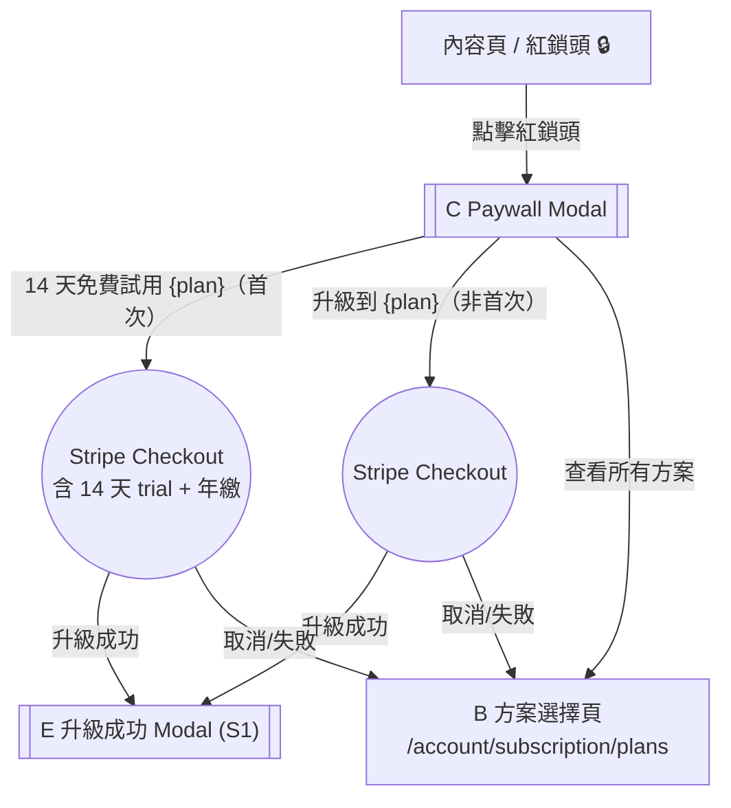

# Story 2: Paywall 攔截

**Master PRD：** [saas-plan-upgrade-downgrade-v1.2-20260210.md](saas-plan-upgrade-downgrade-v1.2-20260210.md)
**Story：** S2 — Paywall 攔截
**元件：** C（Paywall Modal）
**依賴：** Story 1（B 頁 + 升級流程）、紅鎖頭系統

---

## 1. 範疇

用戶在內容頁點擊紅鎖頭（付費功能鎖定圖示），觸發 Paywall Modal，可直接升級至該功能所需最低方案，或導向方案選擇頁瀏覽所有方案。

---

## 2. 名詞定義

| 名詞 | 定義 |
|------|------|
| **紅鎖頭** | 付費功能旁的鎖定圖示，點擊觸發 Paywall Modal |
| **Paywall Modal** | 顯示功能需升級提示的彈窗（元件 C） |
| **Stripe Checkout** | Stripe 託管的結帳頁面 |

---

## 3. 共用參考：方案功能對照表

| 功能 | Free | Lite | Pro | Enterprise |
|------|------|------|-----|------------|
| 進階數據分析 | ✗ | ✗ | ✓ | ✓ |
| 下載數據報表 | ✗ | ✗ | ✓ | ✓ |
| 單集 Flink 萬用連結 | ✗ | ✓ | ✓ | ✓ |
| 移除動態廣告 | ✗ | ✗ | ✓ | ✓ |

> Paywall 觸發時，根據功能對照表判斷該功能所需的最低方案。

---

## 4. UX 流程（Paywall 路徑）



### 流程步驟

1. 用戶在內容頁點擊紅鎖頭
2. 顯示 Paywall Modal C，說明該功能所需方案
3. 用戶可選擇：
   - **首次用戶（`has_ever_subscribed = false`）：**「14 天免費試用 {plan}」→ 跳轉 Stripe Checkout（含 14 天 trial，試用結束後自動以**年繳**計費）
   - **非首次用戶：**「升級到 {plan}」→ 跳轉 Stripe Checkout（直接升級到該功能所需的最低方案）
   - 「查看所有方案」→ 前往方案選擇頁 B（S1）

---

## 5. 驗收標準 (BDD)

**Feature: Paywall 攔截**
As a 創作者, I want to 透過紅鎖頭了解付費功能, So that 我能快速升級解鎖需要的功能.

**Background:**
Given 用戶已登入且擁有一個 show

---

### Scenario 1: 紅鎖頭觸發 Paywall Modal

Given 用戶在內容頁
And 用戶當前方案無法使用某功能
When 用戶點擊該功能旁的紅鎖頭
Then 應該顯示 Paywall Modal C
And Modal 應說明該功能所需方案

### Scenario 2: Paywall Modal 直接升級

Given Paywall Modal C 已顯示
And 該功能最低需要 Pro 方案
When 用戶點擊「升級到 Pro」
Then 應該跳轉至 Stripe Checkout
And Stripe 應顯示 Pro 方案的付費資訊

### Scenario 3: Paywall Modal 查看所有方案

Given Paywall Modal C 已顯示
When 用戶點擊「查看所有方案」
Then 應該導向方案選擇頁 B

---

## 6. UI 規格

### C — Paywall Modal

#### 佈局

```
┌─ Modal sm (480px) ── border-radius: 16px ── shadow-xl ──────────┐
│  padding: 24px                                                    │
│                                                          [×] ──── │
│                                                                   │
│  ┌─ Icon ──┐                                                      │
│  │  Lock   │  ── Lucide `Lock` icon, 48px, --primary              │
│  └─────────┘                                                      │
│                                          gap: 16px                │
│  此功能需要 {plan} 方案                                            │
│  ── text-xl / semibold / --foreground                              │
│                                          gap: 8px                 │
│  {feature_description}                                             │
│  ── text-sm / --muted-foreground / max 2 行                       │
│                                          gap: 24px                │
│  ┌──────────────────────────────────────────────────────────────┐ │
│  │  [ 升級到 {plan} ]  ── Button Primary (lg), full-width       │ │
│  └──────────────────────────────────────────────────────────────┘ │
│                                          gap: 8px                 │
│  ┌──────────────────────────────────────────────────────────────┐ │
│  │  [ 查看所有方案 ]   ── Button Ghost (lg), full-width          │ │
│  └──────────────────────────────────────────────────────────────┘ │
└───────────────────────────────────────────────────────────────────┘
  背景遮罩: var(--overlay)
```

#### 動態內容

> **feature_description 來源: [S0 Feature-Tier Registry](saas-plan-upgrade-downgrade-v1.2-story0-feature-registry-20260210.md)** — `description` 欄位。待 S0 確認後可能補充更多觸發功能。

| 觸發功能 | {plan} | {feature_description} |
|---------|--------|----------------------|
| 進階數據分析 | Pro | 深入了解聽眾行為與互動數據，優化你的內容策略 |
| 下載數據報表 | Pro | 將數據匯出為報表，方便分析與簡報使用 |
| 單集 Flink 萬用連結 | Lite | 為每集建立專屬短連結，追蹤各管道成效 |
| 移除動態廣告 | Pro | 移除系統自動插入的廣告，提供乾淨的收聽體驗 |

> **免費試用 CTA 規則：** 若用戶符合試用資格（`has_ever_subscribed = false`），CTA 文案從「升級到 {plan}」改為「14 天免費試用 {plan}」。詳見 Story 1 Section 3.6。

#### 狀態

| 狀態 | 說明 |
|------|------|
| **Default** | 如上佈局 |
| **Hover (升級按鈕)** | bg: `--primary-hover` |
| **Hover (查看所有方案)** | bg: `--primary-muted` |

---

## 7. i18n 對照表

| Key | zh-TW | en |
|-----|-------|----|
| `plan.paywall.title` | 此功能需要 {plan} 方案 | This feature requires {plan} |
| `plan.paywall.upgrade` | 升級到 {plan} | Upgrade to {plan} |
| `plan.paywall.view_all` | 查看所有方案 | View All Plans |
| `plan.paywall.trial_upgrade` | 14 天免費試用 {plan} | 14-Day Free Trial {plan} |

---

## 8. Figma Make Prompt

> 設計 Paywall Modal：
> - Modal sm (480px)，圓角 16px
> - Lock icon 48px → 功能名稱 text-xl → 價值描述 text-sm
> - 升級 CTA（Primary full-width）→ 查看所有方案（Ghost full-width）
> - 4 種觸發功能情境：進階數據分析、下載數據報表、單集 Flink、移除動態廣告
