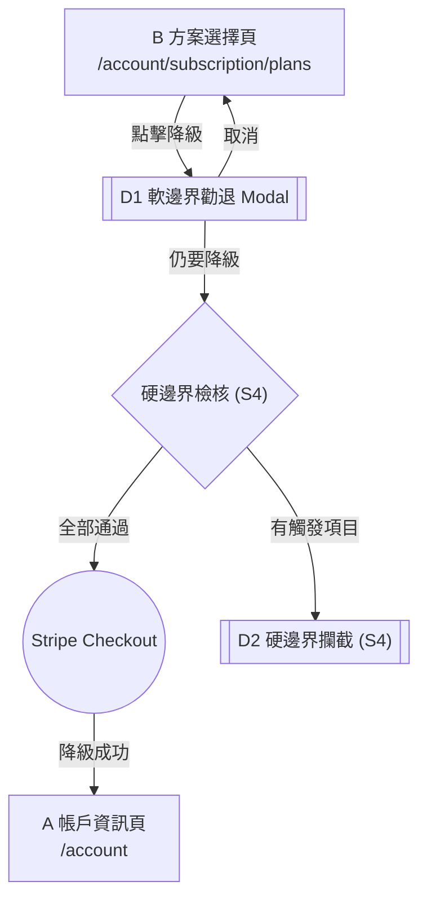
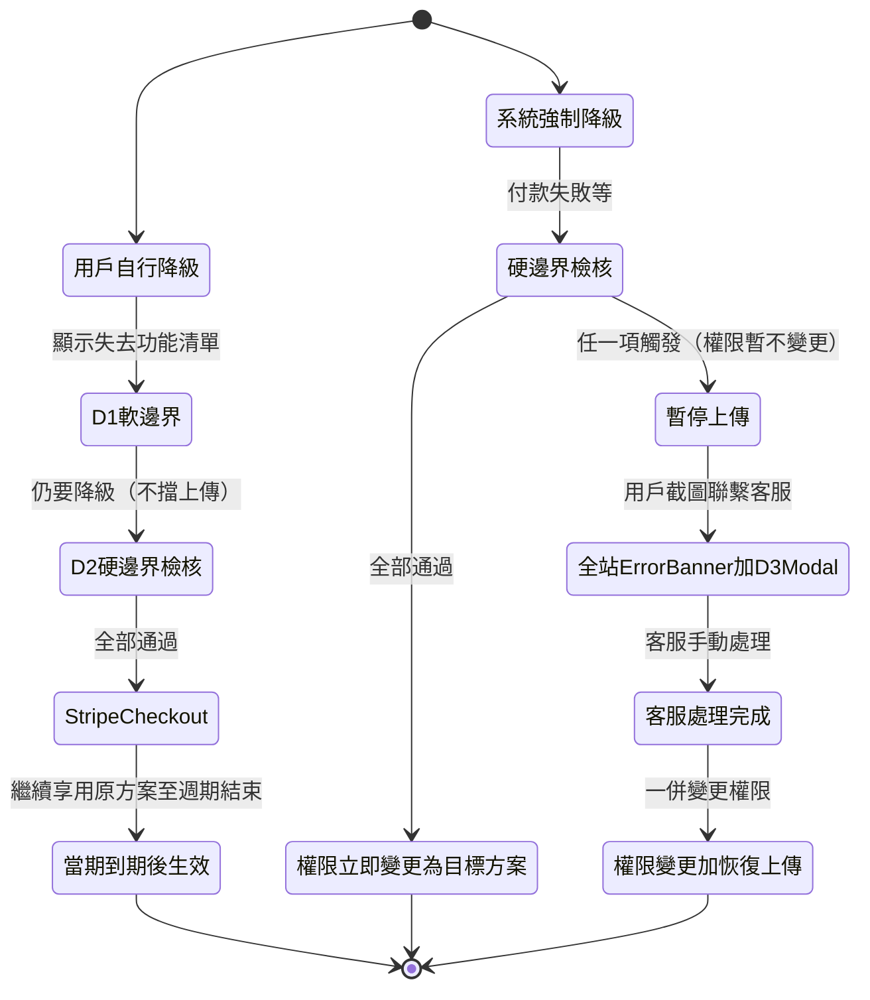

# Story 3: 軟邊界降級

**Master PRD：** [saas-plan-upgrade-downgrade-v1.2-20260210.md](saas-plan-upgrade-downgrade-v1.2-20260210.md)
**Story：** S3 — 軟邊界降級
**元件：** D1（軟邊界勸退 Modal）+ A（待降級 / 強制降級狀態）+ 全站 Error Banner（強制降級暫停上傳）
**依賴：** Story 1（B 頁存在）、使用量 API、Stripe 排程降級

---

## 1. 範疇

用戶在方案選擇頁選擇較低方案後，顯示軟邊界勸退 Modal（D1），列出降級後將失去的功能清單。用戶可取消或繼續降級。降級成功後，帳戶頁 A 顯示「待降級」狀態；系統強制降級時顯示警告 Banner。

---

## 2. 名詞定義

| 名詞 | 定義 |
|------|------|
| **降級勸退 Modal** | 降級前顯示將失去功能清單的彈窗（元件 D1） |
| **Stripe Checkout** | Stripe 託管的結帳頁面 |
| **當期到期** | 當前計費週期結束的時間點 |

---

## 3. 降級影響矩陣（軟邊界）

> **downgrade_impact 來源: [S0 Feature-Tier Registry](saas-plan-upgrade-downgrade-v1.2-story0-feature-registry-20260210.md)** — 以下矩陣可由 Registry 的 `downgrade_impact` 欄位推導生成。
>
> Modal D1 動態內容來源。數字欄位以 `{變數}` 標示，需由後端即時帶入。

### 從 Enterprise 降

| 降至 → | 失去功能清單 |
|--------|-------------|
| Pro | 每月失去 19 集 AI 內容萃取、每筆廣告分潤減少 100%、每筆經營會員抽成漲價 2% |
| Lite | 失去下載數據報表、總計 {flink_count} 條單集 Flink 萬用連結失效、每月失去 22 集 AI 內容萃取、每筆廣告分潤減少 100%、每筆經營會員抽成漲價 5% |
| Free | 總計 {flink_count} 條單集 Flink 萬用連結失效、每月失去 24 集 AI 內容萃取、自動幫所有 {episode_count} 集單集插入廣告、每筆廣告分潤減少 100%、每筆經營會員抽成漲價 5% |

### 從 Pro 降

| 降至 → | 失去功能清單 |
|--------|-------------|
| Lite | 失去下載數據報表、總計 {flink_count} 條單集 Flink 萬用連結失效、每月失去 3 集 AI 內容萃取、每筆經營會員抽成漲價 3% |
| Free | 總計 {flink_count} 條單集 Flink 萬用連結失效、每月失去 5 集 AI 內容萃取、自動幫所有 {episode_count} 集單集插入廣告、每筆經營會員抽成漲價 3% |

### 從 Lite 降

| 降至 → | 失去功能清單 |
|--------|-------------|
| Free | 每月失去 2 集 AI 內容萃取、自動幫所有 {episode_count} 集單集插入廣告 |

> **規則：** 所有方案都「降不回 Legacy」。Legacy 用戶在方案選擇頁只看到升級選項。

---

## 4. UX 流程（降級 → D1 路徑）



### 流程步驟

1. 用戶在方案選擇頁 B 選擇較低方案
2. 顯示 Modal D1：列出降級後將失去的具體功能
3. 用戶選擇：
   - 「取消」→ 回 B
   - 「仍要降級」→ 後端執行硬邊界檢核（S4）
4. 若硬邊界全部通過 → Stripe Checkout
5. 降級成功 → 返回帳戶頁 A（顯示「待降級」狀態）

### 降級生效規則



#### 降級生效規則說明

- **用戶自行降級**：走完 D1 軟邊界 → D2 硬邊界檢核（有觸發則要求截圖聯繫客服，但**不會暫停上傳**）→ 全部通過後進入 Stripe → 降級於當期到期後生效
- **系統強制降級**（付款失敗等）：
  - **硬邊界全通過**：權限立即變更為目標方案（例：降到 Free → 開啟廣告、鎖定 Pro 功能紅鎖頭）
  - **硬邊界有觸發**：權限**暫不變更**，暫停上傳功能，全站顯示 Error Banner → 點擊開 D3 Modal → 客服處理完成後一併變更權限並恢復上傳

---

## 5. 驗收標準 (BDD)

**Feature: 軟邊界降級**
As a 創作者, I want to 了解降級影響後再做決定, So that 我不會意外失去重要功能.

**Background:**
Given 用戶已登入且擁有一個 show

---

### Scenario 1: 降級觸發勸退 Modal

Given 用戶在方案選擇頁
And 用戶當前方案為 Pro
When 用戶點擊 Lite 方案
Then 應該顯示降級勸退 Modal D1
And Modal 應列出降級後將失去的功能清單

### Scenario 2: 降級勸退 — 用戶取消

Given 降級勸退 Modal D1 已顯示
When 用戶點擊「取消」
Then Modal 應關閉
And 用戶應回到方案選擇頁 B

### Scenario 3: 降級勸退 — 用戶確認降級（硬邊界全通過）

Given 降級勸退 Modal D1 已顯示
When 用戶點擊「仍要降級」
And 硬邊界檢核全部通過
Then 應該跳轉至 Stripe Checkout 處理降級

### Scenario 4: 用戶自行降級成功

Given 用戶透過 Stripe Checkout 完成降級
When 用戶從 Stripe 返回
Then 應該導向帳戶資訊頁 A
And 帳戶頁應顯示新方案（當期到期後生效）
And 用戶在當期到期前應繼續享用原方案功能

### Scenario 5a: 系統強制降級 — 硬邊界全通過

Given 用戶因付款失敗等原因被系統強制降級
And 5 項硬邊界檢核全部通過
When 系統執行降級
Then 權限應立即變更為目標方案
And 受限功能應立即鎖定（顯示紅鎖頭）
And 上傳功能應正常可用

### Scenario 5b: 系統強制降級 — 硬邊界有觸發 → 暫停上傳

Given 用戶因付款失敗等原因被系統強制降級
And 硬邊界檢核有項目被觸發
When 系統執行降級
Then 上傳功能應暫停
And 權限應暫不變更（維持原方案權限）
And **所有** `studio.firstory.me/*` 頁面頂部應顯示 Error Banner
And Error Banner 不可關閉
And Error Banner 點擊應開啟 D3 Modal

### Scenario 5c: 客服處理完成 → 恢復上傳 + 權限變更

Given 系統強制降級後上傳已暫停
And 客服已處理完所有硬邊界項目
When 客服標記處理完成
Then 權限應變更為目標方案
And 上傳功能應恢復
And 全站 Error Banner 應消失

### Scenario 6: Stripe 取消或失敗

Given 用戶在 Stripe Checkout 頁面
When 用戶取消付款或付款失敗
Then 應該返回方案選擇頁 B
And 用戶方案應維持不變

---

## 6. UI 規格

### D1 — 軟邊界勸退 Modal

#### 佈局

```
┌─ Modal sm (480px) ── border-radius: 16px ── shadow-xl ──────────┐
│  padding: 24px                                                    │
│                                                          [×] ──── │
│                                                                   │
│  ┌─ Icon ──┐                                                      │
│  │  Alert  │  ── Lucide `AlertTriangle`, 48px, --warning-fgnd     │
│  └─────────┘                                                      │
│                                          gap: 16px                │
│  確定要降級嗎？                                                    │
│  ── text-xl / semibold / --foreground                              │
│                                          gap: 8px                 │
│  降級後您將失去以下功能：                                           │
│  ── text-sm / --muted-foreground                                   │
│                                          gap: 12px                │
│  ┌─ 失去功能清單 ── Card filled (bg: --error, 低透明度) ────────┐ │
│  │  padding: 16px                                                │ │
│  │  − {loss_item_1}                                              │ │
│  │  − {loss_item_2}                                              │ │
│  │  − {loss_item_3}                                              │ │
│  │  ...                                                          │ │
│  │  ── text-sm / --error-foreground / Lucide `Minus` 16px        │ │
│  └───────────────────────────────────────────────────────────────┘ │
│                                          gap: 12px                │
│  降級將於當期結束後（{date}）生效。                                 │
│  ── text-xs / --muted-foreground                                   │
│                                          gap: 24px                │
│  ┌──────────────────────────────────────────────────────────────┐ │
│  │  [ 取消 ]          ── Button Primary (lg), full-width         │ │
│  └──────────────────────────────────────────────────────────────┘ │
│                                          gap: 8px                 │
│  ┌──────────────────────────────────────────────────────────────┐ │
│  │  [ 仍要降級 ]      ── Button Ghost (lg), full-width           │ │
│  └──────────────────────────────────────────────────────────────┘ │
└───────────────────────────────────────────────────────────────────┘
  背景遮罩: var(--overlay)
```

#### 軟邊界動態內容對照表

| 當前 → 目標 | 清單項目 |
|------------|---------|
| Enterprise → Pro | AI -19 集、廣告分潤 -100%、抽成 +2% |
| Enterprise → Lite | 失去下載數據報表、Flink 失效 {n} 條、AI -22 集、廣告分潤 -100%、抽成 +5% |
| Enterprise → Free | Flink 失效 {n} 條、AI -24 集、插入廣告 {n} 集、廣告分潤 -100%、抽成 +5% |
| Pro → Lite | 失去下載數據報表、Flink 失效 {n} 條、AI -3 集、抽成 +3% |
| Pro → Free | Flink 失效 {n} 條、AI -5 集、插入廣告 {n} 集、抽成 +3% |
| Lite → Free | AI -2 集、插入廣告 {n} 集 |

---

### A — 帳戶資訊頁（待降級 / 強制降級狀態）

#### 待降級狀態

```
┌─ Card default ────────────────────────────────────────────────┐
│  方案名稱 + Badge「待降級」(warning)                           │
│  計費資訊                                                      │
│  [ 變更方案 ] Button Primary                                   │
└───────────────────────────────────────────────────────────────┘
┌─ Alert Info Banner ───────────────────────────────────────────┐
│  ℹ 您的方案將於 {date} 變更為 {plan}                          │
└───────────────────────────────────────────────────────────────┘
```

#### 強制降級狀態（硬邊界全通過 — 權限已變更）

```
┌─ Card default ────────────────────────────────────────────────┐
│  方案名稱 + Badge「活躍」(success)                             │
│  免費方案                                                      │
│  [ 變更方案 ] Button Primary                                   │
└───────────────────────────────────────────────────────────────┘
┌─ Alert Warning Banner ────────────────────────────────────────┐
│  ⚠ 您的付款失敗，方案已降級為 {plan}。請更新付款方式。         │
└───────────────────────────────────────────────────────────────┘
```

#### 強制降級狀態（硬邊界有觸發 — 上傳暫停中）

> 權限暫不變更，方案卡片仍顯示原方案。全站 Error Banner 固定於 `studio.firstory.me/*` 所有頁面頂部。

```
┌─ 全站 Error Banner（Global, 不可關閉）────────────────────────┐
│  ❌ 上傳功能已暫停，請點此聯繫客服處理                         │
│  ── bg: --error / text: --error-foreground                     │
│  ── 固定於頁面頂部（所有頁面）                                 │
│  ── onclick: 開啟 D3 Modal                                     │
│  ── 不可關閉（無 × 按鈕）                                     │
└───────────────────────────────────────────────────────────────┘

┌─ Card default ────────────────────────────────────────────────┐
│  方案名稱（原方案）+ Badge「暫停中」(error)                    │
│  計費資訊（原方案）                                            │
│  [ 變更方案 ] Button Primary                                   │
└───────────────────────────────────────────────────────────────┘
```

---

## 7. i18n 對照表

| Key | zh-TW | en |
|-----|-------|----|
| `plan.downgrade.cta` | 降級 | Downgrade |
| `plan.downgrade.confirm.title` | 確定要降級嗎？ | Are you sure you want to downgrade? |
| `plan.downgrade.confirm.lose` | 降級後您將失去以下功能： | You will lose access to: |
| `plan.downgrade.confirm.cancel` | 取消 | Cancel |
| `plan.downgrade.confirm.proceed` | 仍要降級 | Downgrade Anyway |
| `plan.downgrade.confirm.effective` | 降級將於當期結束後（{date}）生效。 | Downgrade takes effect after your current period ends ({date}). |
| `plan.downgrade.pending` | 您的方案將於 {date} 變更為 {plan} | Your plan will change to {plan} on {date} |
| `plan.downgrade.forced` | 您的付款失敗，方案已降級為 {plan}。請更新付款方式。 | Payment failed. Your plan has been downgraded to {plan}. Please update your payment method. |
| `plan.downgrade.forced.upload_suspended` | 上傳功能已暫停，請點此聯繫客服處理 | Upload is suspended. Click here to contact support. |
| `plan.downgrade.forced.badge_suspended` | 暫停中 | Suspended |
| `plan.downgrade.loss.report` | 失去下載數據報表 | Lose access to Download Data Reports |
| `plan.downgrade.loss.flink` | 總計 {count} 條單集 Flink 萬用連結失效 | {count} episode Flink links will be deactivated |
| `plan.downgrade.loss.ai` | 每月失去 {count} 集 AI 內容萃取 | Lose {count} AI content extractions per month |
| `plan.downgrade.loss.ad_insert` | 自動幫所有 {count} 集單集插入廣告 | Ads will be auto-inserted into all {count} episodes |
| `plan.downgrade.loss.ad_revenue` | 每筆廣告分潤減少 {percent}% | Ad revenue share reduced by {percent}% |
| `plan.downgrade.loss.commission` | 每筆經營會員抽成漲價 {percent}% | Membership commission increases by {percent}% |
| `plan.legacy.no_downgrade` | 此方案無法降回 Legacy | Cannot downgrade to Legacy plan |

---

## 8. Figma Make Prompt

> 設計軟邊界降級流程：
> 1. 降級勸退 Modal D1 (480px)：AlertTriangle icon、「確定要降級嗎？」、失去功能清單（紅色背景卡片 + Minus icon）、生效時間提示、取消按鈕（Primary）、仍要降級（Ghost）
> 2. 帳戶頁待降級狀態：Badge「待降級」+ Info Banner
> 3. 帳戶頁強制降級狀態：Warning Banner
