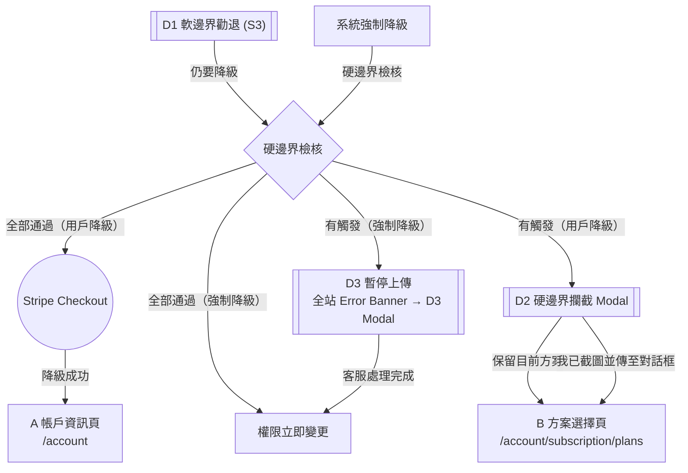

# Story 4: 硬邊界降級

**Master PRD：** [saas-plan-upgrade-downgrade-v1.2-20260210.md](saas-plan-upgrade-downgrade-v1.2-20260210.md)
**Story：** S4 — 硬邊界降級
**元件：** D2（硬邊界攔截 Modal）+ D3（強制降級暫停上傳 Modal）+ 全站 Error Banner
**依賴：** Story 3（D1 流程）、硬邊界檢核 API、客服對話框整合

---

## 1. 範疇

用戶在 D1 點擊「仍要降級」後，後端執行硬邊界檢核。若任一高危險項目被觸發，顯示 D2 Modal 要求用戶截圖聯繫客服手動處理。若全部通過則跳過 D2 直接進入 Stripe Checkout。

**系統強制降級亦觸發硬邊界檢核：** 當系統因付款失敗等原因強制降級時，同樣執行 5 項硬邊界檢核。若全部通過，權限立即變更為目標方案；若任一項觸發，則暫停上傳功能、全站顯示 Error Banner，點擊開啟 D3 Modal（佈局類似 D2，強調上傳已暫停），等待客服處理完成後一併變更權限並恢復上傳。

---

## 2. 名詞定義

| 名詞 | 定義 |
|------|------|
| **硬邊界檢核** | 後端在 D1 之後執行的 5 項高危險檢核 |
| **Modal D2** | 硬邊界攔截彈窗，要求用戶截圖聯繫客服 |
| **客服對話框** | 右下角即時客服對話元件 |

---

## 3. 硬邊界檢核項目

> **檢核項目來源: [S0 Feature-Tier Registry](saas-plan-upgrade-downgrade-v1.2-story0-feature-registry-20260210.md)** — 對應 Registry 中 `lock_type` 為 quota 或 binary 且涉及硬邊界的 feature_key。
>
> 後端在用戶通過 Phase 1（D1）後執行檢核。若以下 5 項**全部通過**（皆不觸發），則跳過 D2 直接進入 Stripe Checkout。任一項觸發，則顯示 Modal D2。

| # | 檢核項目 | 觸發條件 | 說明 |
|---|---------|---------|------|
| 1 | 移除部分節目 | 降級後方案節目上限 < 現有節目數 | 例：Enterprise (無限) → Pro (5 檔)，但用戶有 8 個節目 |
| 2 | 移除法人銀行提領 | 降到 Lite 或 Free，且目前設有法人銀行提領 | 法人提領僅 Pro+ 支援 |
| 3 | 移除部分免費追蹤會員 | 降級後免費追蹤會員上限 < 現有免費追蹤會員人數 | 各方案上限：Free 50 / Lite 100 / Pro 500 / Enterprise 7,000 |
| 4 | 關閉 Discord 群組 | 降到 Lite 或 Free，且目前設有 Discord 群組 | Discord 整合僅 Pro+ 支援 |
| 5 | 關閉 Zapier 會員自動信 | 降到 Lite 或 Free，且目前設有 Zapier 自動信 | Zapier 整合僅 Pro+ 支援 |

### 處理流程

用戶截圖 Modal D2 → 傳至客服對話框 → 客服手動處理危險項目 → 處理完成後用戶可繼續降級（已處理的項目不再觸發）

---

## 4. UX 流程（D1 → 硬邊界檢查 → D2 路徑）



### 流程步驟

1. 用戶在 D1 點擊「仍要降級」→ 後端執行硬邊界檢核
2. **若檢核全部通過** → 跳過 D2，直接進入 Stripe Checkout
3. **若有觸發項目** → 顯示 Modal D2：
   - 顯示「{當前方案} → {目標方案}」Badge
   - 列出需客服處理的高危險項目（僅顯示被觸發的）
   - 提供「保留目前方案」和「我已截圖並傳至對話框」按鈕
   - **兩個按鈕都回到方案選擇頁 B**
4. 用戶截圖傳至客服 → 客服手動處理 → 用戶再次操作降級時已處理項目不再觸發

---

## 5. 驗收標準 (BDD)

**Feature: 硬邊界降級**
As a 創作者, I want to 在降級前知道需要客服處理的事項, So that 我的資料能被妥善處理.

**Background:**
Given 用戶已登入且擁有一個 show
And 用戶已通過 D1 軟邊界勸退

---

### Scenario 1: 硬邊界檢核全部通過

Given 用戶點擊 D1 的「仍要降級」
And 5 項硬邊界檢核全部通過
When 後端回傳檢核結果
Then 不應顯示 D2 Modal
And 應直接跳轉至 Stripe Checkout

### Scenario 2: 硬邊界檢核有觸發項目

Given 用戶點擊 D1 的「仍要降級」
And 用戶有 8 個節目（超過 Pro 上限 5 個）
And 用戶設有 Discord 群組
When 後端回傳檢核結果
Then 應顯示 D2 Modal
And Modal 應顯示「移除部分節目」和「關閉 Discord 群組」
And Modal 不應顯示其他未觸發的檢核項目

### Scenario 3: 用戶選擇保留目前方案

Given D2 Modal 已顯示
When 用戶點擊「保留目前方案」
Then Modal 應關閉
And 用戶應回到方案選擇頁 B
And 用戶方案應維持不變

### Scenario 4: 用戶截圖傳至客服

Given D2 Modal 已顯示
When 用戶點擊「我已截圖並傳至對話框」
Then Modal 應關閉
And 用戶應回到方案選擇頁 B

### Scenario 5: 客服處理完成後再次降級

Given 客服已處理完所有硬邊界項目
When 用戶再次嘗試降級並通過 D1
Then 硬邊界檢核應全部通過
And 用戶應直接進入 Stripe Checkout

### Scenario 6: 系統強制降級 — 硬邊界有觸發 → D3 暫停上傳

Given 用戶因付款失敗被系統強制降級
And 硬邊界檢核有項目被觸發
When 系統執行強制降級
Then 上傳功能應暫停
And 權限應暫不變更
And **所有** `studio.firstory.me/*` 頁面頂部應顯示 Error Banner
And Error Banner 點擊應開啟 D3 Modal
And D3 Modal 應列出被觸發的硬邊界項目

### Scenario 7: 系統強制降級 — 硬邊界全通過 → 不暫停

Given 用戶因付款失敗被系統強制降級
And 5 項硬邊界檢核全部通過
When 系統執行強制降級
Then 權限應立即變更為目標方案
And 上傳功能應正常可用
And 不應顯示 Error Banner 或 D3 Modal

### Scenario 8: 全站 Error Banner 點擊開啟 D3

Given 系統強制降級已觸發上傳暫停
And 全站 Error Banner 正在顯示
When 用戶在任一頁面點擊 Error Banner
Then 應開啟 D3 Modal
And D3 Modal 應顯示被觸發的硬邊界項目及截圖說明

---

## 6. UI 規格

### D2 — 硬邊界攔截 Modal

#### 佈局

```
┌─ Modal sm (480px) ── border-radius: 16px ── shadow-xl ──────────┐
│  padding: 24px                                                    │
│                                                          [×] ──── │
│                                                                   │
│  ┌─ Badge ──────────────────────────────────┐                     │
│  │  {current_plan} → {target_plan}          │                     │
│  │  bg: --primary / text: --primary-fgnd    │                     │
│  │  border-radius: --radius-full            │                     │
│  └──────────────────────────────────────────┘                     │
│                                          gap: 16px                │
│  降級前需要完成的事                                                │
│  ── text-xl / bold / --foreground                                  │
│                                          gap: 8px                 │
│  請完整截圖本頁，並傳送至右下角客服對話框。                         │
│  ── text-sm / --muted-foreground                                   │
│                                          gap: 16px                │
│  ┌─ 檢核清單 ── Card outlined (border: dashed) ────────────────┐ │
│  │  padding: 16px                                                │ │
│  │                                                               │ │
│  │  以下事項因危險性較高，將有客服專員為您處理：                  │ │
│  │  ── text-sm / semibold / --foreground                         │ │
│  │                                          gap: 12px            │ │
│  │  − 移除部分節目              (條件觸發)                       │ │
│  │  − 移除法人銀行提領          (條件觸發)                       │ │
│  │  − 移除部分免費追蹤會員      (條件觸發)                       │ │
│  │  − 關閉 Discord 群組         (條件觸發)                       │ │
│  │  − 關閉 Zapier 會員自動信    (條件觸發)                       │ │
│  │  ── text-sm / --error-foreground                              │ │
│  │  ── Lucide `Minus` icon (16px, --error-foreground) 每行前綴   │ │
│  │                                                               │ │
│  │  ※ 僅顯示被觸發的項目                                        │ │
│  └───────────────────────────────────────────────────────────────┘ │
│                                          gap: 24px                │
│  ┌──────────────────────────────────────────────────────────────┐ │
│  │  [ 保留目前方案 ]  ── Button Primary (lg), full-width         │ │
│  └──────────────────────────────────────────────────────────────┘ │
│                                          gap: 8px                 │
│  ┌──────────────────────────────────────────────────────────────┐ │
│  │  [ 我已截圖並傳至對話框 ]  ── Button Ghost (lg), full-width   │ │
│  └──────────────────────────────────────────────────────────────┘ │
└───────────────────────────────────────────────────────────────────┘
  背景遮罩: var(--overlay)
```

#### 硬邊界觸發條件速查

| 項目 | 觸發條件 | 適用降級路徑 |
|------|---------|-------------|
| 移除部分節目 | 降級後方案節目上限 < 現有節目數 | Enterprise → Pro/Lite/Free |
| 移除法人銀行提領 | 目前設有法人銀行提領 | 任何 → Lite 或 Free |
| 移除部分免費追蹤會員 | 降級後免費追蹤會員上限 < 現有人數 | 視方案上限而定 |
| 關閉 Discord 群組 | 目前設有 Discord 群組 | 任何 → Lite 或 Free |
| 關閉 Zapier 會員自動信 | 目前設有 Zapier 自動信 | 任何 → Lite 或 Free |

---

### 全站 Error Banner（強制降級暫停上傳）

> 當系統強制降級觸發硬邊界時，固定於 `studio.firstory.me/*` **所有頁面**頂部。

```
┌─ Error Banner（Global, 固定頂部, 不可關閉）───────────────────┐
│  ❌ 上傳功能已暫停，請點此聯繫客服處理                         │
│  ── bg: --error / text: --error-foreground / text-sm           │
│  ── position: fixed / top: 0 / width: 100% / z-index: 999     │
│  ── cursor: pointer / onclick: 開啟 D3 Modal                   │
│  ── 無關閉按鈕                                                 │
└───────────────────────────────────────────────────────────────┘
```

---

### D3 — 強制降級暫停上傳 Modal

> 佈局類似 D2，但標題/副標不同，強調上傳已暫停。透過全站 Error Banner 點擊觸發。

#### 佈局

```
┌─ Modal sm (480px) ── border-radius: 16px ── shadow-xl ──────────┐
│  padding: 24px                                                    │
│                                                          [×] ──── │
│                                                                   │
│  ┌─ Badge ──────────────────────────────────────────┐             │
│  │  {current_plan} → {target_plan}                  │             │
│  │  bg: --error / text: --error-fgnd                │             │
│  │  border-radius: --radius-full                    │             │
│  └──────────────────────────────────────────────────┘             │
│                                          gap: 16px                │
│  降級後需要處理的事                                                │
│  ── text-xl / bold / --foreground                                  │
│                                          gap: 8px                 │
│  上傳功能已暫停。請完整截圖本頁，並傳送至右下角客服對話框。       │
│  ── text-sm / --muted-foreground                                   │
│                                          gap: 16px                │
│  ┌─ 檢核清單 ── Card outlined (border: dashed) ────────────────┐ │
│  │  padding: 16px                                                │ │
│  │                                                               │ │
│  │  以下事項因危險性較高，將有客服專員為您處理：                  │ │
│  │  ── text-sm / semibold / --foreground                         │ │
│  │                                          gap: 12px            │ │
│  │  − 移除部分節目              (條件觸發)                       │ │
│  │  − 移除法人銀行提領          (條件觸發)                       │ │
│  │  − 移除部分免費追蹤會員      (條件觸發)                       │ │
│  │  − 關閉 Discord 群組         (條件觸發)                       │ │
│  │  − 關閉 Zapier 會員自動信    (條件觸發)                       │ │
│  │  ── text-sm / --error-foreground                              │ │
│  │  ── Lucide `Minus` icon (16px, --error-foreground) 每行前綴   │ │
│  │                                                               │ │
│  │  ※ 僅顯示被觸發的項目                                        │ │
│  └───────────────────────────────────────────────────────────────┘ │
│                                          gap: 24px                │
│  ┌──────────────────────────────────────────────────────────────┐ │
│  │  [ 我已截圖並傳至對話框 ]  ── Button Primary (lg), full-width │ │
│  └──────────────────────────────────────────────────────────────┘ │
└───────────────────────────────────────────────────────────────────┘
  背景遮罩: var(--overlay)
```

#### D3 與 D2 差異

| 項目 | D2（用戶自行降級） | D3（系統強制降級） |
|------|-------------------|-------------------|
| 觸發方式 | D1 → 仍要降級 | 全站 Error Banner 點擊 |
| 標題 | 降級前需要完成的事 | 降級後需要處理的事 |
| 副標 | 請完整截圖… | **上傳功能已暫停。**請完整截圖… |
| Badge 色 | --primary | --error |
| 按鈕 | 保留目前方案 + 我已截圖 | 僅「我已截圖並傳至對話框」 |
| 暫停上傳 | 否 | 是 |

---

## 7. i18n 對照表

| Key | zh-TW | en |
|-----|-------|----|
| `plan.downgrade.hard.badge` | {current} → {target} | {current} → {target} |
| `plan.downgrade.hard.title` | 降級前需要完成的事 | Things to Complete Before Downgrading |
| `plan.downgrade.hard.subtitle` | 請完整截圖本頁，並傳送至右下角客服對話框。 | Please screenshot this page and send it to the support chat in the bottom right. |
| `plan.downgrade.hard.description` | 以下事項因危險性較高，將有客服專員為您處理： | The following items require manual handling by our support team: |
| `plan.downgrade.hard.keep` | 保留目前方案 | Keep Current Plan |
| `plan.downgrade.hard.submitted` | 我已截圖並傳至對話框 | I've Sent a Screenshot to Support |
| `plan.downgrade.hard.remove_shows` | 移除部分節目 | Remove Some Shows |
| `plan.downgrade.hard.remove_bank` | 移除法人銀行提領 | Remove Corporate Bank Withdrawal |
| `plan.downgrade.hard.remove_followers` | 移除部分免費追蹤會員 | Remove Some Free Followers |
| `plan.downgrade.hard.close_discord` | 關閉 Discord 群組 | Close Discord Group |
| `plan.downgrade.hard.close_zapier` | 關閉 Zapier 會員自動信 | Close Zapier Auto-Messages |
| `plan.downgrade.hard.forced_title` | 降級後需要處理的事 | Things to Resolve After Downgrade |
| `plan.downgrade.hard.forced_subtitle` | 上傳功能已暫停。請完整截圖本頁，並傳送至右下角客服對話框。 | Upload is suspended. Please screenshot this page and send it to the support chat in the bottom right. |

---

## 8. Figma Make Prompt

> 設計硬邊界降級 Modal：
> - Modal sm (480px)，圓角 16px
> - 方案轉換 Badge（Primary pill，border-radius: full）
> - 「降級前需要完成的事」標題 + 截圖說明
> - 虛線框檢核清單（border: 2px dashed）內含 Minus icon + 危險項目
> - 保留目前方案按鈕（Primary full-width）
> - 我已截圖並傳至對話框（Ghost full-width）
> - 情境：全部 5 項觸發 / 部分觸發（2 項）/ 全部通過不顯示
