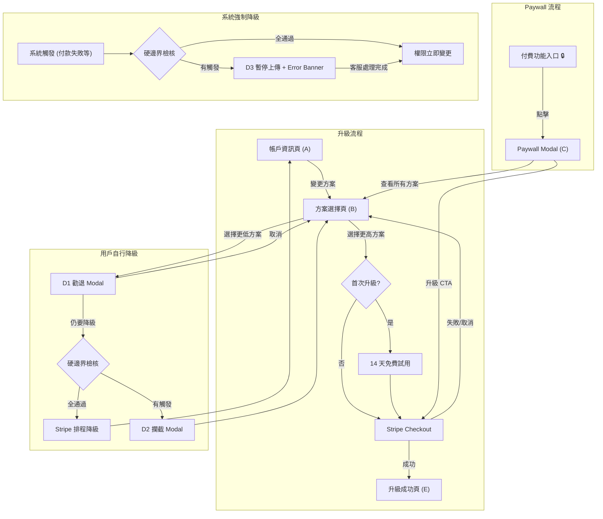

# User Stories: SaaS 方案升降級流程重設計

**Feature Slug：** saas-plan-upgrade-downgrade
**版本：** v2.1
**日期：** 2026-02-12
**狀態：** Draft
**前序產物：** prd-v2.0-20260211.md
**對應 PRD：** prd-v2.0
**總 Story Points：** 51（P0: 31 pts / P1: 20 pts）

---

## 總覽

| ID | Title | Priority | Points | 依賴 |
|----|-------|----------|--------|------|
| S0-001 | Feature-Tier Registry | P0 | 3 | — |
| S1-001 | 帳戶資訊頁顯示方案狀態 | P0 | 2 | S0-001 |
| S1-002 | 方案選擇頁瀏覽與比較 | P0 | 5 | S0-001 |
| S1-003 | 14 天免費試用升級 | P1 | 5 | S1-002 |
| S1-004 | Stripe Checkout 升級結帳 | P0 | 5 | S1-002 |
| S1-005 | 升級成功確認 | P1 | 2 | S1-004 |
| S2-001 | 紅鎖頭系統 | P1 | 3 | S0-001 |
| S2-002 | Paywall Modal 快速升級 | P1 | 3 | S2-001, S1-004 |
| S3-001 | 降級勸退 Modal | P1 | 5 | S0-001, S1-002 |
| S3-002 | 帳戶頁待降級狀態 | P1 | 2 | S3-001, S1-001 |
| S4-001 | 硬邊界檢核 | P0 | 5 | S0-001 |
| S4-002 | 用戶自行降級 — D2 攔截 Modal | P0 | 3 | S4-001 |
| S4-003 | 系統強制降級 — D3 暫停上傳 | P0 | 8 | S4-001 |

### 核心邏輯

**P0（7 個，31 pts）= 能升級 + 能收錢 + 降級不壞資料**
- 升級主線：Registry → 帳戶頁 → 方案頁 → Stripe Checkout
- 降級安全：硬邊界檢核 → D2 攔截 → D3 系統強制

**P1（6 個，20 pts）= 轉化率優化 + 挽留優化 + 體驗優化**
- 免費試用、紅鎖頭、Paywall、勸退 Modal、升級確認頁、待降級狀態

---

## User Flow

---

## S0-001: Feature-Tier Registry

**Priority:** P0
**Story Points:** 3
**依賴：** 無

### Use Case
- **As a** 開發者,
- **I want to** 維護一份 Feature-Tier Registry，定義每個功能在各方案的可用性、鎖定類型與邊界類型,
- **so that** 所有元件（方案頁、Paywall、降級 Modal）可從單一來源推導功能清單，避免不一致.

### Acceptance Criteria（Smoke-test 級別）

> 每個 Story 1-2 個場景，聚焦「這個 Story 交付了什麼」。完整測試場景由 /acceptance-criteria 補充。

**Scenario: Registry 提供完整功能對照**
- Given: Registry 已定義 12 項功能的方案對照
- When: 任一元件查詢特定功能的方案可用性
- Then: 回傳該功能的 min_tier、lock_type、hard_boundary、description 與 tier_values

**Scenario: 新增功能至 Registry**
- Given: Registry 已有 12 項功能
- When: 工程師新增一項功能定義（含所有必要欄位）
- Then: 所有下游元件可立即查詢到新功能

### 技術備註
- 初版以靜態設定（JSON/Config）維護，不建管理後台 CRUD
- Registry 為所有下游元件（S1–S4）的唯一資料來源
- `hard_boundary` 欄位決定降級時走 D1（軟）或 D2/D3（硬）路徑
- 需翻查 Permission/feature-flag 模組、`if plan >= X` 邏輯、Middleware/guard 中的方案檢查，確認 12 項無遺漏

**Registry 欄位定義**

| 欄位 | 型別 | 說明 |
|------|------|------|
| `feature_key` | string | 功能唯一識別碼 |
| `display_name` | string | 功能顯示名稱（zh） |
| `description` | string | 功能價值說明（zh），與 display_name 組成 Paywall Modal 文案 |
| `min_tier` | enum | 最低需求方案（Free/Lite/Pro/Enterprise） |
| `lock_type` | enum | 鎖定類型：`binary`（有/無）或 `quota`（配額制） |
| `hard_boundary` | boolean | 降級時是否為硬邊界（需客服處理） |
| `tier_values` | object | 各方案對應值 |

**完整 Registry（12 項）**

| # | feature_key | display_name | description | min_tier | lock_type | hard_boundary | tier_values |
|---|------------|--------------|-------------|----------|-----------|---------------|-------------|
| 1 | `show_limit` | 創立節目上限 | 建立更多節目，拓展你的內容版圖 | Free | quota | 是 | Free:1, Lite:1, Pro:5, Ent:∞ |
| 2 | `advanced_analytics` | 進階數據分析 | 深入了解聽眾行為，用數據驅動成長策略 | Pro | binary | 否 | Free:✗, Lite:✗, Pro:✓, Ent:✓ |
| 3 | `download_report` | 下載數據報表 | 匯出完整報表，輕鬆與團隊或贊助商分享成果 | Pro | binary | 否 | Free:✗, Lite:✗, Pro:✓, Ent:✓ |
| 4 | `episode_flink` | 單集 Flink 萬用連結 | 一條連結導向所有平台，讓聽眾用慣用的 App 收聽 | Lite | binary | 否 | Free:✗, Lite:✓, Pro:✓, Ent:✓ |
| 5 | `ai_extraction` | AI 內容萃取 | AI 自動產出逐字稿、摘要與精華片段，節省製作時間 | Free | quota | 否 | Free:1, Lite:3, Pro:6, Ent:25 |
| 6 | `remove_dynamic_ads` | 移除動態廣告 | 移除系統預設廣告，打造純淨的聽眾體驗 | Pro | binary | 否 | Legacy:✓, Free:✗, Lite:✗, Pro:✓, Ent:✓ |
| 7 | `ad_revenue_share` | 提高廣告分潤 | 獲得 100% 廣告收益，最大化你的內容變現 | Enterprise | quota | 否 | Free:0%, Lite:0%, Pro:0%, Ent:100% |
| 8 | `commission_discount` | 調降經營會員抽成 | 降低平台抽成，讓更多會員收入留在你手中 | Pro | quota | 否 | Free:0%, Lite:0%, Pro:3%, Ent:5% |
| 9 | `corporate_bank` | 法人銀行提領 | 以公司帳戶提領收入，滿足企業財務需求 | Pro | binary | 是 | Free:✗, Lite:✗, Pro:✓, Ent:✓ |
| 10 | `discord_integration` | Discord 整合 | 串接 Discord 社群，自動管理會員權限 | Pro | binary | 是 | Free:✗, Lite:✗, Pro:✓, Ent:✓ |
| 11 | `zapier_integration` | Zapier 整合 | 透過 Zapier 自動化會員通知與工作流程 | Pro | binary | 是 | Free:✗, Lite:✗, Pro:✓, Ent:✓ |
| 12 | `free_follower_limit` | 免費追蹤會員上限 | 擴大免費追蹤名額，觸及更多潛在付費會員 | Free | quota | 是 | Free:50, Lite:100, Pro:500, Ent:7000 |

**方案層級定義**

| 方案 | 層級 | 說明 |
|------|------|------|
| Legacy | -1 | 舊版方案，不可降回 |
| Free | 0 | 基礎免費 |
| Lite | 1 | |
| Pro | 2 | |
| Enterprise | 3 | |

---

## S1-001: 帳戶資訊頁顯示方案狀態

**Priority:** P0
**Story Points:** 2
**依賴：** S0-001

### Use Case
- **As a** 已登入用戶,
- **I want to** 在帳戶資訊頁看到我目前的方案名稱與狀態,
- **so that** 我知道目前使用的方案並能找到變更入口.

### Acceptance Criteria（Smoke-test 級別）

**Scenario: 顯示當前方案與變更入口**
- Given: 用戶已登入且目前為 Lite 月繳方案
- When: 用戶進入帳戶資訊頁
- Then: 顯示「Lite — 月繳」及「變更方案」按鈕

**Scenario: 待降級狀態顯示**
- Given: 用戶已排程從 Pro 降至 Lite，生效日為 2026-03-01
- When: 用戶進入帳戶資訊頁
- Then: 顯示降級排程資訊（目標方案 Lite + 生效日 2026-03-01）

### 技術備註
- 待降級期間若用戶又升級 → 取消排程降級，直接升級
- 降級排程資訊需從 Stripe Subscription 狀態推導

---

## S1-002: 方案選擇頁瀏覽與比較

**Priority:** P0
**Story Points:** 5
**依賴：** S0-001

### Use Case
- **As a** 想要變更方案的用戶,
- **I want to** 在方案選擇頁瀏覽各方案的定價與功能差異,
- **so that** 我能找到最適合我需求的方案.

### Acceptance Criteria（Smoke-test 級別）

**Scenario: 瀏覽方案比較表**
- Given: 用戶目前為 Free 方案
- When: 用戶進入方案選擇頁
- Then: 顯示所有方案定價（預設年繳）與功能差異，Free 標示「目前方案」且不可選

**Scenario: Legacy 用戶只看升級選項**
- Given: 用戶目前為 Legacy 方案
- When: 用戶進入方案選擇頁
- Then: 僅顯示升級選項，無降級按鈕

### 技術備註
- 功能差異清單由 Registry `tier_values` 各方案對比推導
- 預設顯示年繳，提供月繳/年繳切換
- 定價：Lite $9/$7、Pro $19/$15、Enterprise $199/$159（月繳/年繳月均）

---

## S1-003: 14 天免費試用升級

**Priority:** P1
**Story Points:** 5
**依賴：** S1-002

### Use Case
- **As a** 從未升級過付費方案的用戶,
- **I want to** 以 14 天免費試用的方式體驗付費功能,
- **so that** 我可以在付費前確認功能價值.

### Acceptance Criteria（Smoke-test 級別）

**Scenario: 符合資格的用戶啟用試用**
- Given: 用戶 `has_ever_subscribed = false`
- When: 用戶在方案選擇頁選擇 Pro 方案
- Then: CTA 顯示「14 天免費試用 Pro」，點擊後進入 Stripe Checkout 含 14 天試用

**Scenario: 不符合資格的用戶直接升級**
- Given: 用戶曾訂閱過付費方案（`has_ever_subscribed = true`）
- When: 用戶在方案選擇頁選擇 Pro 方案
- Then: CTA 顯示「升級到 Pro」，點擊後進入 Stripe Checkout 無試用

### 技術備註
- 每位用戶僅一次試用，所有方案共享同一額度
- 到期處理：自動以年繳方案扣款
- 試用期間可提前取消，不產生費用，方案回到 Free

---

## S1-004: Stripe Checkout 升級結帳

**Priority:** P0
**Story Points:** 5
**依賴：** S1-002

### Use Case
- **As a** 決定升級的用戶,
- **I want to** 透過安全的結帳流程完成付費,
- **so that** 我的方案立即升級並解鎖對應功能.

### Acceptance Criteria（Smoke-test 級別）

**Scenario: Checkout 成功後方案立即生效**
- Given: 用戶為 Free 方案，選擇升級至 Pro
- When: Stripe Checkout 回調成功
- Then: 用戶方案立即變更為 Pro，解鎖所有 Pro 功能

**Scenario: Checkout 失敗方案不變**
- Given: 用戶為 Free 方案，選擇升級至 Pro
- When: Stripe Checkout 失敗或用戶取消
- Then: 用戶方案維持 Free 不變，返回方案選擇頁

### 技術備註
- 使用 Stripe Checkout 託管頁面（非自建表單）
- 適用所有升級路徑：Free→Lite/Pro/Ent、Lite→Pro/Ent、Pro→Ent

---

## S1-005: 升級成功確認

**Priority:** P1
**Story Points:** 2
**依賴：** S1-004

### Use Case
- **As a** 剛完成升級的用戶,
- **I want to** 看到我解鎖了哪些功能,
- **so that** 我立即知道升級帶來的價值並開始使用.

### Acceptance Criteria（Smoke-test 級別）

**Scenario: 顯示解鎖功能清單**
- Given: 用戶從 Free 成功升級至 Pro
- When: Stripe 回調成功後進入確認頁
- Then: 元件 E 顯示 Pro 方案解鎖功能清單，含「立即體驗」CTA

### 技術備註
- 解鎖清單由 Registry 推導（比較升級前後 tier_values 差異）
- 升級解鎖矩陣：Lite（Flink、AI 萃取 3 集/月）、Pro（5 檔節目、進階分析、報表下載、Flink、AI 萃取 6 集/月、移除廣告、抽成折扣 3%）、Enterprise（無限節目、進階分析、報表下載、Flink、AI 萃取 25 集/月、移除廣告、廣告分潤 100%、抽成折扣 5%）

---

## S2-001: 紅鎖頭系統

**Priority:** P1
**Story Points:** 3
**依賴：** S0-001

### Use Case
- **As a** 遇到付費功能限制的用戶,
- **I want to** 透過紅鎖頭了解該功能需要哪個方案才能使用,
- **so that** 我可以快速評估是否值得升級.

### Acceptance Criteria（Smoke-test 級別）

**Scenario: 付費功能顯示紅鎖頭**
- Given: 用戶為 Free 方案
- When: 用戶瀏覽到「進階數據分析」功能入口
- Then: 功能入口旁顯示紅鎖頭圖示

### 技術備註
- Paywall 觸發功能（4 項，由 Registry 推導）：`advanced_analytics`（Pro）、`download_report`（Pro）、`episode_flink`（Lite）、`remove_dynamic_ads`（Pro）
- 待工程確認：是否有其他功能入口需要紅鎖頭？（如 AI 內容萃取的配額限制提示）

---

## S2-002: Paywall Modal 快速升級

**Priority:** P1
**Story Points:** 3
**依賴：** S2-001, S1-004

### Use Case
- **As a** 點擊紅鎖頭的用戶,
- **I want to** 在彈窗中看到功能價值說明與所需方案,
- **so that** 我可以直接升級而不需手動找方案頁.

### Acceptance Criteria（Smoke-test 級別）

**Scenario: Paywall Modal 顯示升級路徑**
- Given: Free 用戶點擊「進階數據分析」的紅鎖頭
- When: Paywall Modal（元件 C）彈出
- Then: 顯示功能名稱、說明、所需方案（Pro），含升級 CTA 與「查看所有方案」連結

**Scenario: 從 Paywall 直接升級**
- Given: Free 用戶在 Paywall Modal 中
- When: 用戶點擊升級 CTA
- Then: 跳轉 Stripe Checkout，成功後進入元件 E 確認頁

### 技術備註
- CTA 文案依試用資格切換：「升級到 {plan}」或「14 天免費試用 {plan}」
- 次要 CTA：「查看所有方案」→ 方案選擇頁（元件 B）

---

## S3-001: 降級勸退 Modal

**Priority:** P1
**Story Points:** 5
**依賴：** S0-001, S1-002

### Use Case
- **As a** 考慮降級的用戶,
- **I want to** 在確認降級前看到我將失去哪些功能,
- **so that** 我可以充分考慮降級的影響再做決定.

### Acceptance Criteria（Smoke-test 級別）

**Scenario: 顯示降級影響清單**
- Given: Pro 用戶在方案選擇頁點擊降至 Free
- When: D1 勸退 Modal 彈出
- Then: 顯示將失去的功能清單（進階分析、報表下載、廣告插入、Flink 失效、AI 萃取減少、抽成漲價）

**Scenario: 用戶取消降級（挽留成功）**
- Given: D1 Modal 已顯示
- When: 用戶點擊「取消」
- Then: 回到方案選擇頁，方案不變

### 技術備註
- D1 Modal 動態內容由 Registry 推導，數字欄位以 `{變數}` 標示需後端即時帶入
- 用戶選擇「仍要降級」→ 進入硬邊界檢核（S4）
- 硬邊界全通過 → Stripe 排程降級（當期到期後生效）
- 所有方案都「降不回 Legacy」；Legacy 用戶只看到升級選項

**降級影響矩陣（軟邊界，由 Registry 推導）**

##### 從 Enterprise 降

| 降至 | 失去功能清單 |
|------|-------------|
| **Pro** | 每月失去 19 集 AI 內容萃取、每筆廣告分潤減少 100%、每筆經營會員抽成漲價 2% |
| **Lite** | 失去進階數據分析、失去下載數據報表、自動幫所有 {episode_count} 集插入廣告、總計 {flink_count} 條單集 Flink 萬用連結失效、每月失去 22 集 AI 內容萃取、每筆廣告分潤減少 100%、每筆經營會員抽成漲價 5% |
| **Free** | 失去進階數據分析、失去下載數據報表、自動幫所有 {episode_count} 集插入廣告、總計 {flink_count} 條單集 Flink 萬用連結失效、每月失去 24 集 AI 內容萃取、每筆廣告分潤減少 100%、每筆經營會員抽成漲價 5% |

##### 從 Pro 降

| 降至 | 失去功能清單 |
|------|-------------|
| **Lite** | 失去進階數據分析、失去下載數據報表、自動幫所有 {episode_count} 集插入廣告、每月失去 3 集 AI 內容萃取、每筆經營會員抽成漲價 3% |
| **Free** | 失去進階數據分析、失去下載數據報表、自動幫所有 {episode_count} 集插入廣告、總計 {flink_count} 條單集 Flink 萬用連結失效、每月失去 5 集 AI 內容萃取、每筆經營會員抽成漲價 3% |

##### 從 Lite 降

| 降至 | 失去功能清單 |
|------|-------------|
| **Free** | 總計 {flink_count} 條單集 Flink 萬用連結失效、每月失去 2 集 AI 內容萃取 |

---

## S3-002: 帳戶頁待降級狀態

**Priority:** P1
**Story Points:** 2
**依賴：** S3-001, S1-001

### Use Case
- **As a** 已排程降級的用戶,
- **I want to** 在帳戶頁看到待降級狀態與生效時間,
- **so that** 我清楚知道降級何時生效，也可以改變主意.

### Acceptance Criteria（Smoke-test 級別）

**Scenario: 顯示待降級排程**
- Given: 用戶已排程從 Pro 降至 Free，當期到期日 2026-03-15
- When: 用戶進入帳戶資訊頁
- Then: 顯示「將於 2026-03-15 降為 Free 方案」

### 技術備註
- 待降級期間上傳功能正常（用戶自行降級不影響上傳）
- 待降級期間若用戶又升級 → 取消排程降級，直接升級

---

## S4-001: 硬邊界檢核

**Priority:** P0
**Story Points:** 5
**依賴：** S0-001

### Use Case
- **As a** 確認軟邊界後繼續降級的用戶（或系統強制降級時）,
- **I want to** 系統自動檢查我是否有需要客服處理的高危險項目,
- **so that** 避免降級導致不可逆的資料損失.

### Acceptance Criteria（Smoke-test 級別）

**Scenario: 硬邊界全通過**
- Given: Pro 用戶降至 Lite，現有節目數 1（≤ Lite 上限 1），無法人銀行、無 Discord、無 Zapier
- When: 系統執行硬邊界檢核
- Then: 檢核通過，進入降級排程流程

**Scenario: 硬邊界觸發**
- Given: Pro 用戶降至 Free，目前設有法人銀行提領
- When: 系統執行硬邊界檢核
- Then: 檢核失敗，回傳觸發項目清單（含 `corporate_bank`）

### 技術備註
- 硬邊界由 Registry `hard_boundary = true` 推導，共 5 項檢核

**硬邊界檢核項目（5 項）**

| # | 檢核項目 | feature_key | 觸發條件 | 適用降級路徑 |
|---|---------|-------------|---------|-------------|
| 1 | 移除部分節目 | `show_limit` | 現有節目數 > 降級後方案上限 | Enterprise → Pro/Lite/Free |
| 2 | 移除法人銀行提領 | `corporate_bank` | 目前設有法人銀行提領 | 任何 → Lite 或 Free |
| 3 | 移除部分免費追蹤會員 | `free_follower_limit` | 現有人數 > 降級後方案上限 | 視方案上限而定 |
| 4 | 關閉 Discord 群組 | `discord_integration` | 目前設有 Discord 群組 | 任何 → Lite 或 Free |
| 5 | 關閉 Zapier 會員自動信 | `zapier_integration` | 目前設有 Zapier 自動信 | 任何 → Lite 或 Free |

---

## S4-002: 用戶自行降級 — D2 攔截 Modal

**Priority:** P0
**Story Points:** 3
**依賴：** S4-001

### Use Case
- **As a** 觸發硬邊界的自行降級用戶,
- **I want to** 看到需客服處理的項目清單與操作指引,
- **so that** 我知道如何完成降級前的必要處理.

### Acceptance Criteria（Smoke-test 級別）

**Scenario: D2 攔截並展示處理項目**
- Given: 用戶降級觸發硬邊界（法人銀行提領）
- When: D2 Modal 彈出
- Then: 列出「移除法人銀行提領」需客服處理，提供「保留目前方案」與「我已截圖」按鈕

### 技術備註
- 不擋上傳 — 用戶自行降級流程中上傳始終正常
- 客服處理完成後，用戶再次降級時已處理項目不再觸發

---

## S4-003: 系統強制降級 — D3 暫停上傳

**Priority:** P0
**Story Points:** 8
**依賴：** S4-001

### Use Case
- **As a** 被系統強制降級且觸發硬邊界的用戶,
- **I want to** 清楚知道我的帳戶需要客服處理才能恢復正常,
- **so that** 我可以儘快聯繫客服解除限制.

### Acceptance Criteria（Smoke-test 級別）

**Scenario: 強制降級硬邊界全通過**
- Given: 用戶因付款失敗被系統強制降至 Free，無觸發硬邊界
- When: 系統執行強制降級
- Then: 權限立即變更為 Free，上傳正常

**Scenario: 強制降級觸發硬邊界**
- Given: 用戶因付款失敗被系統強制降至 Free，目前設有法人銀行提領
- When: 系統執行強制降級
- Then: 暫停上傳、全站顯示不可關閉 Error Banner、點擊 Banner 開啟 D3 Modal

### 技術備註
- D2 vs D3 關鍵差異：D2 不擋上傳、D3 暫停上傳 + Error Banner
- 系統強制降級不顯示 D1 勸退（系統直接執行）
- 硬邊界觸發時權限暫不變更，等客服處理完成後一併變更 + 恢復上傳 + Banner 消失

**D2 vs D3 差異對照**

| 維度 | D2（用戶自行降級） | D3（系統強制降級） |
|------|-------------------|-------------------|
| 觸發時機 | 用戶在方案選擇頁點降級 | 系統觸發（付款失敗等） |
| 軟邊界 | 先顯示 D1 勸退 | 不顯示（系統直接執行） |
| 硬邊界全通過 | Stripe 排程 → 當期到期後生效 | 權限立即變更 |
| 硬邊界觸發 | D2 攔截，不擋上傳 | 暫停上傳 + Error Banner + D3 |
| 權限處理 | 不變更（等 Stripe 排程） | 暫不變更（等客服處理） |

---

## 策略對齊

| 維度 | 對齊結論 |
|------|---------|
| **ICP** | 撞牆期專業創作者 — 完全吻合。他們是最可能升級付費方案的族群 |
| **NSM** | SaaS 線：MAU x ARPPU x **Conversion Rate** x **Retention Rate**。本功能直接提升後兩項 |
| **Roadmap** | Q4 SaaS「升降級 UX 調整」 |

**成功指標**

| 指標 | 目標 | 關聯 Story |
|------|------|-----------|
| 升級轉化率 | 提升 20%+ | S1, S2 |
| 降級挽留率 | > 30% | S3 |
| Paywall→升級轉化率 | > 15% | S2 |

---

## 開放問題（繼承自 PRD v2.0）

- [ ] Enterprise 方案是否需要聯繫銷售而非 Stripe Checkout？
- [ ] 降級後的資料保留規則？
- [ ] Legacy 用戶的具體遷移路徑？
- [ ] Legacy 方案的 tier_values 是否需要納入 Registry？
- [ ] 經營會員抽成的 base 比例為何？
- [ ] 是否有其他隱性權限未列在 Registry 中？（待工程盤點）
- [ ] AI 內容萃取達到配額上限時，是否也觸發紅鎖頭 / Paywall？

---

## 相關檔案

| 類型 | 檔案 | 狀態 |
|------|------|------|
| PRD | `prd-v2.0-20260211.md` | ✅ 已存在 |
| User Story | `user-story-v2.1-20260212.md` | ✅ 本文件 |
| Wireframe | — | ⬜ 尚未產出 |
| Prototype | — | ⬜ 尚未產出 |
| AC | — | ⬜ 尚未產出 |

---

## 變更紀錄

| 版本 | 日期 | 變更內容 | 影響範圍 |
|------|------|----------|----------|
| v2.0 | 2026-02-11 | 全面重寫，嚴格遵循 /user-story 模板。新增：總覽表 Points/依賴欄位、User Flow Mermaid 圖、每 Story Smoke-test AC 與技術備註、INVEST/Points/Priority/Mermaid 指引段落。修正：S0 角色「系統」→「開發者」、Lite→Free 矩陣移除錯誤的廣告插入項並補回 Flink 失效、Pro→Lite 矩陣移除錯誤的 Flink 失效項 | User Story |
| v2.1 | 2026-02-12 | 版本管理集中化升版（內容無變更） | User Story |
