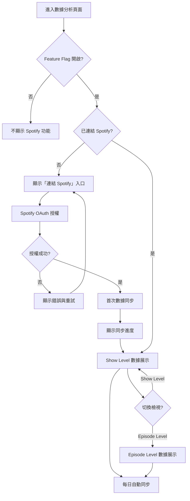

# User Stories: Spotify 數據整合

**Feature Slug：** spotify-data-integration

---

## Stories 總覽

| ID | Title | Epic | Priority | Points | 依賴 |
|----|-------|------|----------|--------|------|
| US-001 | Spotify 帳號授權連結 | Spotify API 資料同步 | P0 | 5 | — |
| US-002 | Show Level 數據同步 | Spotify API 資料同步 | P0 | 5 | US-001 |
| US-003 | Episode Level 數據同步 | Spotify API 資料同步 | P0 | 3 | US-001 |
| US-004 | Show Level 數據展示 | 前台數據展示 | P0 | 5 | US-002 |
| US-005 | Episode Level 數據展示 | 前台數據展示 | P1 | 5 | US-003 |
| US-006 | Spotify 帳號斷開連結 | Spotify API 資料同步 | P1 | 3 | US-001 |
| US-007 | 每日自動數據同步 | 資料儲存與管理 | P0 | 5 | US-002, US-003 |
| US-008 | 灰度發布控制 | 灰度發布與上線 | P0 | 3 | — |

---

## Epic 1: Spotify API 資料同步

### User Story US-001:

- **Summary**: 連結 Spotify 帳號，授權平台存取 Podcast 數據

#### Use Case:
- **As a** Firstory 創作者,
- **I want to** 將我的 Spotify 帳號連結到 Firstory,
- **so that** 平台可以取得我在 Spotify 上的 Podcast 收聽數據.

#### Acceptance Criteria:

- **Scenario**: 成功授權連結 Spotify 帳號
- **Given**: 創作者已登入 Firstory 後台
- **and Given**: 創作者尚未連結 Spotify 帳號
- **and Given**: 數據分析頁面顯示「連結 Spotify」入口
- **When**: 創作者點擊連結並完成 Spotify OAuth 授權流程
- **Then**: 系統成功取得授權，頁面顯示已連結狀態與對應的 Spotify Show 名稱

---

### User Story US-002:

- **Summary**: 同步 Show Level 的 Spotify 數據到平台

#### Use Case:
- **As a** 已連結 Spotify 的創作者,
- **I want to** 同步我的節目整體數據（Play、Stream、Listener、Follower）,
- **so that** 我可以在 Firstory 後台查看 Spotify 上的節目表現.

#### Acceptance Criteria:

- **Scenario**: 授權後首次同步 Show Level 歷史數據
- **Given**: 創作者已成功連結 Spotify 帳號
- **and Given**: Spotify 帳號下有至少一個 Show
- **and Given**: 系統尚未同步過該 Show 的數據
- **When**: 授權完成後系統自動觸發首次數據同步
- **Then**: 系統取得 Show Level 的 Play、Stream、Listener、Follower 日粒度歷史數據並儲存，頁面顯示同步進度

---

### User Story US-003:

- **Summary**: 同步 Episode Level 的 Spotify 數據到平台

#### Use Case:
- **As a** 已連結 Spotify 的創作者,
- **I want to** 同步每一集的個別數據（Play、Stream、Listener）,
- **so that** 我可以比較各集在 Spotify 上的表現差異.

#### Acceptance Criteria:

- **Scenario**: 同步 Episode Level 數據
- **Given**: 創作者已成功連結 Spotify 帳號
- **and Given**: Show Level 數據已同步完成
- **and Given**: 該 Show 下有已發布的 Episode
- **When**: 系統執行 Episode Level 數據同步
- **Then**: 系統取得各 Episode 的 Play、Stream、Listener 日粒度數據並儲存

---

### User Story US-006:

- **Summary**: 斷開 Spotify 帳號連結，停止數據同步

#### Use Case:
- **As a** 已連結 Spotify 的創作者,
- **I want to** 斷開我的 Spotify 帳號連結,
- **so that** 平台停止同步我的 Spotify 數據.

#### Acceptance Criteria:

- **Scenario**: 確認後斷開 Spotify 連結
- **Given**: 創作者已連結 Spotify 帳號
- **and Given**: 創作者進入帳號設定或數據分析頁面
- **and Given**: 頁面顯示「斷開連結」選項
- **When**: 創作者點擊斷開連結並在確認對話框中確認
- **Then**: 系統撤銷 Spotify 授權，停止自動同步，已同步的歷史數據保留不刪除

---

## Epic 2: 資料儲存與管理

### User Story US-007:

- **Summary**: 每日自動同步最新 Spotify 數據

#### Use Case:
- **As a** 已連結 Spotify 的創作者,
- **I want to** 系統每天自動同步最新的 Spotify 數據,
- **so that** 我不需要手動操作就能看到最新的收聽表現.

#### Acceptance Criteria:

- **Scenario**: 排程自動同步每日新增數據
- **Given**: 創作者已連結 Spotify 帳號且首次同步已完成
- **and Given**: 距離上次同步已超過 24 小時
- **When**: 系統排程任務觸發每日同步
- **Then**: 系統取得自上次同步後的新增數據（Show + Episode Level），更新至最新狀態

---

## Epic 3: 前台數據展示

### User Story US-004:

- **Summary**: 在數據分析頁面查看 Show Level Spotify 數據趨勢

#### Use Case:
- **As a** 已同步 Spotify 數據的創作者,
- **I want to** 在數據分析頁面查看節目的 Spotify 數據日趨勢,
- **so that** 我能掌握節目在 Spotify 上的整體表現走勢.

#### Acceptance Criteria:

- **Scenario**: 查看 Show Level 日趨勢圖表
- **Given**: 創作者已連結 Spotify 且數據已同步
- **and Given**: 創作者進入數據分析頁面
- **and Given**: 頁面有 Spotify 數據區塊
- **When**: 創作者查看 Spotify 數據區塊
- **Then**: 頁面顯示 Play、Stream、Listener、Follower 的日趨勢折線圖，可選擇時間區間

---

### User Story US-005:

- **Summary**: 查看各集 Episode 在 Spotify 上的數據表現

#### Use Case:
- **As a** 已同步 Spotify 數據的創作者,
- **I want to** 查看每一集在 Spotify 上的個別數據,
- **so that** 我能找出哪些集數表現好、哪些需要改進.

#### Acceptance Criteria:

- **Scenario**: 查看 Episode Level 數據列表
- **Given**: 創作者已連結 Spotify 且 Episode 數據已同步
- **and Given**: 創作者進入數據分析頁面的 Episode 區塊
- **When**: 創作者切換至 Episode Level 檢視
- **Then**: 頁面顯示各集的 Play、Stream、Listener 數據列表，支援依指標排序

---

## Epic 4: 灰度發布與上線

### User Story US-008:

- **Summary**: 透過 Feature Flag 控制 Spotify 數據功能的可見性

#### Use Case:
- **As a** 產品營運人員,
- **I want to** 透過 Feature Flag 控制哪些用戶可以看到 Spotify 數據功能,
- **so that** 我們可以分階段灰度發布，降低上線風險.

#### Acceptance Criteria:

- **Scenario**: Feature Flag 關閉時用戶不可見功能入口
- **Given**: Spotify 數據功能的 Feature Flag 對該用戶為關閉狀態
- **and Given**: 用戶登入 Firstory 後台
- **When**: 用戶進入數據分析頁面
- **Then**: 頁面不顯示任何 Spotify 相關的功能入口與數據區塊

---

## User Flow

