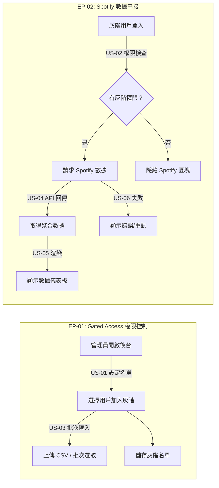

# User Stories: Spotify Gated Release

**Feature Slug：** spotify-gated-release
**對應 PRD：** ⬜ 尚未產出（最速模式）
**總 Story Points：** 21

---

## Stories 總覽

| ID | Title | Priority | Points | 依賴 |
|----|-------|----------|--------|------|
| **EP-01: Gated Access 權限控制** | | **P0** | **10** | |
| US-01 | 後台設定灰階釋出名單 | P0 | 3 | — |
| US-02 | 前端根據權限顯示/隱藏 Spotify 區塊 | P0 | 3 | US-01 |
| US-03 | 管理員批次匯入/移除灰階用戶 | P1 | 4 | US-01 |
| **EP-02: Spotify 數據串接** | | **P0** | **11** | |
| US-04 | API 端點提供 Spotify 聚合數據 | P0 | 5 | — |
| US-05 | 前端顯示 Spotify 數據儀表板 | P0 | 3 | US-02, US-04 |
| US-06 | 數據載入狀態與錯誤處理 | P1 | 3 | US-05 |

---

## User Flow

> **ID 標注規則：** subgraph 標題用 Epic ID，箭頭標籤帶 Story ID，節點文字不放 ID。

---

## EP-01: Gated Access 權限控制

---

### US-01: 後台設定灰階釋出名單

**Epic:** EP-01
**Priority:** P0
**Story Points:** 3
**依賴：** 無

### Use Case
- **As a** 管理員,
- **I want to** 在後台將特定用戶加入灰階釋出名單,
- **so that** 只有被選定的用戶能看到 Spotify 數據功能。

### Acceptance Criteria（Smoke-test 級別）

**Scenario: 成功加入灰階名單**
- Given: 管理員在後台的灰階管理頁面
- When: 搜尋並選擇一位用戶，點擊加入灰階
- Then: 該用戶出現在灰階名單中，狀態為「已啟用」

**Scenario: 從灰階名單移除用戶**
- Given: 灰階名單中有一位已啟用的用戶
- When: 管理員點擊移除該用戶
- Then: 該用戶不再出現在灰階名單中，且立即失去存取權限

### 技術備註
- 需要一個 feature flag 機制來控制灰階狀態（可用現有 flag 系統或新建）
- 灰階名單需持久化儲存，支援快速查詢某用戶是否在名單中

---

### US-02: 前端根據權限顯示/隱藏 Spotify 區塊

**Epic:** EP-01
**Priority:** P0
**Story Points:** 3
**依賴：** US-01

### Use Case
- **As a** 灰階用戶,
- **I want to** 登入後自動看到 Spotify 數據區塊,
- **so that** 我能在不需額外操作的情況下存取新功能。

### Acceptance Criteria（Smoke-test 級別）

**Scenario: 灰階用戶看到 Spotify 區塊**
- Given: 用戶已被加入灰階名單
- When: 用戶登入並進入相關頁面
- Then: 頁面顯示 Spotify 數據區塊

**Scenario: 非灰階用戶看不到 Spotify 區塊**
- Given: 用戶不在灰階名單中
- When: 用戶登入並進入相同頁面
- Then: 頁面不顯示 Spotify 數據區塊，且無任何殘留 UI 元素

### 技術備註
- 前端需在頁面載入時檢查用戶的灰階權限
- 權限檢查結果應可快取，避免每次頁面切換重新請求

---

### US-03: 管理員批次匯入/移除灰階用戶

**Epic:** EP-01
**Priority:** P1
**Story Points:** 4
**依賴：** US-01

### Use Case
- **As a** 管理員,
- **I want to** 透過批次操作一次匯入或移除多位灰階用戶,
- **so that** 大規模調整灰階名單時不需逐一手動操作。

### Acceptance Criteria（Smoke-test 級別）

**Scenario: CSV 批次匯入用戶**
- Given: 管理員準備了一份包含用戶識別資訊的 CSV 檔案
- When: 上傳 CSV 並確認匯入
- Then: 檔案中的所有有效用戶被加入灰階名單，無效的用戶列出錯誤明細

**Scenario: 批次移除用戶**
- Given: 灰階名單中有多位用戶
- When: 管理員勾選多位用戶並執行批次移除
- Then: 被勾選的用戶全部從灰階名單移除

### 技術備註
- CSV 格式需定義明確的欄位規範（如 email 或 user ID）
- 批次操作應為非同步處理，避免大量資料時 timeout

---

## EP-02: Spotify 數據串接

---

### US-04: API 端點提供 Spotify 聚合數據

**Epic:** EP-02
**Priority:** P0
**Story Points:** 5
**依賴：** 無

### Use Case
- **As a** 前端應用,
- **I want to** 呼叫 API 取得當前用戶的 Spotify 聚合數據,
- **so that** 前端能渲染數據儀表板。

### Acceptance Criteria（Smoke-test 級別）

**Scenario: 成功取得 Spotify 數據**
- Given: 用戶有灰階權限且資料庫中有該用戶的 Spotify 數據
- When: 前端呼叫 Spotify 數據 API
- Then: API 回傳結構化的聚合數據（包含播放次數、聽眾數等關鍵指標）

**Scenario: 無權限用戶被拒絕**
- Given: 用戶不在灰階名單中
- When: 嘗試呼叫 Spotify 數據 API
- Then: API 回傳 403 Forbidden

### 技術備註
- API 需整合灰階權限檢查（middleware 層級）
- 聚合數據的欄位需與資料庫現有 Spotify 數據表對應
- 考慮回應快取策略，Spotify 數據不需即時更新

---

### US-05: 前端顯示 Spotify 數據儀表板

**Epic:** EP-02
**Priority:** P0
**Story Points:** 3
**依賴：** US-02, US-04

### Use Case
- **As a** 灰階用戶,
- **I want to** 在頁面上看到我的 Spotify 整合數據儀表板,
- **so that** 我能了解我的內容在 Spotify 上的表現。

### Acceptance Criteria（Smoke-test 級別）

**Scenario: 儀表板顯示關鍵指標**
- Given: 灰階用戶已登入且 API 成功回傳數據
- When: 用戶進入 Spotify 數據頁面
- Then: 儀表板顯示播放次數、聽眾數等關鍵指標

**Scenario: 無數據時顯示空狀態**
- Given: 灰階用戶已登入但尚無 Spotify 數據
- When: 用戶進入 Spotify 數據頁面
- Then: 顯示友善的空狀態提示，引導用戶了解數據何時會出現

### 技術備註
- 儀表板元件需配合 US-02 的權限控制條件渲染
- 數據呈現格式需與設計團隊對齊（最速模式無 Wireframe，需另行確認）

---

### US-06: 數據載入狀態與錯誤處理

**Epic:** EP-02
**Priority:** P1
**Story Points:** 3
**依賴：** US-05

### Use Case
- **As a** 灰階用戶,
- **I want to** 在數據載入中或發生錯誤時看到明確的狀態提示,
- **so that** 我知道系統正在處理或出了什麼問題。

### Acceptance Criteria（Smoke-test 級別）

**Scenario: 數據載入中顯示 loading 狀態**
- Given: 用戶進入 Spotify 數據頁面
- When: API 正在回傳數據（尚未完成）
- Then: 顯示載入中的骨架屏或 spinner

**Scenario: API 錯誤時顯示重試選項**
- Given: 用戶進入 Spotify 數據頁面
- When: API 回傳 5xx 錯誤
- Then: 顯示錯誤訊息與「重試」按鈕，點擊後重新請求

### 技術備註
- 錯誤處理需區分 403（無權限）與 5xx（系統錯誤）的不同呈現
- 考慮加入自動重試機制（如 exponential backoff）

---

## 相關檔案

| 類型 | 檔案 | 狀態 |
|------|------|------|
| PRD | `prd.md` | ⬜ 尚未產出 |
| User Story | `user-story.md` | ✅ 本文件 |
| Wireframe | `wireframe.html` | ⬜ 尚未產出 |
| Prototype | `prototype.html` | ⬜ 尚未產出 |
| AC | `acceptance-criteria.md` | ⬜ 尚未產出 |
