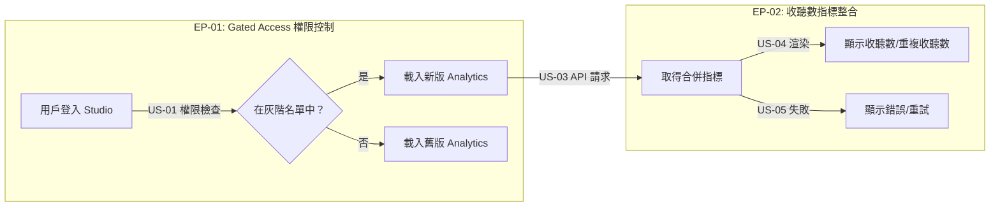

# User Stories: Spotify Gated Release

**Feature Slug：** spotify-gated-release
**對應 PRD：** ⬜ 尚未產出（最速模式）
**總 Story Points：** 16

---

## Stories 總覽

| ID | Title | Priority | Points | 依賴 |
|----|-------|----------|--------|------|
| **EP-01: Gated Access 權限控制** | | **P0** | **4** | |
| US-01 | 以寫死名單控制灰階釋出權限 | P0 | 1 | — |
| US-02 | Analytics Overview 頁面根據權限切換指標顯示 | P0 | 3 | US-01 |
| **EP-02: 收聽數指標整合** | | **P0** | **12** | |
| US-03 | API 整合 RSS 下載數與 Spotify 串流數為「收聽數」 | P0 | 5 | — |
| US-04 | Analytics Overview 顯示收聽數取代下載數 | P0 | 3 | US-02, US-03 |
| US-05 | 數據載入狀態與錯誤處理 | P1 | 4 | US-04 |

---

## User Flow

> **ID 標注規則：** subgraph 標題用 Epic ID，箭頭標籤帶 Story ID，節點文字不放 ID。

---

## EP-01: Gated Access 權限控制

---

### US-01: 以寫死名單控制灰階釋出權限

**Epic:** EP-01
**Priority:** P0
**Story Points:** 1
**依賴：** 無

### Use Case
- **As a** 開發團隊,
- **I want to** 用寫死的用戶名單控制誰能看到新版 Analytics 指標,
- **so that** 能在正式全量釋出前讓特定用戶先行驗證。

### Acceptance Criteria（Smoke-test 級別）

**Scenario: 名單內的用戶獲得灰階權限**
- Given: 用戶 ID 在寫死的灰階名單中
- When: 系統檢查該用戶的灰階權限
- Then: 回傳「已啟用」

**Scenario: 名單外的用戶無灰階權限**
- Given: 用戶 ID 不在寫死的灰階名單中
- When: 系統檢查該用戶的灰階權限
- Then: 回傳「未啟用」

### 技術備註
- 名單寫死在 config 或程式碼中，不需後台 UI
- 未來全量釋出時直接移除 feature flag 即可

---

### US-02: Analytics Overview 頁面根據權限切換指標顯示

**Epic:** EP-01
**Priority:** P0
**Story Points:** 3
**依賴：** US-01

### Use Case
- **As a** 灰階用戶,
- **I want to** 在 Analytics Overview 頁面看到新版指標介面,
- **so that** 我能提前體驗整合 Spotify 數據後的正式介面。

### Acceptance Criteria（Smoke-test 級別）

**Scenario: 灰階用戶看到新版指標**
- Given: 用戶在灰階名單中
- When: 用戶進入 `/podcast/analytics/overview`
- Then: 頁面顯示「收聽數」與「重複收聽數」取代原本的「下載數」與「重複下載數」

**Scenario: 非灰階用戶看到舊版指標**
- Given: 用戶不在灰階名單中
- When: 用戶進入 `/podcast/analytics/overview`
- Then: 頁面維持顯示原本的「下載數」與「重複下載數」，無任何變化

### 技術備註
- 影響頁面：https://studio.firstory.me/podcast/analytics/overview
- 灰階用戶看到的是未來正式介面，非臨時 UI

---

## EP-02: 收聽數指標整合

---

### US-03: API 整合 RSS 下載數與 Spotify 串流數為「收聽數」

**Epic:** EP-02
**Priority:** P0
**Story Points:** 5
**依賴：** 無

### Use Case
- **As a** 前端應用,
- **I want to** 呼叫 API 取得合併後的收聽指標,
- **so that** 前端能顯示整合 Spotify 數據的新版指標。

### Acceptance Criteria（Smoke-test 級別）

**Scenario: 成功取得合併指標**
- Given: 用戶有灰階權限且資料庫中有 RSS 下載數據與 Spotify 數據
- When: 前端呼叫收聽數 API
- Then: API 回傳：
  - 「收聽數」= Apple 等 RSS 平台不重複下載數（unique downloads）+ Spotify 串流數（streams）
  - 「重複收聽數」= Apple 等 RSS 平台下載數（downloads）+ Spotify 播放數（plays）

**Scenario: 無權限用戶被拒絕**
- Given: 用戶不在灰階名單中
- When: 嘗試呼叫收聽數 API
- Then: API 回傳 403 Forbidden

### 技術備註
- 需整合灰階權限檢查（middleware 層級）
- 指標合併邏輯：unique downloads + streams = 收聽數；downloads + plays = 重複收聽數
- 考慮回應快取策略，Spotify 數據不需即時更新

---

### US-04: Analytics Overview 顯示收聽數取代下載數

**Epic:** EP-02
**Priority:** P0
**Story Points:** 3
**依賴：** US-02, US-03

### Use Case
- **As a** 灰階用戶,
- **I want to** 在 Analytics Overview 頁面看到收聽數與重複收聽數,
- **so that** 我能了解包含 Spotify 在內的完整收聽表現。

### Acceptance Criteria（Smoke-test 級別）

**Scenario: 收聽數取代下載數**
- Given: 灰階用戶已登入且 API 成功回傳合併指標
- When: 用戶進入 `/podcast/analytics/overview`
- Then: 原本顯示「下載數」的位置改為顯示「收聽數」，數值為 unique downloads + streams

**Scenario: 重複收聽數取代重複下載數**
- Given: 灰階用戶已登入且 API 成功回傳合併指標
- When: 用戶進入 `/podcast/analytics/overview`
- Then: 原本顯示「重複下載數」的位置改為顯示「重複收聽數」，數值為 downloads + plays

### 技術備註
- 僅替換指標名稱與數據來源，頁面佈局與圖表維持不變
- 數據呈現格式（趨勢圖、數字卡片等）沿用現有元件

---

### US-05: 數據載入狀態與錯誤處理

**Epic:** EP-02
**Priority:** P1
**Story Points:** 4
**依賴：** US-04

### Use Case
- **As a** 灰階用戶,
- **I want to** 在數據載入中或發生錯誤時看到明確的狀態提示,
- **so that** 我知道系統正在處理或出了什麼問題。

### Acceptance Criteria（Smoke-test 級別）

**Scenario: 數據載入中顯示 loading 狀態**
- Given: 用戶進入 Analytics Overview
- When: 收聽數 API 正在回傳數據（尚未完成）
- Then: 顯示載入中的骨架屏或 spinner

**Scenario: API 錯誤時 fallback 到舊版指標**
- Given: 用戶進入 Analytics Overview
- When: 收聽數 API 回傳錯誤
- Then: 自動 fallback 顯示原本的下載數指標，並顯示提示訊息

### 技術備註
- 錯誤處理策略：API 失敗時 graceful fallback 到舊版指標，而非顯示空白
- 區分 403（無權限，不應發生）與 5xx（系統錯誤，需 fallback）

---

## 相關檔案

| 類型 | 檔案 | 狀態 |
|------|------|------|
| PRD | `prd.md` | ⬜ 尚未產出 |
| User Story | `user-story.md` | ✅ 本文件 |
| Wireframe | `wireframe.html` | ⬜ 尚未產出 |
| Prototype | `prototype.html` | ⬜ 尚未產出 |
| AC | `acceptance-criteria.md` | ⬜ 尚未產出 |
