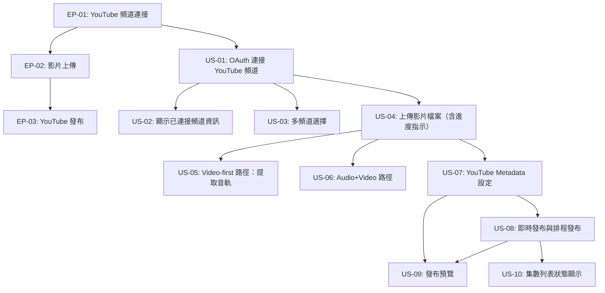

# User Stories: YouTube Video Publishing — Phase 1

**Feature Slug：** youtube-video-publishing
**對應 PRD：** `features/youtube-video-publishing/prd.md` Phase 1
**對應 PRD 開放問題假設：** 見文末「待確認項目」

---

## Stories 總覽

| ID | Title | Priority | Points | 依賴 |
|----|-------|----------|--------|------|
| **EP-01: YouTube 頻道連接** | | **P0** | **8** | |
| US-01 | OAuth 連接 YouTube 頻道 | P0 | 3 | — |
| US-02 | 顯示已連接頻道資訊 | P0 | 2 | US-01 |
| US-03 | 多頻道選擇 | P0 | 3 | US-01 |
| **EP-02: 影片上傳** | | **P0** | **13** | |
| US-04 | 上傳影片檔案（含進度指示） | P0 | 5 | US-01 |
| US-05 | Video-first 路徑：從影片提取音軌 | P0 | 5 | US-04 |
| US-06 | Audio+Video 路徑：分別上傳音訊與影片 | P0 | 3 | US-04 |
| **EP-03: YouTube 發布** | | **P0** | **13** | |
| US-07 | YouTube Metadata 設定 | P0 | 3 | US-04 |
| US-08 | 即時發布與排程發布 | P0 | 3 | US-07 |
| US-09 | 發布預覽 | P0 | 3 | US-07, US-08 |
| US-10 | 集數列表 YouTube 發布狀態顯示 | P0 | 2 | US-08 |

**總計：34 Story Points**

---

## User Flow

---

## EP-01: YouTube 頻道連接

---

### US-01: OAuth 連接 YouTube 頻道

**Epic:** EP-01
**Priority:** P0
**Story Points:** 3
**依賴：** 無

### Use Case
- **As a** Podcast 主持人，
- **I want to** 透過 OAuth 授權連接我的 YouTube 頻道，
- **so that** 我可以直接從平台發布集數到 YouTube，不需要手動上傳。

### Acceptance Criteria（Smoke-test 級別）

**Scenario: 成功連接 YouTube 頻道**
- Given: 用戶已登入，目前 Podcast 設定頁尚未連接任何 YouTube 頻道
- When: 用戶點擊「連接 YouTube 頻道」按鈕，完成 Google OAuth 授權流程
- Then: 系統顯示已連接頻道名稱、頻道頭像及訂閱人數，並出現「中斷連接」選項

**Scenario: 免費方案用戶連接**
- Given: 用戶已登入且使用免費方案，目前 Podcast 設定頁尚未連接任何 YouTube 頻道
- When: 用戶點擊「連接 YouTube 頻道」按鈕，完成 Google OAuth 授權流程
- Then: 系統顯示已連接頻道名稱、頻道頭像及訂閱人數，並出現「中斷連接」選項

**Scenario: OAuth 授權失敗**
- Given: 用戶已登入，點擊「連接 YouTube 頻道」後進入 Google OAuth 頁面
- When: 用戶在 Google 授權頁面點擊「拒絕」或關閉彈窗
- Then: 系統顯示授權失敗錯誤訊息，頻道連接狀態維持未連接

### 技術備註
- OAuth 2.0 scopes 需包含 `youtube.upload` 及 `youtube.readonly`
- Access token 與 refresh token 需安全儲存，支援 token 自動更新
- 每個 Podcast 限連接一個 YouTube 頻道（帳號下有多頻道時走 US-03 選擇流程）

---

### US-02: 顯示已連接頻道資訊

**Epic:** EP-01
**Priority:** P0
**Story Points:** 2
**依賴：** US-01

### Use Case
- **As a** 已連接 YouTube 頻道的 Podcast 主持人，
- **I want to** 在設定頁看到目前連接的頻道基本資訊，
- **so that** 我可以確認連接狀態正確，並在需要時切換或中斷連接。

### Acceptance Criteria（Smoke-test 級別）

**Scenario: 顯示已連接頻道資訊**
- Given: 用戶已登入且 Podcast 已成功連接 YouTube 頻道
- When: 用戶進入 Podcast 設定頁的 YouTube 連接區塊
- Then: 系統顯示頻道頭像、頻道名稱、訂閱人數，以及「中斷連接」按鈕

**Scenario: 中斷頻道連接**
- Given: 用戶已登入且 Podcast 已連接 YouTube 頻道，目前在設定頁
- When: 用戶點擊「中斷連接」並確認操作
- Then: 系統移除頻道授權資料，頁面回到未連接狀態並顯示「連接 YouTube 頻道」按鈕

### 技術備註
- 訂閱人數從 YouTube Data API 取得，顯示時使用人性化格式（如「1.2萬」）
- 中斷連接需 revoke Google OAuth token，並清除本地儲存的 token

---

### US-03: 多頻道選擇

**Epic:** EP-01
**Priority:** P0
**Story Points:** 3
**依賴：** US-01

### Use Case
- **As a** Google 帳號下擁有多個 YouTube 頻道的 Podcast 主持人，
- **I want to** 在授權後從清單中選擇要連接的頻道，
- **so that** 我可以將 Podcast 集數發布到正確的 YouTube 頻道。

### Acceptance Criteria（Smoke-test 級別）

**Scenario: 顯示多頻道選擇畫面**
- Given: 用戶已完成 Google OAuth 授權，且該 Google 帳號擁有 2 個以上的 YouTube 頻道
- When: OAuth 授權流程完成，系統偵測到多個頻道
- Then: 系統顯示頻道選擇彈窗，列出所有可用頻道（含頻道名稱、頭像、訂閱人數）

**Scenario: 選擇指定頻道完成連接**
- Given: 系統顯示多頻道選擇彈窗，列出用戶的所有 YouTube 頻道
- When: 用戶選擇其中一個頻道並點擊「確認連接」
- Then: 系統連接該頻道，並在設定頁顯示已選頻道的資訊（同 US-02 成功狀態）

### 技術備註
- 使用 YouTube Data API `channels.list` 取得帳號下所有頻道清單
- 若帳號只有一個頻道，跳過選擇步驟，直接完成連接

---

## EP-02: 影片上傳

---

### US-04: 上傳影片檔案（含進度指示）

**Epic:** EP-02
**Priority:** P0
**Story Points:** 5
**依賴：** US-01

### Use Case
- **As a** 已連接 YouTube 頻道的 Podcast 主持人，
- **I want to** 在集數編輯頁上傳影片檔案並看到上傳進度，
- **so that** 我可以在上傳期間繼續編輯其他集數內容，不需要等待上傳完成。

### Acceptance Criteria（Smoke-test 級別）

**Scenario: 成功上傳影片並顯示進度**
- Given: 用戶已登入，Podcast 已連接 YouTube 頻道，目前在集數編輯頁的 YouTube 發布區塊
- When: 用戶選擇一個 MP4 影片檔案並開始上傳
- Then: 系統顯示上傳進度條（百分比），並允許用戶繼續編輯集數的其他欄位

**Scenario: 上傳完成顯示縮圖預覽**
- Given: 用戶已選擇影片檔案且上傳正在進行
- When: 影片上傳完成
- Then: 系統顯示影片縮圖預覽，並標示上傳完成狀態

**Scenario: 影片上傳失敗**
- Given: 用戶已選擇影片檔案且上傳正在進行
- When: 上傳過程中發生網路錯誤或伺服器錯誤
- Then: 系統顯示上傳失敗錯誤訊息，並提供「重試」按鈕

**Scenario: 未驗證 YouTube 頻道的上傳限制提示**
- Given: 用戶已連接 YouTube 頻道，但該頻道尚未在 YouTube 完成驗證
- When: 用戶進入 YouTube 發布區塊
- Then: 系統顯示提示訊息，告知用戶未驗證頻道有 15 分鐘影片長度限制，並提供 YouTube 驗證頁面連結

### 技術備註
- 影片暫存伺服器直至成功上傳 YouTube 後刪除，不永久保存
- 支援格式至少包含 MP4、MOV；最大檔案大小依 YouTube API 限制（128GB）
- 上傳使用 YouTube Data API resumable upload，支援斷點續傳
- 顯示每日 YouTube API 上傳配額提示（Phase 1 不設排隊機制）

---

### US-05: Video-first 路徑：從影片提取音軌

**Epic:** EP-02
**Priority:** P0
**Story Points:** 5
**依賴：** US-04

### Use Case
- **As a** 只有影片檔案的 Podcast 主持人，
- **I want to** 讓系統自動從影片中提取音軌作為 RSS 音訊，
- **so that** 我不需要另外準備獨立音訊檔案即可同步在 Podcast RSS 和 YouTube 發布。

### Acceptance Criteria（Smoke-test 級別）

**Scenario: 選擇 Video-first 路徑並提取音軌**
- Given: 用戶已上傳影片檔案（US-04 完成），集數編輯頁顯示發布路徑選項
- When: 用戶選擇「Video-first（從影片提取音軌）」路徑
- Then: 系統顯示正在提取音軌的處理狀態，並於完成後顯示提取成功、音訊將用於 RSS 發布的確認訊息

**Scenario: 音軌提取完成後可繼續編輯**
- Given: 用戶已選擇 Video-first 路徑且音軌提取處理中
- When: 音軌提取完成
- Then: 系統更新音訊來源顯示為「來自影片提取」，用戶可繼續設定 YouTube Metadata 及發布設定

### 技術備註
- 系統提取最高品質音軌，不提供品質選項（Phase 1 假設）
- 音軌提取為非同步處理，前端以 polling 或 WebSocket 更新狀態
- 提取的音訊格式需符合 RSS 規範（建議 MP3 或 AAC）

---

### US-06: Audio+Video 路徑：分別上傳音訊與影片

**Epic:** EP-02
**Priority:** P0
**Story Points:** 3
**依賴：** US-04

### Use Case
- **As a** 擁有獨立高品質音訊檔案的 Podcast 主持人，
- **I want to** 分別上傳音訊和影片到同一集數，
- **so that** RSS 訂閱者獲得最佳音訊品質，YouTube 觀眾看到完整影片。

### Acceptance Criteria（Smoke-test 級別）

**Scenario: 選擇 Audio+Video 路徑並上傳音訊**
- Given: 用戶已上傳影片檔案（US-04 完成），集數編輯頁顯示發布路徑選項
- When: 用戶選擇「Audio+Video（分別上傳）」路徑並上傳獨立音訊檔案
- Then: 系統分別顯示影片和音訊的上傳完成狀態，並標示各自的用途（影片→YouTube、音訊→RSS）

**Scenario: 僅有音訊無影片（降級路徑）**
- Given: 用戶在集數編輯頁，尚未上傳任何影片
- When: 用戶選擇「Audio+Video」路徑但僅上傳音訊、未上傳影片
- Then: 系統提示影片為必填，YouTube 發布區塊保持未完成狀態，不允許繼續發布流程

### 技術備註
- 音訊檔案上傳流程與現有集數音訊上傳複用相同元件
- 需在 UI 明確標示哪個檔案對應哪個用途，避免用戶混淆

---

## EP-03: YouTube 發布

---

### US-07: YouTube Metadata 設定

**Epic:** EP-03
**Priority:** P0
**Story Points:** 3
**依賴：** US-04

### Use Case
- **As a** 準備在 YouTube 發布集數的 Podcast 主持人，
- **I want to** 設定影片在 YouTube 上的標題、說明、縮圖、Playlist、可見性及相關旗標，
- **so that** 影片能以正確的資訊和設定呈現給 YouTube 觀眾。

### Acceptance Criteria（Smoke-test 級別）

**Scenario: 預設帶入集數資訊**
- Given: 用戶已上傳影片（US-04 完成），且集數已填寫標題和說明
- When: 用戶進入 YouTube Metadata 設定區塊
- Then: 系統自動帶入集數標題為影片標題、集數說明為影片說明，用戶可手動修改

**Scenario: 設定自訂縮圖**
- Given: 用戶在 YouTube Metadata 設定區塊
- When: 用戶上傳自訂縮圖圖片
- Then: 系統顯示縮圖預覽，並以此縮圖取代 YouTube 自動產生的縮圖

**Scenario: 設定 Visibility 為排程發布情境**
- Given: 用戶在 YouTube Metadata 設定區塊，Visibility 目前為「Public」
- When: 用戶將 Visibility 改為「Private」
- Then: 系統更新 Visibility 選項顯示為「Private」，其餘 Metadata 設定不受影響

### 技術備註
- Playlist 清單從 YouTube Data API `playlists.list` 動態載入
- Visibility 選項：Public、Unlisted、Private（對應 YouTube API `status.privacyStatus`）
- 「Made for Kids」及「AI 生成內容」旗標對應 YouTube API 的 `status.madeForKids` 和 `status.containsSyntheticMedia`
- 縮圖建議尺寸 1280x720，檔案大小上限 2MB（符合 YouTube 規範）

---

### US-08: 即時發布與排程發布

**Epic:** EP-03
**Priority:** P0
**Story Points:** 3
**依賴：** US-07

### Use Case
- **As a** 已完成 YouTube Metadata 設定的 Podcast 主持人，
- **I want to** 選擇立即發布或設定未來的排程時間發布，
- **so that** 我可以在最佳時間點讓影片上線，或提前準備好定時發布。

### Acceptance Criteria（Smoke-test 級別）

**Scenario: 選擇即時發布**
- Given: 用戶已完成 YouTube Metadata 設定，發布時間選項預設為「立即發布」
- When: 用戶確認選擇「立即發布」並點擊發布
- Then: 系統立即將影片提交至 YouTube，並在集數列表顯示「發布中」狀態

**Scenario: 設定排程發布時間**
- Given: 用戶已完成 YouTube Metadata 設定，發布時間選項目前為「立即發布」
- When: 用戶選擇「排程發布」並設定未來的日期與時間
- Then: 系統儲存排程設定，集數列表顯示「已排程：{日期時間}」狀態

**Scenario: 排程時間設定為過去時間**
- Given: 用戶選擇「排程發布」並輸入過去的日期時間
- When: 用戶嘗試儲存設定
- Then: 系統顯示錯誤訊息提示時間必須為未來，排程設定不被儲存

### 技術備註
- 排程發布使用 YouTube API `status.publishAt` 欄位，需將 Visibility 設為 `private` 並搭配發布時間
- 時區處理：UI 顯示用戶本地時區，API 傳送 UTC

---

### US-09: 發布預覽

**Epic:** EP-03
**Priority:** P0
**Story Points:** 3
**依賴：** US-07, US-08

### Use Case
- **As a** 準備確認發布的 Podcast 主持人，
- **I want to** 在送出前預覽影片在 YouTube 上的呈現方式，
- **so that** 我可以在正式發布前發現並修正任何設定錯誤。

### Acceptance Criteria（Smoke-test 級別）

**Scenario: 顯示發布預覽畫面**
- Given: 用戶已完成 YouTube Metadata 設定和發布時間設定
- When: 用戶點擊「預覽發布」按鈕
- Then: 系統顯示預覽面板，呈現影片縮圖、標題、說明前幾行、Visibility 設定及發布時間（即時或排程）

**Scenario: 從預覽返回修改**
- Given: 系統正在顯示發布預覽面板
- When: 用戶點擊「返回修改」按鈕
- Then: 系統關閉預覽面板，用戶回到 Metadata 設定頁面，所有已填寫的設定保持不變

### 技術備註
- 預覽為前端 UI 組合現有輸入資料的模擬呈現，非實際呼叫 YouTube API
- 預覽畫面需模擬 YouTube 影片頁面的基本版型（縮圖、標題、頻道名稱、說明摘要）

---

### US-10: 集數列表 YouTube 發布狀態顯示

**Epic:** EP-03
**Priority:** P0
**Story Points:** 2
**依賴：** US-08

### Use Case
- **As a** 管理多個集數的 Podcast 主持人，
- **I want to** 在集數列表看到每集的 YouTube 發布狀態，
- **so that** 我可以快速了解哪些集數已發布、哪些已排程、哪些尚未發布到 YouTube。

### Acceptance Criteria（Smoke-test 級別）

**Scenario: 集數列表顯示 YouTube 狀態標籤**
- Given: Podcast 有多個集數，部分已發布 YouTube、部分已排程、部分未設定
- When: 用戶進入集數列表頁
- Then: 每個集數顯示對應的 YouTube 狀態標籤：「已發布」（含 YouTube 連結）、「已排程：{日期}」或「未發布」

**Scenario: 點擊 YouTube 連結跳轉**
- Given: 集數列表中有集數顯示「已發布」狀態
- When: 用戶點擊該集數的 YouTube 連結
- Then: 系統在新分頁開啟對應的 YouTube 影片頁面

### 技術備註
- YouTube 狀態從本地資料庫讀取，不需每次即時查詢 YouTube API
- 狀態同步：YouTube 上傳/排程完成後更新本地狀態；考慮定期 polling 以更新非同步狀態變更

---

## 待確認項目

| PRD 開放問題 # | 問題 | 當前假設 | 影響的 Story |
|---|---|---|---|
| 1 | YouTube 功能是否與特定付費方案綁定？ | 開放給所有用戶（含免費方案） | US-01 |
| 2 | 從影片提取的音訊品質是否足夠用於 RSS？ | 系統預設提取最高品質音軌，不提供品質選項 | US-05 |
| 3 | 影片儲存策略為何？ | 影片暫存至上傳 YouTube 成功後刪除，不永久保存 | US-04 |
| 4 | YouTube Data API 每日配額是否充足？ | Phase 1 不設排隊機制，但顯示每日上傳上限提示 | US-04 |
| 5 | 未驗證 YouTube 頻道的上傳限制如何處理？ | UI 提示用戶需先在 YouTube 驗證頻道以解除 15 分鐘長度限制 | US-04 |
