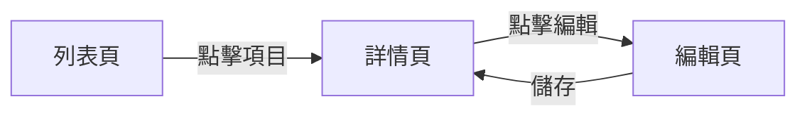

# <Feature> SPEC

## 概覽
一句話描述功能。

## Success Metrics

### 關鍵指標
（定義衡量功能成效的指標，依功能性質選擇合適類型）

### 事件定義（如需要）
| 事件 | 維度 | 記錄時機 | 說明 |
|------|------|----------|------|

### 回饋蒐集（如需要）
（管道、觸發條件、時機）

## 明確不做

## Notes / 開放問題

## UI Flow

## 頁面 A — 列表頁

| 預設狀態 | 空狀態 |
|:---:|:---:|
|  |  |

### 欄位規格
| 欄位 | 類型 | 必填 | 限制 | 特殊狀況 |
|------|------|------|------|----------|
| 標題 | text | Y | 50字 | 超過截斷+... |

### 互動行為
| 操作 | 觸發 | 結果 |
|------|------|------|
| 點擊項目 | tap | 進入詳情頁 |

### 狀態說明
| 狀態 | 條件 | 顯示 |
|------|------|------|
| 空狀態 | 無資料 | 插圖+提示文字 |

---

（重複每頁...）